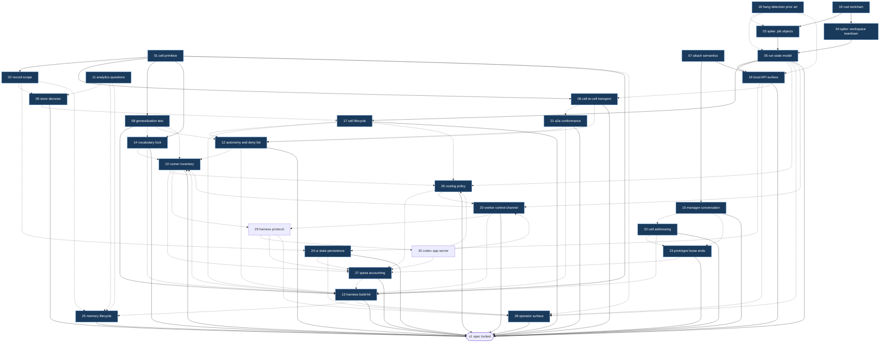

# Map: Farseer v1

Label: `wayfinder:map`

## Destination

A locked v1 specification for Farseer as a **cell runtime**: the cell primitive and its recursion rules, the record contract, the three protocol boundaries, and the worker-control and attach semantics.
Reaching the destination means M0 spikes have answered the scary platform questions and no architectural decision remains open before implementation starts.
It does not mean any of Farseer is built.

## Notes

Domain: local-first agent orchestration on Windows, Rust single binary, no required external services.

Source documents:

- `BRIEF.md` - landscape research, Windows failure catalogue, 35 operator questions.
- `ARCHITECTURE.md` - the cell model proposal this map is deciding on.
- `Inspirationst.txt` - the operator's reference list.

Standing preferences for this effort:

- Every session consults `/grilling` and `/domain-modeling`.
- Research tickets are resolved by a `/research` subagent, and only when the operator asks for one to be spawned.
- Never use the em dash. Plain dash only.
- One sentence per line in markdown.
- Windows native first. mac and Linux are a later subtraction, never a v1 constraint.
- Planning only. This map produces decisions, not deliverables. The M0 spikes are the single exception, and they exist to unblock decisions, not to become the product.

## Decisions so far

- [Is the cell the right primitive?](issues/01-cell-primitive.md) - the cell survives as the unit of addressing plus policy plus record scope, never as a unit of code. **cell definition** (data in git) and **running cell** (live manager plus in-flight workers) are two nouns. Manager mandatory, workers spawn on demand under a cap, and a worker may never spawn. Foreign agents are **runners** over ACP (Zed); foreign orchestrators are **peer cells** over A2A, discriminated by whether they make their own delegation decisions. Cell is data, not a loadable plugin. Runtime is headless from v1 behind one local HTTP API on `127.0.0.1` with SSE. Worker versus tool is decided by supervision, not by whether an LLM is involved. Falsification test handed to `08`.
- [Attach: to a worker or to a run, and what does intervention do?](issues/07-attach-semantics.md) - attach targets a **run** (one worker contract's execution, one record entry), not a process, so live tail and dead-session replay share one surface. Read-only by default with explicit takeover. Rule 4 amended: attach reaches any worker in any cell **whose record farseer owns**, so peer cells are observable but not attachable. No PTY in the runtime; terminal-only runners have their adapter own the PTY and emit events. Intervention appends `operator_intervened`, does not void the contract, and the manager decides whether to re-plan. Run control states `autonomous` / `observed` / `taken over`, with auto-release on dropped connection, and cancel as a separate verb.
- [How do comparable tools detect hangs and handle observation and takeover?](issues/18-hang-detection-prior-art.md) - **the `BRIEF.md` Windows failure catalogue is herdr-specific, not a platform wall.** Every concrete herdr, firstmate and buzz Windows bug found has a stated root cause that is an implementation choice, and a herdr maintainer confirmed Windows attach is unbuilt feature work rather than a limitation. Adopt a no-progress-event watchdog: 120s marks a run `stalled`, 600s flags `likely-hung`, no auto-kill. **The watchdog input was later corrected by [Run state model and control semantics](issues/05-run-state-model.md) to key on activity rather than progress; the two numbers survive unchanged.** Reap with **one Win32 Job Object per worker tree using `JOB_OBJECT_LIMIT_KILL_ON_JOB_CLOSE`**, plus explicit `.cmd` / `.exe` resolution. No surveyed Windows agent tool was confirmed to use Job Objects at all.
- [Rust toolchain on Windows: MSVC or GNU](issues/19-rust-toolchain.md) - **`x86_64-pc-windows-msvc`**, rustup stable 1.98.0. Visual Studio Build Tools 2026 installed with two components only, `VC.Tools.x86.x64` and `Windows11SDK.26100`, no workload and no recommended extras. Ecosystem risk beat the portability preference: crates are tested on MSVC first, and farseer exists precisely to not hit bugs nobody else hits. The portability preference is relocated to farseer's own runtime dependencies rather than the compiler that builds it once. `windows-rs` v0.62.2 verified against `CreateJobObjectW`. Both spikes unblocked.
- [Spike: Win32 Job Object kill-on-close with a real harness child](issues/03-spike-job-objects.md) - **confirmed, and it holds under ConPTY.** A five-deep `.cmd`-rooted tree reaps completely in **300 to 400 microseconds** with zero survivors, while killing the root alone leaves **five of six processes alive indefinitely**. No teardown budget to design around. Three implementation rules fixed: spawn suspended then assign then resume, walk `PATHEXT` before accepting a bare filename, and expect `conhost.exe` in the tree despite `CREATE_NO_WINDOW`. The spike also proved the hard way that **parent-pid tree reconstruction is unsafe on Windows** - a reused pid caused it to terminate an unrelated application - so process identity is `(pid, creation_time)` or job membership, never a pid alone. Spike code: [spikes/jobspike](spikes/jobspike/README.md).
- [Spike: workspace create and destroy under a running dev server](issues/04-spike-workspace-teardown.md) - **`worktree` is the default isolation strategy**, with **zero failures in 60 supervised cycles**, p50 2.5ms and p95 38.5ms. The blocker is not the watcher, Defender or the indexer: **every blocked attempt was `SHARING_VIOLATION` on the workspace root directory, caused by the worker process's own current directory**, proven by an A/B where moving cwd outside the workspace took a live server from 0/5 deletable to 5/5. The ticket's proposed **quarantine-by-rename fallback does not work** and was removed - a directory held open as a cwd cannot be renamed either - so the ladder is two rungs and a stuck workspace is surfaced to the operator rather than papered over. Teardown ordering is a hard constraint: deleting without reaping first does not fail cleanly, it corrupts a live workspace. Spike code: [spikes/wsspike](spikes/wsspike/README.md).
- [Run state model and control semantics](issues/05-run-state-model.md) - the five inherited states were never one enum but **three orthogonal axes**: lifecycle (`queued`/`running`/`finished`), control (`autonomous`/`observed`/`taken over`), and liveness (`live`/`stalled`/`likely-hung`), the last **derived from a timestamp and never stored**. **Corrects `18`:** the watchdog keys on **activity** (any bytes) rather than **progress** (tool call, tool result, status change), because a model reasoning for twenty minutes emits no progress events and is not hung; the 120s and 600s numbers survive, the signal they measure does not. Budget catches waste, the watchdog catches silence. The liveness clock pauses whenever control is not `autonomous`. Auto-release is a **30s heartbeat, released after two missed beats**, not a wall-clock timeout. A **worker contract is immutable** (goal, workspace, runner, tool grants, autonomy, budget, definition-of-done), so the manager gets four verbs - **steer** within it, **re-scope** into a new run, **cancel**, **re-run**. `cancelled` is never `failed`. Intervention never tightens autonomy. A stuck workspace becomes the cell's problem as an `orphaned` workspace swept at startup, never a run that refuses to close. **Later corrected by [Worker control channel](issues/20-worker-control-channel.md): steering is turn-boundary granular, not interrupt granular, because no surveyed harness supports interrupting a turn in flight.** Amended again for compaction: the liveness clock also pauses during a known compaction, since a server-side compaction is silence and would otherwise trip a false `stalled` on the longest runs - see [context-compaction.md](research/context-compaction.md).
- [What is the local API surface?](issues/16-local-api-surface.md) - **bespoke HTTP plus SSE is the substrate, and an ACP server sits on top of it as a first-class adapter.** The ordering is the decision: ACP covers roughly a fifth of a fleet surface, so making it the transport would deform every other operation into a custom extension. berd's precedent does not transfer because berd is a single-agent app. One ACP session maps to one cell manager conversation; roster, lifecycle and **attach and takeover are deliberately not exposed over ACP**. One scoped stream endpoint, and **replay and attach-mid-run are the same call with a different cursor**. The stream is **explicitly lossy** with an in-band `gap` event, because **a slow client must never slow a worker**. Definitions stay files in git with read, validate and reload but no edit path. Instructions are fire-and-forget. All four manager verbs are operator-callable, and operator-initiated re-scope and re-run leave an event behind. `/v1/` additive-only, a promise that exists purely for third-party UIs. Token in a user-ACL'd file and a URL fragment, plus **`Origin` validation, since a token alone does not stop DNS rebinding**.
- [Cell-to-cell transport: in-process envelope, A2A endpoint, or both?](issues/06-cell-transport.md) - **both, and the ordering is the decision.** A typed internal envelope is native and never serialized; a real A2A endpoint ships as an alternative surface, **off by default**, reached by mapping that envelope at the boundary. `ARCHITECTURE.md`'s A2A-shaped in-process bus is rejected on the same reasoning `16` used against ACP-as-substrate: an external protocol is spoken at a boundary, never shaped into internals. The envelope is `05`'s contract **minus what the callee owns** - no workspace, no runner, no tool grants - because **the caller states what it wants and what it will pay, the callee decides how**; `autonomy_ceiling` rather than `autonomy`, since a ceiling composes safely under nesting. Cell calls are fire-and-forget, and **a cell call is a run in the calling cell**, which dissolves failure ownership into `05` rather than needing new machinery. Farseer may be consumed as a runner by another orchestrator, but **declares at ACP handshake that it is an orchestrator**, so a caller fails at connect time rather than mid-task. Local cells get a stable `cell_id` and no cryptography; foreign callers get a **bearer token per peer**. Spec facts split to `21`.
- [Record scope: global with visibility, or private per cell?](issues/02-record-scope.md) - **the tension was false.** `BRIEF.md` and `ARCHITECTURE.md` conflict only if storage and visibility are the same thing: it is **one physical append-only log with cell-scoped visibility**. **The log is not session history** - farseer owns the log, the harness owns the transcript - which yields three categories with different rules: **events** (runtime-observed, scrubbed, queryable), **memory** (agent-written claims, scrubbed, queryable), **attachments** (unscrubbed, out of band, pointer only). Memory is scoped **by kind not by cell** - global, cell-local, run-local - and the global tier is what `BRIEF.md` was actually promising. Two ids, because **UUIDv7 is only k-sortable and cannot carry a cursor**: `event_id` UUIDv7 for portable identity, `seq` monotonic integer for the cursor. Every event carries an `actor`. **The record outlives the cell** - delete removes the definition binding, purge is a separate louder verb. The MCP face is query plus memory-write and **never raw event append**, because an agent that can forge events can rewrite its own history. **Scrub on write, never at read**, and attachments are not scrubbed, which is why farseer takes no custody of them by default. Resolves the raw-PTY fog entry by generalising it into the attachment category.
- [What does a non-coding cell need that a coding cell does not?](issues/08-generalization-test.md) - **the primitive survives and `01` is not reopened.** Working every question added **zero fields**. Review is over **artifacts**, and artifact type is discovered from the file rather than declared. A non-coding cell needs no git, because `plain directory` is a third value in the workspace-strategy slot `04` already created. Credentials dissolve - farseer never holds them, MCP servers do, and `tool grants` already exists. Two things did change, and neither is a field: **the word "runner" is wrong**, since a runner is anything satisfying the worker control channel contract and an `ffmpeg` render qualifies, handed to `14`; and **irreversibility is a missing policy dimension**, handed to `12`. Scheduling stays out of the runtime but ships in the box - **triggers are API clients, not subsystems**, with cron calling the local API and hooks subscribing to the SSE stream, which is `16`'s boundary carrying triggers for free. The social roster is two worker kinds plus tools plus a manager, which is **thinner than the coding cell but still a cell**.
- [Which analytics questions must the record answer?](issues/11-analytics-questions.md) - **four questions, three entities, two edge kinds.** Cost per **successful** run by cell/runner/model, **intervention rate**, rework rate, and which lessons actually reduced failure rate. Research changed two of them: cost must be per *successful* run, since agentic coding averages 1 to 3.5M tokens per task **including retries** and a raw figure cannot separate work from thrashing; and **intervention rate was missing from the candidate list entirely** despite appearing in every practitioner metric set, is already emitted by `05` and `07`, and most directly measures whether farseer works at all - a fleet you babysit is not a fleet. **Cut: the file entity** (expensive, coding-only, and `08` made artifact the general concept) and dead ends (a memory feature, not a query). Latency percentiles, CSAT, escalation rate and ROI deliberately not adopted as team metrics irrelevant to one operator. Only one new edge exists: `run -> consulted -> memory`.
- [Worker control channel: ACP (Zed) first, or headless JSON per harness?](issues/20-worker-control-channel.md) - **the question dissolved.** `08` made a runner anything satisfying the contract, so ACP and headless JSON are two **implementations**, not two candidates. v1 ships both: an **ACP runner** as the default path, and **one native runner** (Claude Code `stream-json`) because a runner interface with one implementation is a wrapper, not an interface. **ACP maps onto `05`'s activity/progress split almost exactly** - `agent_message_chunk` and `thought` are activity, `tool_call`/`tool_call_update`/`plan` are progress - which is independent convergence on the same distinction. **Corrects `05`: nobody supports mid-run steering.** ACP is strictly sequential, `codex exec resume` is a new process, Claude Code `-p` is one-shot, so **steering is turn-boundary granular, not interrupt granular** and farseer must not promise otherwise. **Gemini CLI and opencode fail the activity test outright** and cannot be runners as-is, which is evidence the disqualifier has teeth. Adapter governance improved (now `@agentclientprotocol/claude-agent-acp`) but real defects are open, including a reported 200K context cap that is a material capability loss and the concrete reason the native path must exist. **Test 3 later corrected by `10`:** Claude Code supports `--input-format stream-json`, accepting follow-ups into a live process, so it passes under this ticket's own corrected definition of steering - and that separates it from Codex, whose `exec resume` replays into a new process.
- [Store: SQLite edge tables and CTEs, or an embedded graph engine?](issues/09-store-decision.md) - **SQLite, not close.** Benched at 100x the honest target (2M events, 291MB): **cursor scan p99 425us**, and a 10x data increase moved it only from 299us to 425us, because `seq` is `INTEGER PRIMARY KEY` and therefore the rowid, making the hot path effectively scale-invariant. `02`'s insistence on a monotonic integer alongside UUIDv7 turns out to be the load-bearing decision. The **recursive CTE** over the rework chain - the query a graph engine would supposedly be needed for - answers in **790ms at 100x scale**, single-digit ms at the real target. Under a continuously appending writer the reader degrades **13% at p99** while the writer absorbs the contention, which is the correct direction. Single-writer holds by construction, since `02` gave farseer one owning writer and workers emit rather than write. **Kuzu was archived 2025-10-10** (Apple acqui-hire, confirmed by an EC filing) and **LadybugDB is a healthy fork**, so the option is real and still wrong: two edge kinds is a join, not a graph. DuckDB deferred, tiering kept as a design hook. `rusqlite` with `bundled` compiles from source on the `19` toolchain, so **the store adds zero install surface**. Bench code: [spikes/storebench](spikes/storebench/README.md).
- [A2A conformance: task model, Agent Card, discovery](issues/21-a2a-conformance.md) - **viable, and lossy in exactly one direction.** A2A v1.0 is stable and under the Linux Foundation. The **task lifecycle maps almost perfectly** onto `05`'s: seven states including `CANCELED` distinct from `FAILED` (satisfying `05` natively, and *better* than the native harnesses `20` rated "weak"), and `INPUT_REQUIRED` as a resumable interrupt that is exactly `01`'s gated action. Async-first with `returnImmediately`, matching `06`'s fire-and-forget. Results are **Artifacts**, converging independently with `08`. Three real gaps: **`SubscribeToTask` gives a state snapshot plus live, not `16`'s cursored backlog replay**, so a peer cell's history is unrecoverable through A2A - which is why `07` was right to make peer cells observable but not attachable; **four of eight envelope fields have no native home** (`autonomy_ceiling`, `budget`, `definition_of_done`, `deadline`), so **a foreign callee is unbounded by construction** and enforcement must live in the calling cell's run; and **A2A cannot express "I am an orchestrator"** at all, so `06`'s advertisement is prose over A2A where it is structured capability negotiation over ACP. There is **no health check in the spec** - discovery is a well-known URI and freshness is plain HTTP caching. Per-peer bearer token fits `HTTPAuthSecurityScheme` natively, and `from_cell` is derived from auth rather than asserted.
- [Vocabulary and naming lock](issues/14-vocabulary-lock.md) - **the glossary is authoritative and every later document uses it.** Two renames. **`seat` becomes `runner`** across everything, because `08` found the word wrong - an `ffmpeg` render is a worker whose contract needs one, and nothing sits there; "runner" is already the industry word for a slot that executes work agnostic to what is inside, and there is no code yet, so this was the cheapest moment it would ever be. **`envelope` is retired as a noun**, caught while assembling the glossary: `05` used it for the worker contract and `06` for the cell-call payload, overlapping fields and one word, which is exactly the ambiguity this ticket exists to prevent. Replaced by **`worker contract`** and **`cell call`**. Kept: **cell** (because `harness` is already taken by the thing farseer orchestrates, and cells contain cells), **manager** (**the corporate metaphor is a good mental model and a bad vocabulary** - "CEO" only fits cell #0, and "manager" is scale-free), **task** (no longer provisional). **Cut: Chronicler and Librarian** - `02` created no such processes, so naming them implies daemons that do not exist. **`session` narrowed** to a runner's own conversation with its model, owned by the harness, because every dependency already uses the word. CLI is **`farseer`** with **`fsr`** as an alias, never `fs`.
- [Cell lifecycle: pause, resume, archive, delete](issues/17-cell-lifecycle.md) - **pause means drain, never suspend.** The manager stops starting new runs and in-flight runs finish; suspending an agent mid-API-call corrupts it, and `03` made cancel sub-millisecond, so the one place Windows process semantics would have bitten, farseer simply does not go. **A running cell does not survive a restart, and that trade was already made in `03`**: kill-on-close means every worker tree dies with the runtime, which is exactly what prevents orphan storms - farseer chooses **no orphans over run survival**, and orphaned `running` runs become `finished(failed)` with reason `runtime_restarted`. **The run pins the definition, not the cell**, so reload always succeeds, never touches an in-flight run, and applies to the next - reusing `05`'s contract immutability instead of inventing versioning. Three verbs increasing in violence: **archive** (reversible), **delete** (keeps the record, reversible via git), **purge** (**the only irreversible verb farseer owns**, and partial by cell or date range). **Cell #0 can be archived, never deleted.** Purge writes a **tombstone** and emits **`void`** rather than `gap`, so a permanent hole is distinguishable from a recoverable one and the record stays honest about its own completeness. Definition versioning stays in plain git.
- [Autonomy grants, the deny list, and the delivery gate](issues/12-autonomy-and-deny-list.md) - **the deny list prevents mistakes, not attacks**, and no document may imply otherwise: without a sandbox `deny read .env` is defeated by `cat .env`. That relocates the real control - **grant lists beat deny lists**, the tool grant is the only isolation v1 has, and **if shell is granted, everything is granted**, which a cell must accept explicitly rather than by assumption. **The workspace boundary is the autonomy boundary**: write and commit freely inside it, never push or merge, reusing `04`'s isolation as the policy line. **Farseer never merges in v1**, because `11`'s intervention rate only measures anything while the human is the gate. Irreversibility gets **three levels** - `reversible`, `undoable`, `irreversible` - and **the top level is never lowerable per cell**, or unattended payments are one file edit away. Everything composes by narrowing only: deny lists union, ceilings take the minimum, and a callee may refuse a ceiling too low rather than failing later. **A foreign peer cell is an `irreversible` tool**, which answers all three of `21`'s questions at once. **Purge is operator-only** - forge and destroy are two halves of one threat - and retention purge is a scheduled trigger, not an agent. The delivery gate is a **tool**, not a field, and a non-coding cell needs no stricter default because **policy attaches to the tool, not the cell**. **Later confirmed by measurement in `10`:** Codex CLI's `--sandbox read-only` accepted the flag and created the file anyway on this machine, so the tool grant really is the only isolation - and a runner advertising a sandbox that does not enforce is more dangerous than one that does not advertise, because reach must be recorded as **observed, never advertised**.
- [What does "farseer builds a harness" actually produce?](issues/13-harness-build-kit.md) - **`ARCHITECTURE.md` was right: a cell definition plus scaffolding, never generated code.** The definition **fits on one page** and holds nine things, all inherited rather than invented. It is a **file in git, not a database row**, and versioning is plain git per `17`. **A dry run is not a mode - it is a run with `autonomy_ceiling` clamped to `reversible`**, which reuses `12`'s levels and, because `06` made ceilings narrow only, **propagates into every called cell for free**. Survey: **prime-agent**'s Continual Harness independently confirms `02`'s memory tiers and sharpens them - **the default write tier should be run-local, not global**, with promotion earned by `11`'s fourth question. **OpenClaw**'s workspace / agent-dir / session split converges with farseer's, and warns that reusing an agent dir across agents collides auth and session state. **deepseek-harness disagrees outright** - everything is a plugin, no privileged core, 95k stars in two days - and the honest reading is that it and farseer **agree on the goal and differ on the mechanism**: an in-process ABI versus out-of-process protocols, where `01`'s reasoning about a Windows ABI survives the counter-example. Collected the six **non-fields** a kit may never emit.
- [Prototype: one operator turn, end to end](issues/15-manager-conversation.md) - a full written transcript of "post about X on social media", from what the operator types to what comes back. Artifact: [one-operator-turn.md](prototypes/one-operator-turn.md). **The ticket's premise was stale** - it asked for an A2A call, and `06` had since made local cells take the in-process path, so it is written as a **cell call** with the A2A version kept as a contrast. **Found five gaps**, graduated into `22` and `23`, the largest being that **nothing on the map justifies cell #0 knowing the social cell exists** - `01` gave a cell a roster of workers and tools and never put callable cells in it. **Confirmed three things**: `06`'s caller/callee split reads as a brief rather than a configuration and the missing workspace and runner fields are a feature you can feel; `08`'s artifact concept survives a real non-coding example; and a gated action is a **state, not an error**, matching what `21` found in A2A's `INPUT_REQUIRED`. Section 11 replays the same turn against a **foreign** harness and loses attach, replay and every bound the caller set - the strongest argument for keeping the social harness a farseer cell, and more persuasive as a worked example than as a principle.
- [Which cells may a manager call, and does an instruction route or delegate?](issues/22-cell-addressing.md) - **the last question that could have added a field, and it did not.** The collision it recorded dissolved once the **grant mechanism** and the **supervision classification** were treated as independent: `12` made the allowlist the grant, `01` made supervision the classifier, and something can be granted without being a tool. So **a callable cell is a third entry kind in the roster**, alongside workers and tools - no new field, `08`'s test intact, a cell with no cell entries still coherent. An operator instruction **delegates, never routes**: one task, one owner, because routing would give the operator two conversation partners for one request and make `11`'s cost attribution ambiguous. **An ungranted cell stays ungranted even when the operator names it** - the fix is edit-and-reload, which leaves a git commit where a conversational override would not. A cell entry carries a **maximum `autonomy_ceiling`**, reusing `06`'s ceiling, and a foreign peer entry is pinned at `irreversible` per `21`. **Cycles are refused by the runtime**, and that is a safety measure rather than tidiness until `23` settles whether budgets narrow.
- [Three loose ends the prototype exposed](issues/23-prototype-loose-ends.md) - **a ceiling is compared, a budget is drawn down.** That distinction is the whole first answer: a ceiling is a level checked once, a budget is a quantity, so a callee's spend **decrements the caller's remaining pool** rather than merely being compared against its original figure - otherwise three sequential $2 calls spend $6 under a $2 parent. Defaults come from three narrowing layers: the definition of the cell where the task started, the roster entry's cap, and the caller's remaining budget as the hard limit. That makes `11`'s headline metric honest, and downgrades `22`'s cycle refusal to a convenience - **which stays in v1 anyway**, because a bounded infinite loop still burns a real budget. **`edit` is takeover**, word for word from `07`, so `16` needs no third verb and **the gated-action prompt and the attach surface are one surface** - a constraint on presentation, not storage, since the record cannot distinguish them. And the lifecycle gains a fourth terminal outcome, **`abandoned`**: the *manager* decided a queued run was unnecessary, where `cancelled` means a *human* chose and `failed` invites a retry. Excluded from `11`'s cost denominator, surfaced as a planning signal, because a manager that abandons half of what it queues is planning badly.
- [Where does UI state persist?](issues/24-ui-state-persistence.md) - **not the record, and not ephemeral either.** The map had conflated those: a canvas layout is not a thing that happened, so `02`'s append-only log is the wrong home, but that is no reason for the command center to come back vanilla on restart. Farseer stores it as an **opaque blob** under two verbs on one key, in a table separate from the event log - mutable, last-write-wins, no `seq`, and **no event emitted on write**, since a cursor drag is not history. Farseer holds it rather than `localStorage` because that is per-origin per-browser, a Tauri window and a browser tab would not share it, clearing site data destroys the dashboard silently, and farseer's data directory is what gets backed up. **Opaque means opaque**: farseer never parses a blob or follows a reference inside one, so a layout pinning a purged cell is the UI's problem to skip - the alternative is a schema farseer owes forever under `16`'s additive-only promise. It is therefore the **second unscrubbed thing** after attachments, excluded from `11`, and untouched by `17`'s purge. Two invariants keep opacity from being a hole: **1 MiB per key** or a UI eventually stores a screenshot, and an opaque key string farseer never splits, capped at 256 bytes and refused with `414`. **No concurrency control, by citation rather than shortcut** - `01` ruled concurrent clients out of scope, and a lost update needs two writers. The line that matters: everything about runs, cells and cost stays reconstructible from a query plus a cursor, and this blob holds **view preference only**.
- [Runner inventory: what accounts, quotas and auth modes actually exist?](issues/10-runner-inventory.md) - **the tiers are Pro and Plus, and one runner tells farseer where it stands on every run.** The machine half was settled by probing; the operator half changed two conclusions. **Claude Pro rather than Max, ChatGPT Plus rather than Pro**, which does not unseat Claude Code as primary runner but does mean **exhaustion is routine rather than an edge case** - promoting the routing and quota fog from useful to load-bearing. Item 4 was then answered by measurement, because the documented path was wrong: Anthropic exposes quota through a **status line**, and a configured status line **provably never fires in `-p` headless mode**. The real path is better than documented - a headless run emits **`rate_limit_event`** in-band on a **successful** turn, carrying `status`, `resetsAt` as unix epoch, `rateLimitType`, and the overage state, so **farseer never has to hit a limit to know where it stands**. Cost arrives the same way as **`total_cost_usd`** plus per-model `costUSD`, making `11`'s headline metric native and in currency. **Codex and cursor-agent have neither** - tokens only, so exhaustion must be inferred from failure and cost priced by farseer, an asymmetry invisible to `05`'s four contract tests and more consequential on Pro than the tests are. **cursor-agent was the surprise**: believed unsubscribed with no quota, actually logged in and working, reaching **Opus 5, GPT-5.6 Sol, Fable 5, Grok and Gemini through one subscription** - which is how the operator's supervisor/worker/reviewer design becomes affordable on Pro. It passes activity and progress, fails follow-up for the same reason Codex does, and cancel is left explicitly unevaluated. Two incidental findings carry weight: **two of three runners refuse a fresh directory** (`--trust`, `--skip-git-repo-check`), and `04` hands every run a fresh worktree; and a one-word prompt cost **$0.32** because the run loaded the invoking environment's plugins as 32k cache tokens, so a worker inherits a token tax for tooling `12` never granted it.
- [Memory lifecycle: promotion, retraction, and who is allowed to do either](issues/25-memory-lifecycle.md) - **the map assumed tiering bounds a bad lesson. Hermes bounds it with a budget instead.** Researched at the operator's direction, and Hermes Agent turns out to have **no tiers at all**: one flat store with a hard character cap where an over-cap write **errors rather than silently dropping**, forcing consolidation in the same turn. Scarcity is the feature, in the most widely deployed curated-memory design there is. That resolves this map's **first outright contradiction between two closed tickets**: `02`'s **cell-local** default stands, and `13`'s blast-radius worry is answered by **a per-tier size cap that errors**, a mechanism neither ticket proposed. `13`'s own fix - a run-local default - is rejected on two costs only visible once written down: run-local is `02`'s word for scratch that dies with the run, so it makes memory do **nothing** until promotion exists; and it creates a chicken-and-egg with `11`, since a lesson that dies with its run has n=1 forever and statistics can never promote it. The cap dissolves both, and **`11`'s evidence governs eviction rather than promotion** - the only direction the statistics support. Promotion is **tiered by blast radius**: the manager decides `cell-local`, the operator gates `global`, because global is the only tier crossing cells. Automatic-on-evidence is rejected for making `11`'s metric a control input over what it measures; agent-requested is rejected as `02`'s forge threat in another costume. Retraction is a **superseding tombstone**, never a removal, which forces a divergence from Hermes' destructive `replace`/`remove` and means **consolidation is also an append**. Two independent convergences recorded: Hermes splits memory **by kind, not by scope**, which is `02` section 4 arrived at separately and the third outside confirmation after prime-agent and A2A; and it **scans on write** for injection, credential exfiltration and **invisible Unicode**, which is `02`'s scrub-on-write with a threat model farseer had not considered.
- [Routing policy: does farseer choose a runner, and what happens when one runs out?](issues/26-routing-policy.md) - **the author asserts equivalence, farseer never infers it.** A roster entry holds an **ordered list** of runners and a one-item list is a pin, so nothing changes for a simple cell; `12` made reach observed rather than advertised, and a full-shell agent and an `ffmpeg` adapter share nothing, so only a human can judge two runners substitutable **for a given worker kind**. Additive like `22`'s third entry kind, so `08` is not reopened - but the definition's promise weakens honestly to **the candidate set**, with `11` recording what ran. The asymmetry `10` found is **normalised at the adapter**, which reports `available` / `exhausted_until(t)` / `unknown`, giving the router one code path instead of two that drift; **`unknown` is permanent, not a transitional shim**, since most runners will never report a window. A run killed by exhaustion is **`failed` with reason `runner_exhausted`**, reusing `17`'s orphaned-run pattern rather than adding a fifth outcome, and **`11`'s rework rate excludes it** exactly as `23` excluded `abandoned` from the cost denominator - the operator's window turning over is not the agent doing a bad job. **The operator overrode the recommendation on budget-aware routing, and was right.** The draft assumed cost is a slope a router shaves; `10` measured that it is **a cliff at exhaustion** - a subscription run costs nothing marginal until the window closes, after which only a pay-per-token overflow continues, which Claude Code reports in band as `overageStatus`. So budget-aware and quota-aware routing are **one mechanism**, and a router that ignores budget cannot express "keep working, but not at $6 a task" - the most valuable sentence available on a Pro account. Three constraints keep it honest: reordering only **within** the author's list, a **reorder emits an event** or `11`'s numbers cannot be explained, and an **estimated cost is marked estimated**, since only Claude Code reports currency. The price table lives with **runner config**, not the cell definition.
- [Credit and quota accounting: a subscription allowance is not money](issues/27-quota-accounting.md) - **a budget is allocated, a window is observed**, and that distinction settles the last question on the map. Every part of `23`'s budget model fails for a subscription window: no caller owns it, every cell on the account shares it simultaneously, and it is drained by sessions farseer never started. So quota is **not a third budget dimension** - it is a **runner property**, and `26` already built the slot as the `available` / `exhausted_until(t)` / `unknown` availability signal. Quota accounting is that signal recorded over time plus farseer's own spend attributed to windows. The utilisation surface shows **`allowed`, a `resetsAt` countdown, and what farseer itself consumed** - never a percentage, because `10` proved `used_percentage` is unreachable headless and farseer's own consumption is only a **lower bound** that would be most wrong exactly near exhaustion. **"How much of my window is left" was never the fleet question**; "what has the fleet spent and which cell is spending it" is, and that is exactly answerable. Accounting is keyed by **account** and display by **runner**, because two runners on one login share one window - the operator declares an `account` string in runner config and farseer never infers it, per `12`. Storage is **append on change, derive current**: observe every run, append only on a status flip or a changed `resetsAt`, so the log records **window transitions** - which makes "how often did this account exhaust" a scan of a few rows - and current state derives from the latest event exactly as `05` derives liveness. **It cost the primitive nothing**: no field, no store, no lifecycle state, the runner property from `26`, the derive-don't-store pattern from `05`, the event shape from `02`.
- [What does the operator look at, and what is a widget?](issues/28-operator-surface.md) - **the canvas is the home screen, and if it is not the canvas it is a widget on it.** Settled by prototype: three variants were built and driven, and the two that assume the operator's day is made of **runs** lost, because a trading-monitoring channel and a content-creation channel do not want the same face. The load-bearing answer is what a widget *is*: **a cell's face, never a second place agents run**. A widget renders and the cell behind it thinks, and a **correction the same day** fixed which manager it thinks at: a widget **displays** a cell and never **addresses** one, so every AI input from every widget goes to the **top manager** and only the top manager, which decides from there - the widget supplies an anchor, not a destination, exactly as a comment on a Claude Design component returns to the main agent. Routing is a decision, not a click. The cost is real: it makes **cross-cell delegation a blocking dependency** of the surface rather than an open item. Rejected the widget-owns-an-agent model - it is right for a tray menu and wrong here, because it hides work from `02`, `11` and `27` and gives every question the record answers a second, wrong answer. **The seam is designed and left unbuilt**: a widget that later needs a brain gets one by being given a cell. Widget code is **authored by cell zero into `widgets/` in git**, never stored by farseer, so audit falls out of git history plus the record. **This is not the plugin ABI `01` ruled out** - that ruling is about the runtime, the runtime still loads nothing, and the loader lives in the client, which is the same out-of-process split `13` drew against deepseek-harness. Three gates on agent-authored code - **keep or undo per turn, an import allowlist at compile, a sandboxed render that never holds the operator token** - and review-before-mount was refused as a gate that fires twice for one decision. Verb reachability is fixed: **instruct** on the canvas, **steer / cancel / observe / take over / release** inline on a run line, **re-run / re-scope** only where the contract is on screen, and **purge never on the canvas at all**. It needed **no new API operation**, which is the strongest evidence the shape is right.

## Not yet specified

Fog that is in scope but not yet sharp enough to ticket:

- **Retention.** `02` fixed scrubbing (on write, events and memory only) and the three categories, so what remains here is narrower: how long events are kept before tiering to Parquet, how long attachments survive, and whether retention is per cell or global. Waits on the store decision, since the tiering mechanism decides what retention can cheaply express.
- **Self-modification.** Whether cell #0 may change Farseer itself, and under what gate.
  **One slice of this is now settled.** [What does the operator look at, and what is a widget?](issues/28-operator-surface.md) let cell zero author the operator's own widgets, gated by keep-or-undo, an import allowlist and a sandboxed render.
  That is the UI, which the runtime never loads, so it says nothing yet about cell zero changing the runtime.
- **Migration.** Whether existing firstmate state is imported or abandoned.
- **Sandbox upgrade path.** Microsoft Execution Containers as a v2 isolation story.
- **Dev Drive and block-clone snapshots as a second isolation strategy.** `04` chose `worktree` on its own merits and could not evaluate `snapshot` at all: both volumes on this machine are NTFS, and creating a Dev Drive needs administrator rights this environment does not have. So `snapshot` is unevaluated rather than rejected. It would be a performance optimisation on a strategy that already works, never a fix for one that does not. Waits on a machine with a ReFS volume.

## Out of scope

Consciously ruled beyond this destination. These do not graduate.

- **Building a token-level model router.** Delegate to NeMo Switchyard or LiteLLM behind a per-runner base URL. Farseer owns runner routing only.
- **Multi-human collaboration.** One operator. Buzz already occupies the shared-workspace-with-many-humans space.
- **Cloud or remote execution of workers.** Single machine for v1. Workspace paths may be assumed local.
- **mac and Linux support in v1.** Portability is a later milestone, and is expected to be a subtraction of Windows workarounds.
- **Code-symbol graph ingestion.** Symbols, call edges and test-to-file links need language-specific parsing and are a far larger job than the process graph. Process graph first.
- **A farseer plugin ABI.** Ruled out by [Is the cell the right primitive?](issues/01-cell-primitive.md). A cell is data the runtime interprets, and the real extension points are MCP servers for tools and ACP adapters for runners, both already out-of-process. A dynamic-loading ABI on Windows is a support burden that cannot be walked back.
- **Concurrent clients on one live session.** Ruled out by [Is the cell the right primitive?](issues/01-cell-primitive.md). The operator wants to swap between UI variations one at a time, not run them side by side. SSE makes fan-out nearly free so it is not designed against, but nothing in v1 may depend on it.
- **Autonomous cell generation by cell #0.** Deferred by [Is the cell the right primitive?](issues/01-cell-primitive.md) as a later milestone: it needs an interview flow, a dry-run mode and definition versioning, none of which the primitive requires. v1 hand-writes the second cell definition. `13 harness build kit` remains in scope as the question of what a cell definition must contain.
- **Non-farseer dashboard widgets.** Trading, weather, calendar and the rest of a command-center surface. They are UI-side data sources with no farseer concept behind them, and pulling them into the runtime would make farseer a dashboard host rather than a cell runtime. The enabling decision is already made and needs no ticket: `16` gave a versioned local API, and a UI that reads farseer through it can read anything else it likes alongside. **Utilisation, cost and kanban are different** - those are farseer's own data and are in scope through `11` and `02`.

## Route

Blue is closed, and everything is blue. No ticket remains open, so there is no frontier left to draw.
A dotted edge is an informing dependency, not a blocking one. `18` supplied mechanisms and numbers to `03`, `05` and `16`; `05` supplied a contract-test list to `20`; `16` handed `06` a question it created; `06` handed `21` a cell call and `12` a composition rule; `02` handed `09` its storage requirements; `08` handed `14` a bad word, `12` a missing dimension and `10` a wider inventory; `11` handed `09` a schema small enough to rule out a graph database; `20` handed `10` two disqualified tools and `13` a reason to emit ACP; `09` handed `17` the purge-leaves-holes problem; `21` handed `12` an unbounded foreign callee and `13` a card to generate; `14` handed `10` a retitle and `13` an authoritative glossary; `17` handed `12` an inward-pointing irreversible verb and `13` a stable id rule; `12` handed `10` a reachability column and `13` its two policy fields; `13` handed `10` the fact that it is a menu, not a survey; `10` handed `20` a corrected test score and `12` a measurement; `15` handed `22` and `23` everything it found; `22` handed `23` a load-bearing budget question and `13` a third roster entry kind; `02` and `16` handed `24` the two boundaries it had to stay inside.

**The map is complete. Twenty-eight tickets, all closed, no fog blocking a decision.**

**The v1 specification is locked in every respect the Destination named**: the cell primitive and its recursion rules, the record contract, the three protocol boundaries, and the worker-control and attach semantics.
Beyond those, this map also settled the store, the vocabulary, the cell lifecycle, the policy model, the cell definition, cell addressing, UI state, memory lifecycle, runner routing, quota accounting and the operator surface.

**Nothing remains to decide before implementation starts.**

**The primitive was falsified against and survived, repeatedly.**
`08` worked every question a non-coding cell raises and added **zero fields**.
Four times afterwards a later ticket's answer was **determined by `08`'s test rather than by preference**, most recently `22` - the last question that could plausibly have added a field, and did not.

Three spikes under `spikes/`, all reproducible: `jobspike`, `wsspike`, `storebench`.
Three research notes under `research/`, and one prototype under `prototypes/`.

**Corrections happen on this map, and that is working as intended.**
Every correction is recorded on the corrected ticket itself as well as here, so nobody reads a stale version:

- `05` corrected `18` - the watchdog keys on **activity**, not progress.
- `20` corrected `05` - steering is **turn-boundary granular**, not interrupt granular.
- `10` corrected `20` - Claude Code **passes** contract test 3 via `--input-format stream-json`.
- `10` **confirmed `12` by measurement** - Codex CLI's `--sandbox read-only` did not prevent a write on this machine.
- `22` **widened `14`** - `roster` now covers workers, tools and callable cells.
- `23` **amended `05`, `11`, `13`, `16` and `22`** - a fourth terminal outcome, an honest cost metric, the task-root and per-roster budget fields missing from `13`'s earlier field table, one fewer API verb, and a downgraded cycle refusal.
- `24` corrected **this map** - a fog paragraph claimed UI state "should not get" a home, conflating *not in the record* with *not persisted*. The operator caught it. Recorded here because the correction was to the map's own prose rather than to a ticket, which is the one place a stale claim has nothing pointing at it.
- `16 local api surface`'s promise that **the answer arrives on the event stream was never kept**, and building the conversation surface on 2026-08-25 is what found it: a manager's words went back to a delegating manager over MCP and nowhere else. `manager_answered` and `run_finished` carry them now. Underneath sat a worse one, in `spawn.rs`: **every child got a piped stdin held open for its lifetime**, and `codex exec` waits for EOF before it starts, so a run spawned a process and then never began - live, silent, and indistinguishable from a hang. The steer frame now decides whether a stdin exists at all.
- **The MVP ran on 2026-08-26**: cell zero's manager and worker both on `codex-app-server`, answering on the canvas, with the account's two real windows beside it at 1% used. Getting there found a structural gap - `observe_window` was only called **when a run finished**, and a manager never finishes, so the quota surface was empty during exactly the period being spent. Window observations are appended **as they arrive** now, which is the same correction `28 operator surface` already made for the context window. Two things kept it from being a second path: the store's on-change guard makes it idempotent, so the end-of-run path stays; and `RunOptions` carries an **account the API declares**, because `27 quota accounting` never infers one and `farseer-manager` reads no config - a window observed without an account is dropped rather than filed under a guess.
- The operator settled the menu question on 2026-08-26: **nothing is hidden, and a runner farseer cannot fully control says so**. `control_of` records four proven capabilities per runner - steer, quota, context, compaction - each one something farseer has driven against the real binary and left a test behind for, with an unknown runner assumed to do nothing so it under-promises rather than offering a verb that stalls. The settings menu turns the gaps into consequences ("reports no quota, so exhaustion arrives as a failure") and still offers every runner. `13 harness build kit`'s finding that the inventory is a **menu rather than a survey** is why: a menu that silently drops entries teaches less than one that says why an entry is dimmer than its neighbour - and the missing capability is usually a property of the **face** rather than the tool, since `codex` and `codex-app-server` are one binary with four caveats and one. Cancellation is deliberately absent from the table: `03 spike job objects`'s kill is farseer's, and no runner has to agree to it.
- `30 codex app server` **settled reasoning effort on 2026-08-26 by researching it rather than deciding it**. It had been noted three times - `28` called it unreportable, `29` corrected that to *unrequested*, `30` confirmed it settable - and **nobody had asked what it was set to**. `config/read` answers with provenance: `xhigh`, from the operator's own `config.toml`. That settles the contract-field question by removing it: farseer **reads the default and never sets one**, because this ticket's own first probe passed `effort: "low"` and silently overrode a machine configured to `xhigh` - which is what every run would have done. The default is surfaced as a **hint** on `session_started` in its own `configured_*` fields, never merged with the observed ones, because they agree only while farseer sends no override and merging would make that coincidence look like a measurement. `10 runner inventory`'s rule extended by one line: **observed, never advertised - and a default is neither.** The contract gains no field; the question reopens the day farseer has a reason to override a default it can now see and name.
- `27 quota accounting` **was widened rather than reversed on 2026-08-26**, and the distinction is the whole lesson: it refused a percentage farseer would **derive from its own spend**, not a percentage that exists. `codex app-server` states its own, so `used_percent` is now reported when a provider states it and absent otherwise - and **the test encoding the refusal passes unchanged**, because its fixture is a runner that states nothing. A second test sits beside it asserting the provider's number is reported as stated, with unrelated spend on the same account, so neither claim can quietly become the other. Two structural findings came with it: a window is identified by **account *and* limit**, because keying by account alone made Codex's five-hour and weekly windows look like one flapping window and would have turned append-on-change into append-everything; and a window going 12% to 85% is now a **transition while still `allowed`**, which is the first advance warning farseer has ever been able to see. Exhaustion is still read only from `rateLimitReachedType` - 100% used and refused are different claims.
- `30 codex app server`'s **read half shipped the same day**, proven live: `codex-app-server` is a runner, and it is the first Codex face with a **denominator**. Two things it decided by declining: `account/rateLimits/updated` is **read but not signalled**, because `27 quota accounting` holds one window and this reports two with a percentage that shape has no field for - forcing it through would report a number farseer cannot stand behind. And `effort`/`model` on `turn/start` are wired to `None`, because reasoning effort is a property of how a run executes and `05 run state model` sealed the contract, so it is a contract field or a runner default and guessing is how a field ends up meaning neither. `jsonrpc.rs` was extracted on the **second** protocol needing it rather than the first, per `08 generalization test`. One thing the day taught about farseer's own tests: running the whole `#[ignore]`d sweep found the ACP live test **failing on a stale assertion** - true when written, false hours later when the fragment fix landed. An `#[ignore]`d test does not run itself, and the ones touching real runners are exactly the ones that rot silently.
- `30 codex app server` **corrected three closed tickets at once on 2026-08-26**, from Codex's own generated schema and a live probe rather than from documentation: `codex exec --json` is the **cut-down face** of a runner farseer already depends on, and `codex app-server` has **95 methods and 75 notifications**. Three of those notifications arrived unprompted in a six-second headless turn. `thread/tokenUsage/updated` carries `last`, `total` **and** `modelContextWindow` - so the `28`-vs-`29` argument about which token scope to report was never a disagreement, it was two adapters each able to answer half. `thread/compacted` gives a compaction boundary, which `10` scored as a column only Claude Code passed and which ACP still lacks entirely. And `account/rateLimits/updated` carries **`usedPercent`, headless, for two windows** - which contradicts `10`'s "Codex emits nothing", shrinks the asymmetry `26` built its entire design on, and lands on `27`'s flat refusal to report a percentage. **`27`'s rule survives**: the percentage it refused was one farseer would compute *from its own spend*, a lower bound on a window other sessions drain; this one is the **provider's own**, which `10`'s observed-never-advertised rule admits. Also: `effort` is settable per turn, so `28`'s "unreportable thinking level" was unrequested; and `turn/steer` takes an `expectedTurnId`, the first evidence against `20`'s finding that steering is turn-boundary granular.
- `29 harness protocol` **ran its second ACP agent on 2026-08-26 and found the first one's assumptions**. `ACP_RUNNERS` claims an entry means farseer has *seen that agent's output*, and `opencode-acp` was in the table having never been run - so the claim was false for half of it. `opencode acp` advertises **no modes at all**, and the handshake was sending `session/set_mode` unconditionally: a JSON-RPC error arriving **before the goal**, which would have failed every `opencode-acp` run in `bootstrap` having done nothing. A `goose`-shaped assumption generalised into "the protocol". It also **names a model where goose names a provider**, both read out of the same untouched `configOptions`, which is what keeping that map whole was for - and it fills `RunRow.model` from an ACP runner. The lesson is narrower than "test more": **a one-agent adapter cannot tell an agent's habits from a protocol's rules**, and only a second agent can.
- `29 harness protocol` **got `28`'s provider field on 2026-08-26, observed rather than declared**: `goose-acp` answers `provider: chatgpt_codex` on `session/new`, where `runners.toml` could only ever say what the *operator* declared. It arrives in the handshake rather than the stream, so what the handshake learned is **replayed into the read loop** as though the agent had said it mid-stream - one path into the record, and `session_started` means the same thing whichever runner produced it. The value also happens to say that `goose-acp` and `codex` spend **one subscription**, which `27 quota accounting` requires the operator to declare because nothing made sharing detectable. That rule stands - it forbids *inferring*, and this is an observation - but it is the first time an agent has volunteered the fact, and it is a candidate for seeding the declaration.
- `29 harness protocol` **reached the settings menu on 2026-08-26**, and the list is read from `farseer_manager::ACP_RUNNERS` rather than repeated in the shell: a menu that drifts from what dispatch accepts fails *after* the operator has committed a definition, which is worse than a missing entry. Presence still resolves against the **executable** rather than the runner name, which is the same reason `claude-code` needed it - `goose-acp` is driven by a binary called `goose`.
- `29 harness protocol` **got its manager on 2026-08-26** - `["Hello!", "Goodbye!"]`, two turns on one live ACP session through `run_worker` - and the test that first went green was **hiding a bug in the direction that made it agree**. It asserted `answers >= 2`, and passed on a *single* turn, because farseer was appending a `manager_answered` event **per streamed fragment**: `goose acp` sends "Hello" then "!". `05 run state model` had already ruled that **token streams are activity, not progress**, and the ACP adapter was breaking that rule while the record filled with a manager stuttering. `RunnerSignal::OutputChunk` accumulates and emits one answer per turn; no native adapter changed, because `Output` still means what it always meant. Also here: `SteerHandle`'s `fn(&str) -> String` **cannot express an ACP steer**, which is a `session/prompt` addressed to a session with an unused request id, so the wire became an enum and `Channel::Acp` grew a role - what ends the read loop is a property of what the session is *for*, not of the protocol.
- `29 harness protocol` **shipped `goose-acp` and `opencode-acp` as runners on 2026-08-26**, proven by a live run through `run_worker` in 2.65 seconds with a context window in the record. It needed a decision `10 runner inventory` never had to make: **a runner name means an executable *and* a subcommand**, because `goose` and `goose-acp` are one binary offering two faces and are two runners precisely because they report different things. It also renamed a field rather than adding one: `StartedWorker`'s `Option<fn(&str) -> String>` had been answering three questions - does a stdin exist, how does the goal get in, what ends the read loop - and could express two, which is the single root of **both** of farseer's live-but-silent bugs. `Channel::{OneShot, Steered, Acp}` names all three. An ACP worker deliberately **cannot steer**: a steer is another `session/prompt` needing a session id, so `steer_handle()` refuses rather than handing back a writer into nothing, and that gates the ACP manager.
- `29 harness protocol`'s driver landed the same day and **hit farseer's second one-shot-versus-conversation bug**: `drive` drains stdout until end of stream, which is right for every runner farseer had and wrong for an ACP agent, because the agent does not exit when a turn ends - the session stays open for the next prompt. The first live test hung until it was killed. This is the same shape as `28`'s stdin bug seen from the other side - **machinery correct for a one-shot runner, silently wrong for a conversational one, presenting as a live process producing nothing** - and having now hit it twice, it is worth naming as a class rather than fixing twice. Proven live against `goose acp` in 2.2 seconds: handshake with `fs` and `terminal` declined, mode set to `auto` explicitly rather than trusted, text answered, and a context window `size` greater than zero.
- `29 harness protocol` **was half-built the same day, and the transcript corrected the ticket**: `goose acp` and `opencode acp` turned out to be installed on this machine already, and the first ACP agent farseer ever spoke to sent `{"used":4560,"size":1050000}` unprompted - the **denominator this map has never had**, which `28`'s meta strip now shows with the 75/95% thresholds ACP's clients already settled on. Two corrections came out of running it rather than reading it: the per-turn token split is **not** rejected by ACP, it rides the terminal response while `used`/`size` streams at session scope, so the real rule is never to read **cost** from both; and the reading belongs in the **record** rather than on `RunReport`, because a number that only survives to the end of a run cannot show a window filling while it fills. What shipped is the frames and the parse, backed line-for-line by the capture; what did not is the **driver**, because every runner here is one-shot and ACP is a conversation.
- `29 harness protocol` **corrected `10 runner inventory`'s fails column on 2026-08-26**, and the correction is about modes rather than products: `10` disqualified **Gemini CLI** and **opencode** on the activity test, and both now ship a mode that streams - `gemini --acp` and `opencode serve`. A harness fails in one invocation and passes in another, so the fails column must name the mode it tested. The same research reversed one of `28`'s own open items: ACP considered the per-turn token breakdown farseer was about to build and **chose `used`/`size` instead**, because a context percentage is what a surface can act on and a four-way split of one turn is `11`'s question, not the operator's. It also found the one thing farseer would **lose** by standardising: ACP has no `rate_limit_event` and no compaction boundary, which is `27`'s foundation and a column `10` scored, so ACP lands as a fifth runner kind beside the native adapters rather than in place of them.
- `28 operator surface` **grew a settings surface on 2026-08-25, and it is not an API operation**: `16` gave definitions read, validate and reload with no edit path, so the **shell** writes `cells/zero.toml` and asks the runtime to reload it. The change leaves a git diff, which is exactly what `22` relied on when it refused an in-conversation override. One line changes and the file keeps its own line endings, both pinned by tests.
- `28 operator surface` **chose its desktop shell on 2026-08-25: Tauri**, with `farseer serve` demoted to optional rather than the way in. The reasons are about this project - it is Rust, the shell can own the runtime as a sidecar, and the token stays off the webview exactly as it stays off the browser today. Electron was rejected at a ~150MB installer and a second runtime for one dependency, since esbuild ships standalone; farseer-serves-the-page was rejected for putting rendering inside the headless runtime `01` kept clear.
- `28 operator surface` **section 3 turned out to be unimplementable as written**, and one live run on 2026-08-25 is what showed it: cell zero could not write a file at all, because `--allowedTools` named only the MCP tools and every built-in write waited on a permission prompt nobody answers. Fixed by granting `Write`/`Edit`/`Bash` to a manager whose cell grants a shell, per `12`. Two more facts came out of the same attempt - a manager reads a worktree of **HEAD**, so its contract must be committed, and it must leave a **branch** because the detached worktree is deleted. Cell zero has now written a widget end to end.
- `28 operator surface`'s **verb table was built on 2026-08-25**, and it needed one new operation: `16` could read a run by id but could not say which runs exist, so `GET /v1/runs` lands under the additive-only promise. Proven live - a running claude-code run offered `steer` and `cancel`, and the same run after cancelling offered nothing at all.
- `27 quota accounting` was **corrected on 2026-08-25 by running it**: `allowed` was modelled as carrying no `resetsAt`, so the widget showed no countdown in the normal case. `10` had already recorded that `resetsAt` arrives on every report. The reset time now doubles as the **window's identity**, which is what makes a fresh window a transition without waiting for a refusal.
- `28 operator surface`'s **three gates were built and attacked on 2026-08-25**, which is the only way to know a gate holds. A widget that compiles cleanly and then goes for the host reached the bridge and **nothing else**: the parent page, `localStorage`, cookies and every direct `fetch` all refused, and the isolation runs both ways. The import allowlist turned out to need two corrections the design did not anticipate - it must govern the widget's own source rather than an allowed dependency's internals, and allowed bare imports resolve from the host. Recorded on the ticket with the table of what the attack reached.
- `27 quota accounting` **was implemented on 2026-08-25** and needed no amendment - the shape held. Two things it left open were decided in the build: an **undeclared runner is its own account**, which declines to merge rather than guessing at a shared login, and **anything that is not the provider's own `allowed` is treated as exhausted**, because `10` captured no other status string and `26` routes away from exhaustion rather than into it. Recorded on the ticket.
- `06 cell transport` **was implemented on 2026-08-25** as `delegate_to_cell`, and the build had to choose four things the ticket left implicit: the caller's record entry is a `cell_called` **event rather than a second run row**, since a mirror row would be two sources of truth for one execution; the link `02` left open is the **callee's run id** in that payload; the callee's run carries the **caller's task id** so `11`'s cost nests; and the caller's budget is **reserved at call time rather than drawn at return**, because fire-and-forget has no return to draw at. Proven live the same day - Claude manager in cell zero to a Goose manager in cell social, `ok`, under one task - and the live run is what caught the bug every offline test had missed: a tool on the MCP face but absent from `--allowedTools` leaves the manager waiting on a permission prompt nobody is watching, which is indistinguishable from a hang.
- `28 operator surface` **corrected itself within the day** - section 2 gave every widget an address, and the operator's model has one: every AI request lands on the top manager, and operator verbs on a run stay direct. The correction is on the ticket, and it promotes cross-cell delegation from open to blocking.
- `28 operator surface` **closed the UI shape fog** rather than correcting a ticket, and confirmed `01`'s no-plugin-ABI ruling instead of amending it. It added one word's meaning to `24`: the opaque blob is a canvas arrangement of widgets, and farseer still never parses it.
- `14 vocabulary lock` was applied to the code on 2026-08-25 - the retired noun had returned as `claude_code::steer_envelope`, now `steer_frame`, and the contract sense in `run.rs` now says `worker contract`.
- `24` **amended `02`, `11`, `16` and `17`** - a fourth non-record category, one exclusion from analytics, two opaque API operations, and one verb that deliberately does not reach.
- A consistency pass on 2026-08-23 found `14`'s two renames had **not** been applied to three tickets that closed before it. `01`, `02` and `21` now carry the note, and `01`'s also records that **`06` rejected its A2A-shaped in-process bus** - the one place a superseded design had nothing pointing at it.
- `26` **corrected its own recommendation** - the operator overrode budget-aware routing and was right, because `10` had measured a cost **cliff** at exhaustion where the draft assumed a slope.

- `29 harness protocol` gained a **fifth runner protocol on 2026-08-27**: `pi --mode rpc`, which is line-delimited JSON commands rather than JSON-RPC, so `08 generalization test`'s extract-on-second-use rule left `jsonrpc.rs` alone. pi is the **second runner in the inventory able to report money** - `10 runner inventory` recorded Claude Code as the only one - and the third able to name a compaction boundary. It reports no quota and streams no context denominator, and `control_of` says both rather than showing empty columns.
- `27 quota accounting` and `30 codex app server` were **both widened on 2026-08-27 by the same one-line file**: `runners.toml` now carries `model` and `effort` beside `account`. `30` decided farseer reads an effort and never writes one, so an operator who configured `xhigh` is not silently downgraded; that rule is intact, because farseer still invents nothing and sends a value only where a person wrote it down. What was missing was **somewhere for them to write it**.
- The **"a manager never ends" bug appeared for the third time** on 2026-08-27, and is now worth naming as a shape rather than fixed again as an incident. A fact recorded only at the end of a run is a fact the operator never sees while it matters, because the run they are watching is the one that does not finish: `28 operator surface` hit it with the context window, `27 quota accounting` hit it with the quota window on 2026-08-26, and the run row's **model** hit it on 2026-08-27. Every fix is the same fix - record it when it arrives.
- `31 manager delegation reach` was **opened on 2026-08-27 by reading the record**, not by a failure. A `codex-app-server` manager asked to spawn a sub-agent ran `ping` itself and reported the wait as a delegation, because `manager_run_options` returns early for any runner that is not `claude-code` and the manager therefore had no `delegate` tool and no roster. The record then held a false claim about farseer's own execution, which is what `02 record scope` exists to prevent. **A missing capability that does not announce itself gets filled in by the agent.**

- `32 harness capability floor` **measured four harnesses on 2026-08-27** with pi as the benchmark, and the ticks were not the finding - **four capabilities the harnesses have and farseer is blind to** were. Skills is the largest: pi lists 28 commands on this machine, twenty-odd of them skills, and a cell cannot ask for one, the record cannot say one was used, and the menu cannot show them.
- The **terminal signal has now been finer-grained than farseer assumed three times**, which is enough to state as a rule: *ask the runner whether it is done; never infer it from the shape of the stream.* `29 harness protocol` ended a run at an EOF that never came, then at a `turn_end` that was not the end, and `32` found omp ending a loop with `"isTerminal": false` while its own **background subagent** was still running - farseer would have reported the run finished and taken the foreground loop's half-answer as the result.
- **Probing beat reading, most sharply on 2026-08-27.** pi's `compaction_end` fires whether or not anything was compacted, carrying `"errorMessage": "Nothing to compact"`. The happy path had been captured and mapped correctly and the mapping was still wrong: the record would have said a result came out of a summary when it did not, which is the single fact `02 record scope` most needs to be true.

- `32 harness capability floor`'s largest gap was **closed on 2026-08-27**: a cell now declares its skills and farseer passes only those. The decision that matters is the **denial** - every harness discovers skills from the operator's home directory, so a run reached whatever happened to be installed there, and farseer now sends `--no-skills` before naming the cell's own. A skill is someone else's instructions loading into a run `12 autonomy and deny list` is bounding, and inheriting them silently is the opposite of deciding autonomy up front.
- `27 quota accounting`'s reported-versus-derived rule was **extended to money on 2026-08-27**. Two runners report dollars and they do not mean the same thing: Claude Code passes on what the provider charged, while pi and omp multiply their own token counts by their own price table. On a subscription nobody is charged per token at all, so pi's figure is **what this would have cost at list price** - worth reporting, because it is what says the subscription saved something, and never to be summed with money that moved. Recorded as `CostBasis` on the runner rather than on the run, because it is a property of the runner.
- `33 google quota` **closed with a negative answer on 2026-08-27**, confirming the operator's own prior art in `baby-menu-win` rather than repeating it. Antigravity meters in a two-window shape `27` would recognise on sight, and exposes it nowhere a runner adapter can read - `/usage` and `/credits` are real and TUI-only, and the IDE's local state holds sentinels and an undocumented protobuf. The recipe's rule is the one this project would have reached alone: **a wrong number here is worse than no number, because the operator would plan real work around it.**
- **agy failed silently, which is worse than the hang before it.** Headless agy cannot prompt, so it auto-denies every tool needing permission and then reports `"status": "SUCCESS"` with an empty response. A hang is visible; a quiet success is not. That is now three unattended-prompt failures in this family - `06 cell transport`'s missing `--allowedTools`, pi's `ask_question`, and this - and every one was invisible until a live run with a tool in it.

- `31 manager delegation reach` was **half fixed on 2026-08-27**, and the half that shipped is the cheap one. Every manager now learns its roster on whatever channel its runner has - pi and omp on the argv, the Codex app-server as `developerInstructions` - and a manager that cannot reach that roster is told so and told not to claim otherwise. The prompt that fabricated a delegation now answers "I can't reach or spawn the `coder` worker from this runner". **Naming a limit is most of the value of fixing one**, because the failure was never the missing capability, it was the silence around it.
- A **verification tool is part of the system under test**, learned on 2026-08-27 at the cost of a whole ticket. A manager's typographic apostrophe appeared to reach the record double-encoded; the record was correct and the corruption was in the shell one-liner checking it, because `curl | python` decodes stdin as cp1252 on Windows. The ticket was deleted and the live test kept - the failure it chased is real elsewhere and invisible when it happens.

- `31 manager delegation reach` **closed on 2026-08-28**, and closing it needed three pieces rather than one protocol. The verbs had been written as MCP tools, so the roster resolution, the worker cap and the budget draw-down were reachable only by something that speaks MCP; they are now plain functions, with the MCP tools and a new `/v1/manager/delegate/*` face as two thin callers, and a pi extension registering them as ordinary tools. A pi manager delegated live and the record holds the child run with its own spend. That is `29 harness protocol` one level up: **what farseer wants is universal and the way to ask for it is not** - so the verb generalises and the transport does not.
- The **credential moved to the environment** on 2026-08-28, and the runner farseer reached last ended up with the better shape. The MCP face puts a bearer in the manager's prompt, because a Claude Code manager presents its own; the pi extension holds its own instead, so the pi manager's prompt carries **no token at all** and the model cannot read, spend or quote the thing that authorises its delegations. Not the argv either - every process listing on this machine can read that.
- **A harness's extension API needs probing exactly as much as its output.** The delegation extension was written from the examples bundled with pi's own package - `pi.zod`, `pi.logger` - and pi 0.84.3 has neither. It threw at load, pi exited before its first turn, and farseer recorded `the process exited without ever emitting a terminal result`: a manager that died for a reason nothing on the surface names. `10 runner inventory`'s observed-never-advertised rule was written about runner output, and the bundled examples turn out to be advertising too.
- **A test that still passes after its subject changed is not a passing test.** `a_manager_that_cannot_delegate_is_told_so` asserted against pi, and pi can delegate now - so it would have passed on a prompt that was simply wrong. Repointed at `goose-acp`, the last manager runner with no channel for the verbs. The same expiry is worth watching for wherever a test names a runner as an example of a limit.

- **A shared protocol is not a shared command line**, learned on 2026-08-28 when omp was launched through farseer for the first time and died before its first turn. `32 harness capability floor` had established that omp speaks pi's RPC protocol verbatim, and that was true and load-bearing enough to hide the rest: `--exclude-tools` is pi's flag, omp exits with `unknown flag`, and omp has no `--skill` at all - its `--skills` is a glob filter over what it discovered rather than a loader. Two runners, one adapter, two argvs. The evidence that made sharing safe was evidence about the wire, and the launch is not on the wire.
- **A capability a runner lacks must be named where the run is configured.** omp cannot be handed a declared skill, and the failure mode was the one `32` exists to prevent - the run works, the answer is worse, nothing says why - so farseer refuses at instruct time and names the skills. That is the third instance of one rule: `31` refuses to let a manager imply a delegation it cannot make, `delegate_to_worker` refuses a skill missing from the repository, and this refuses a skill the runner cannot load. **Silence around a missing capability is the bug; the missing capability rarely is.**

**None reversed a decision.** Each narrowed a promise, hardened a fact, widened a word, or added an enum value.

Two tickets were **split** rather than answered, because a research question and a grilling question bundled into one ticket cannot resolve in one session: `20` from `05`, `21` from `06`.

Two tickets were **created by a prototype** rather than by charting. `22` and `23` both came out of writing one operator turn on paper, and `22` turned out to be the largest question the map had gone nineteen tickets without noticing. That is the strongest argument on this map for cheap concrete artifacts over more discussion.

Four tickets were **resolved by research or benchmark rather than by preference**, because the operator had no prior view and said so: `11`, `09`, `20` and `13`.
That is legitimate, and is not the agent answering its own questions.
