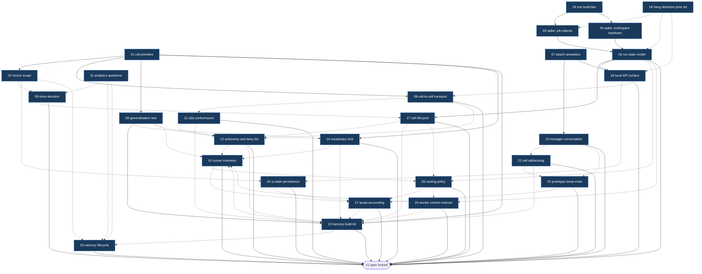

# Map: Farseer v1

Label: `wayfinder:map`

## Destination

A locked v1 specification for Farseer as a **cell runtime**: the cell primitive and its recursion rules, the record contract, the three protocol boundaries, and the worker-control and attach semantics.
Reaching the destination means M0 spikes have answered the scary platform questions and no architectural decision remains open before implementation starts.
It does not mean any of Farseer is built.

## Notes

Domain: local-first agent orchestration on Windows, Rust single binary, no required external services.

Source documents:

- `BRIEF.md` - landscape research, Windows failure catalogue, 35 operator questions.
- `ARCHITECTURE.md` - the cell model proposal this map is deciding on.
- `Inspirationst.txt` - the operator's reference list.

Standing preferences for this effort:

- Every session consults `/grilling` and `/domain-modeling`.
- Research tickets are resolved by a `/research` subagent, and only when the operator asks for one to be spawned.
- Never use the em dash. Plain dash only.
- One sentence per line in markdown.
- Windows native first. mac and Linux are a later subtraction, never a v1 constraint.
- Planning only. This map produces decisions, not deliverables. The M0 spikes are the single exception, and they exist to unblock decisions, not to become the product.

## Decisions so far

- [Is the cell the right primitive?](issues/01-cell-primitive.md) - the cell survives as the unit of addressing plus policy plus record scope, never as a unit of code. **cell definition** (data in git) and **running cell** (live manager plus in-flight workers) are two nouns. Manager mandatory, workers spawn on demand under a cap, and a worker may never spawn. Foreign agents are **runners** over ACP (Zed); foreign orchestrators are **peer cells** over A2A, discriminated by whether they make their own delegation decisions. Cell is data, not a loadable plugin. Runtime is headless from v1 behind one local HTTP API on `127.0.0.1` with SSE. Worker versus tool is decided by supervision, not by whether an LLM is involved. Falsification test handed to `08`.
- [Attach: to a worker or to a run, and what does intervention do?](issues/07-attach-semantics.md) - attach targets a **run** (one worker contract's execution, one record entry), not a process, so live tail and dead-session replay share one surface. Read-only by default with explicit takeover. Rule 4 amended: attach reaches any worker in any cell **whose record farseer owns**, so peer cells are observable but not attachable. No PTY in the runtime; terminal-only runners have their adapter own the PTY and emit events. Intervention appends `operator_intervened`, does not void the contract, and the manager decides whether to re-plan. Run control states `autonomous` / `observed` / `taken over`, with auto-release on dropped connection, and cancel as a separate verb.
- [How do comparable tools detect hangs and handle observation and takeover?](issues/18-hang-detection-prior-art.md) - **the `BRIEF.md` Windows failure catalogue is herdr-specific, not a platform wall.** Every concrete herdr, firstmate and buzz Windows bug found has a stated root cause that is an implementation choice, and a herdr maintainer confirmed Windows attach is unbuilt feature work rather than a limitation. Adopt a no-progress-event watchdog: 120s marks a run `stalled`, 600s flags `likely-hung`, no auto-kill. **The watchdog input was later corrected by [Run state model and control semantics](issues/05-run-state-model.md) to key on activity rather than progress; the two numbers survive unchanged.** Reap with **one Win32 Job Object per worker tree using `JOB_OBJECT_LIMIT_KILL_ON_JOB_CLOSE`**, plus explicit `.cmd` / `.exe` resolution. No surveyed Windows agent tool was confirmed to use Job Objects at all.
- [Rust toolchain on Windows: MSVC or GNU](issues/19-rust-toolchain.md) - **`x86_64-pc-windows-msvc`**, rustup stable 1.98.0. Visual Studio Build Tools 2026 installed with two components only, `VC.Tools.x86.x64` and `Windows11SDK.26100`, no workload and no recommended extras. Ecosystem risk beat the portability preference: crates are tested on MSVC first, and farseer exists precisely to not hit bugs nobody else hits. The portability preference is relocated to farseer's own runtime dependencies rather than the compiler that builds it once. `windows-rs` v0.62.2 verified against `CreateJobObjectW`. Both spikes unblocked.
- [Spike: Win32 Job Object kill-on-close with a real harness child](issues/03-spike-job-objects.md) - **confirmed, and it holds under ConPTY.** A five-deep `.cmd`-rooted tree reaps completely in **300 to 400 microseconds** with zero survivors, while killing the root alone leaves **five of six processes alive indefinitely**. No teardown budget to design around. Three implementation rules fixed: spawn suspended then assign then resume, walk `PATHEXT` before accepting a bare filename, and expect `conhost.exe` in the tree despite `CREATE_NO_WINDOW`. The spike also proved the hard way that **parent-pid tree reconstruction is unsafe on Windows** - a reused pid caused it to terminate an unrelated application - so process identity is `(pid, creation_time)` or job membership, never a pid alone. Spike code: [spikes/jobspike](spikes/jobspike/README.md).
- [Spike: workspace create and destroy under a running dev server](issues/04-spike-workspace-teardown.md) - **`worktree` is the default isolation strategy**, with **zero failures in 60 supervised cycles**, p50 2.5ms and p95 38.5ms. The blocker is not the watcher, Defender or the indexer: **every blocked attempt was `SHARING_VIOLATION` on the workspace root directory, caused by the worker process's own current directory**, proven by an A/B where moving cwd outside the workspace took a live server from 0/5 deletable to 5/5. The ticket's proposed **quarantine-by-rename fallback does not work** and was removed - a directory held open as a cwd cannot be renamed either - so the ladder is two rungs and a stuck workspace is surfaced to the operator rather than papered over. Teardown ordering is a hard constraint: deleting without reaping first does not fail cleanly, it corrupts a live workspace. Spike code: [spikes/wsspike](spikes/wsspike/README.md).
- [Run state model and control semantics](issues/05-run-state-model.md) - the five inherited states were never one enum but **three orthogonal axes**: lifecycle (`queued`/`running`/`finished`), control (`autonomous`/`observed`/`taken over`), and liveness (`live`/`stalled`/`likely-hung`), the last **derived from a timestamp and never stored**. **Corrects `18`:** the watchdog keys on **activity** (any bytes) rather than **progress** (tool call, tool result, status change), because a model reasoning for twenty minutes emits no progress events and is not hung; the 120s and 600s numbers survive, the signal they measure does not. Budget catches waste, the watchdog catches silence. The liveness clock pauses whenever control is not `autonomous`. Auto-release is a **30s heartbeat, released after two missed beats**, not a wall-clock timeout. A **worker contract is immutable** (goal, workspace, runner, tool grants, autonomy, budget, definition-of-done), so the manager gets four verbs - **steer** within it, **re-scope** into a new run, **cancel**, **re-run**. `cancelled` is never `failed`. Intervention never tightens autonomy. A stuck workspace becomes the cell's problem as an `orphaned` workspace swept at startup, never a run that refuses to close. **Later corrected by [Worker control channel](issues/20-worker-control-channel.md): steering is turn-boundary granular, not interrupt granular, because no surveyed harness supports interrupting a turn in flight.** Amended again for compaction: the liveness clock also pauses during a known compaction, since a server-side compaction is silence and would otherwise trip a false `stalled` on the longest runs - see [context-compaction.md](research/context-compaction.md).
- [What is the local API surface?](issues/16-local-api-surface.md) - **bespoke HTTP plus SSE is the substrate, and an ACP server sits on top of it as a first-class adapter.** The ordering is the decision: ACP covers roughly a fifth of a fleet surface, so making it the transport would deform every other operation into a custom extension. berd's precedent does not transfer because berd is a single-agent app. One ACP session maps to one cell manager conversation; roster, lifecycle and **attach and takeover are deliberately not exposed over ACP**. One scoped stream endpoint, and **replay and attach-mid-run are the same call with a different cursor**. The stream is **explicitly lossy** with an in-band `gap` event, because **a slow client must never slow a worker**. Definitions stay files in git with read, validate and reload but no edit path. Instructions are fire-and-forget. All four manager verbs are operator-callable, and operator-initiated re-scope and re-run leave an event behind. `/v1/` additive-only, a promise that exists purely for third-party UIs. Token in a user-ACL'd file and a URL fragment, plus **`Origin` validation, since a token alone does not stop DNS rebinding**.
- [Cell-to-cell transport: in-process envelope, A2A endpoint, or both?](issues/06-cell-transport.md) - **both, and the ordering is the decision.** A typed internal envelope is native and never serialized; a real A2A endpoint ships as an alternative surface, **off by default**, reached by mapping that envelope at the boundary. `ARCHITECTURE.md`'s A2A-shaped in-process bus is rejected on the same reasoning `16` used against ACP-as-substrate: an external protocol is spoken at a boundary, never shaped into internals. The envelope is `05`'s contract **minus what the callee owns** - no workspace, no runner, no tool grants - because **the caller states what it wants and what it will pay, the callee decides how**; `autonomy_ceiling` rather than `autonomy`, since a ceiling composes safely under nesting. Cell calls are fire-and-forget, and **a cell call is a run in the calling cell**, which dissolves failure ownership into `05` rather than needing new machinery. Farseer may be consumed as a runner by another orchestrator, but **declares at ACP handshake that it is an orchestrator**, so a caller fails at connect time rather than mid-task. Local cells get a stable `cell_id` and no cryptography; foreign callers get a **bearer token per peer**. Spec facts split to `21`.
- [Record scope: global with visibility, or private per cell?](issues/02-record-scope.md) - **the tension was false.** `BRIEF.md` and `ARCHITECTURE.md` conflict only if storage and visibility are the same thing: it is **one physical append-only log with cell-scoped visibility**. **The log is not session history** - farseer owns the log, the harness owns the transcript - which yields three categories with different rules: **events** (runtime-observed, scrubbed, queryable), **memory** (agent-written claims, scrubbed, queryable), **attachments** (unscrubbed, out of band, pointer only). Memory is scoped **by kind not by cell** - global, cell-local, run-local - and the global tier is what `BRIEF.md` was actually promising. Two ids, because **UUIDv7 is only k-sortable and cannot carry a cursor**: `event_id` UUIDv7 for portable identity, `seq` monotonic integer for the cursor. Every event carries an `actor`. **The record outlives the cell** - delete removes the definition binding, purge is a separate louder verb. The MCP face is query plus memory-write and **never raw event append**, because an agent that can forge events can rewrite its own history. **Scrub on write, never at read**, and attachments are not scrubbed, which is why farseer takes no custody of them by default. Resolves the raw-PTY fog entry by generalising it into the attachment category.
- [What does a non-coding cell need that a coding cell does not?](issues/08-generalization-test.md) - **the primitive survives and `01` is not reopened.** Working every question added **zero fields**. Review is over **artifacts**, and artifact type is discovered from the file rather than declared. A non-coding cell needs no git, because `plain directory` is a third value in the workspace-strategy slot `04` already created. Credentials dissolve - farseer never holds them, MCP servers do, and `tool grants` already exists. Two things did change, and neither is a field: **the word "runner" is wrong**, since a runner is anything satisfying the worker control channel contract and an `ffmpeg` render qualifies, handed to `14`; and **irreversibility is a missing policy dimension**, handed to `12`. Scheduling stays out of the runtime but ships in the box - **triggers are API clients, not subsystems**, with cron calling the local API and hooks subscribing to the SSE stream, which is `16`'s boundary carrying triggers for free. The social roster is two worker kinds plus tools plus a manager, which is **thinner than the coding cell but still a cell**.
- [Which analytics questions must the record answer?](issues/11-analytics-questions.md) - **four questions, three entities, two edge kinds.** Cost per **successful** run by cell/runner/model, **intervention rate**, rework rate, and which lessons actually reduced failure rate. Research changed two of them: cost must be per *successful* run, since agentic coding averages 1 to 3.5M tokens per task **including retries** and a raw figure cannot separate work from thrashing; and **intervention rate was missing from the candidate list entirely** despite appearing in every practitioner metric set, is already emitted by `05` and `07`, and most directly measures whether farseer works at all - a fleet you babysit is not a fleet. **Cut: the file entity** (expensive, coding-only, and `08` made artifact the general concept) and dead ends (a memory feature, not a query). Latency percentiles, CSAT, escalation rate and ROI deliberately not adopted as team metrics irrelevant to one operator. Only one new edge exists: `run -> consulted -> memory`.
- [Worker control channel: ACP (Zed) first, or headless JSON per harness?](issues/20-worker-control-channel.md) - **the question dissolved.** `08` made a runner anything satisfying the contract, so ACP and headless JSON are two **implementations**, not two candidates. v1 ships both: an **ACP runner** as the default path, and **one native runner** (Claude Code `stream-json`) because a runner interface with one implementation is a wrapper, not an interface. **ACP maps onto `05`'s activity/progress split almost exactly** - `agent_message_chunk` and `thought` are activity, `tool_call`/`tool_call_update`/`plan` are progress - which is independent convergence on the same distinction. **Corrects `05`: nobody supports mid-run steering.** ACP is strictly sequential, `codex exec resume` is a new process, Claude Code `-p` is one-shot, so **steering is turn-boundary granular, not interrupt granular** and farseer must not promise otherwise. **Gemini CLI and opencode fail the activity test outright** and cannot be runners as-is, which is evidence the disqualifier has teeth. Adapter governance improved (now `@agentclientprotocol/claude-agent-acp`) but real defects are open, including a reported 200K context cap that is a material capability loss and the concrete reason the native path must exist. **Test 3 later corrected by `10`:** Claude Code supports `--input-format stream-json`, accepting follow-ups into a live process, so it passes under this ticket's own corrected definition of steering - and that separates it from Codex, whose `exec resume` replays into a new process.
- [Store: SQLite edge tables and CTEs, or an embedded graph engine?](issues/09-store-decision.md) - **SQLite, not close.** Benched at 100x the honest target (2M events, 291MB): **cursor scan p99 425us**, and a 10x data increase moved it only from 299us to 425us, because `seq` is `INTEGER PRIMARY KEY` and therefore the rowid, making the hot path effectively scale-invariant. `02`'s insistence on a monotonic integer alongside UUIDv7 turns out to be the load-bearing decision. The **recursive CTE** over the rework chain - the query a graph engine would supposedly be needed for - answers in **790ms at 100x scale**, single-digit ms at the real target. Under a continuously appending writer the reader degrades **13% at p99** while the writer absorbs the contention, which is the correct direction. Single-writer holds by construction, since `02` gave farseer one owning writer and workers emit rather than write. **Kuzu was archived 2025-10-10** (Apple acqui-hire, confirmed by an EC filing) and **LadybugDB is a healthy fork**, so the option is real and still wrong: two edge kinds is a join, not a graph. DuckDB deferred, tiering kept as a design hook. `rusqlite` with `bundled` compiles from source on the `19` toolchain, so **the store adds zero install surface**. Bench code: [spikes/storebench](spikes/storebench/README.md).
- [A2A conformance: task model, Agent Card, discovery](issues/21-a2a-conformance.md) - **viable, and lossy in exactly one direction.** A2A v1.0 is stable and under the Linux Foundation. The **task lifecycle maps almost perfectly** onto `05`'s: seven states including `CANCELED` distinct from `FAILED` (satisfying `05` natively, and *better* than the native harnesses `20` rated "weak"), and `INPUT_REQUIRED` as a resumable interrupt that is exactly `01`'s gated action. Async-first with `returnImmediately`, matching `06`'s fire-and-forget. Results are **Artifacts**, converging independently with `08`. Three real gaps: **`SubscribeToTask` gives a state snapshot plus live, not `16`'s cursored backlog replay**, so a peer cell's history is unrecoverable through A2A - which is why `07` was right to make peer cells observable but not attachable; **four of eight envelope fields have no native home** (`autonomy_ceiling`, `budget`, `definition_of_done`, `deadline`), so **a foreign callee is unbounded by construction** and enforcement must live in the calling cell's run; and **A2A cannot express "I am an orchestrator"** at all, so `06`'s advertisement is prose over A2A where it is structured capability negotiation over ACP. There is **no health check in the spec** - discovery is a well-known URI and freshness is plain HTTP caching. Per-peer bearer token fits `HTTPAuthSecurityScheme` natively, and `from_cell` is derived from auth rather than asserted.
- [Vocabulary and naming lock](issues/14-vocabulary-lock.md) - **the glossary is authoritative and every later document uses it.** Two renames. **`seat` becomes `runner`** across everything, because `08` found the word wrong - an `ffmpeg` render is a worker whose contract needs one, and nothing sits there; "runner" is already the industry word for a slot that executes work agnostic to what is inside, and there is no code yet, so this was the cheapest moment it would ever be. **`envelope` is retired as a noun**, caught while assembling the glossary: `05` used it for the worker contract and `06` for the cell-call payload, overlapping fields and one word, which is exactly the ambiguity this ticket exists to prevent. Replaced by **`worker contract`** and **`cell call`**. Kept: **cell** (because `harness` is already taken by the thing farseer orchestrates, and cells contain cells), **manager** (**the corporate metaphor is a good mental model and a bad vocabulary** - "CEO" only fits cell #0, and "manager" is scale-free), **task** (no longer provisional). **Cut: Chronicler and Librarian** - `02` created no such processes, so naming them implies daemons that do not exist. **`session` narrowed** to a runner's own conversation with its model, owned by the harness, because every dependency already uses the word. CLI is **`farseer`** with **`fsr`** as an alias, never `fs`.
- [Cell lifecycle: pause, resume, archive, delete](issues/17-cell-lifecycle.md) - **pause means drain, never suspend.** The manager stops starting new runs and in-flight runs finish; suspending an agent mid-API-call corrupts it, and `03` made cancel sub-millisecond, so the one place Windows process semantics would have bitten, farseer simply does not go. **A running cell does not survive a restart, and that trade was already made in `03`**: kill-on-close means every worker tree dies with the runtime, which is exactly what prevents orphan storms - farseer chooses **no orphans over run survival**, and orphaned `running` runs become `finished(failed)` with reason `runtime_restarted`. **The run pins the definition, not the cell**, so reload always succeeds, never touches an in-flight run, and applies to the next - reusing `05`'s contract immutability instead of inventing versioning. Three verbs increasing in violence: **archive** (reversible), **delete** (keeps the record, reversible via git), **purge** (**the only irreversible verb farseer owns**, and partial by cell or date range). **Cell #0 can be archived, never deleted.** Purge writes a **tombstone** and emits **`void`** rather than `gap`, so a permanent hole is distinguishable from a recoverable one and the record stays honest about its own completeness. Definition versioning stays in plain git.
- [Autonomy grants, the deny list, and the delivery gate](issues/12-autonomy-and-deny-list.md) - **the deny list prevents mistakes, not attacks**, and no document may imply otherwise: without a sandbox `deny read .env` is defeated by `cat .env`. That relocates the real control - **grant lists beat deny lists**, the tool grant is the only isolation v1 has, and **if shell is granted, everything is granted**, which a cell must accept explicitly rather than by assumption. **The workspace boundary is the autonomy boundary**: write and commit freely inside it, never push or merge, reusing `04`'s isolation as the policy line. **Farseer never merges in v1**, because `11`'s intervention rate only measures anything while the human is the gate. Irreversibility gets **three levels** - `reversible`, `undoable`, `irreversible` - and **the top level is never lowerable per cell**, or unattended payments are one file edit away. Everything composes by narrowing only: deny lists union, ceilings take the minimum, and a callee may refuse a ceiling too low rather than failing later. **A foreign peer cell is an `irreversible` tool**, which answers all three of `21`'s questions at once. **Purge is operator-only** - forge and destroy are two halves of one threat - and retention purge is a scheduled trigger, not an agent. The delivery gate is a **tool**, not a field, and a non-coding cell needs no stricter default because **policy attaches to the tool, not the cell**. **Later confirmed by measurement in `10`:** Codex CLI's `--sandbox read-only` accepted the flag and created the file anyway on this machine, so the tool grant really is the only isolation - and a runner advertising a sandbox that does not enforce is more dangerous than one that does not advertise, because reach must be recorded as **observed, never advertised**.
- [What does "farseer builds a harness" actually produce?](issues/13-harness-build-kit.md) - **`ARCHITECTURE.md` was right: a cell definition plus scaffolding, never generated code.** The definition **fits on one page** and holds nine things, all inherited rather than invented. It is a **file in git, not a database row**, and versioning is plain git per `17`. **A dry run is not a mode - it is a run with `autonomy_ceiling` clamped to `reversible`**, which reuses `12`'s levels and, because `06` made ceilings narrow only, **propagates into every called cell for free**. Survey: **prime-agent**'s Continual Harness independently confirms `02`'s memory tiers and sharpens them - **the default write tier should be run-local, not global**, with promotion earned by `11`'s fourth question. **OpenClaw**'s workspace / agent-dir / session split converges with farseer's, and warns that reusing an agent dir across agents collides auth and session state. **deepseek-harness disagrees outright** - everything is a plugin, no privileged core, 95k stars in two days - and the honest reading is that it and farseer **agree on the goal and differ on the mechanism**: an in-process ABI versus out-of-process protocols, where `01`'s reasoning about a Windows ABI survives the counter-example. Collected the six **non-fields** a kit may never emit.
- [Prototype: one operator turn, end to end](issues/15-manager-conversation.md) - a full written transcript of "post about X on social media", from what the operator types to what comes back. Artifact: [one-operator-turn.md](prototypes/one-operator-turn.md). **The ticket's premise was stale** - it asked for an A2A call, and `06` had since made local cells take the in-process path, so it is written as a **cell call** with the A2A version kept as a contrast. **Found five gaps**, graduated into `22` and `23`, the largest being that **nothing on the map justifies cell #0 knowing the social cell exists** - `01` gave a cell a roster of workers and tools and never put callable cells in it. **Confirmed three things**: `06`'s caller/callee split reads as a brief rather than a configuration and the missing workspace and runner fields are a feature you can feel; `08`'s artifact concept survives a real non-coding example; and a gated action is a **state, not an error**, matching what `21` found in A2A's `INPUT_REQUIRED`. Section 11 replays the same turn against a **foreign** harness and loses attach, replay and every bound the caller set - the strongest argument for keeping the social harness a farseer cell, and more persuasive as a worked example than as a principle.
- [Which cells may a manager call, and does an instruction route or delegate?](issues/22-cell-addressing.md) - **the last question that could have added a field, and it did not.** The collision it recorded dissolved once the **grant mechanism** and the **supervision classification** were treated as independent: `12` made the allowlist the grant, `01` made supervision the classifier, and something can be granted without being a tool. So **a callable cell is a third entry kind in the roster**, alongside workers and tools - no new field, `08`'s test intact, a cell with no cell entries still coherent. An operator instruction **delegates, never routes**: one task, one owner, because routing would give the operator two conversation partners for one request and make `11`'s cost attribution ambiguous. **An ungranted cell stays ungranted even when the operator names it** - the fix is edit-and-reload, which leaves a git commit where a conversational override would not. A cell entry carries a **maximum `autonomy_ceiling`**, reusing `06`'s ceiling, and a foreign peer entry is pinned at `irreversible` per `21`. **Cycles are refused by the runtime**, and that is a safety measure rather than tidiness until `23` settles whether budgets narrow.
- [Three loose ends the prototype exposed](issues/23-prototype-loose-ends.md) - **a ceiling is compared, a budget is drawn down.** That distinction is the whole first answer: a ceiling is a level checked once, a budget is a quantity, so a callee's spend **decrements the caller's remaining pool** rather than merely being compared against its original figure - otherwise three sequential $2 calls spend $6 under a $2 parent. Defaults come from three narrowing layers: the definition of the cell where the task started, the roster entry's cap, and the caller's remaining budget as the hard limit. That makes `11`'s headline metric honest, and downgrades `22`'s cycle refusal to a convenience - **which stays in v1 anyway**, because a bounded infinite loop still burns a real budget. **`edit` is takeover**, word for word from `07`, so `16` needs no third verb and **the gated-action prompt and the attach surface are one surface** - a constraint on presentation, not storage, since the record cannot distinguish them. And the lifecycle gains a fourth terminal outcome, **`abandoned`**: the *manager* decided a queued run was unnecessary, where `cancelled` means a *human* chose and `failed` invites a retry. Excluded from `11`'s cost denominator, surfaced as a planning signal, because a manager that abandons half of what it queues is planning badly.
- [Where does UI state persist?](issues/24-ui-state-persistence.md) - **not the record, and not ephemeral either.** The map had conflated those: a canvas layout is not a thing that happened, so `02`'s append-only log is the wrong home, but that is no reason for the command center to come back vanilla on restart. Farseer stores it as an **opaque blob** under two verbs on one key, in a table separate from the event log - mutable, last-write-wins, no `seq`, and **no event emitted on write**, since a cursor drag is not history. Farseer holds it rather than `localStorage` because that is per-origin per-browser, a Tauri window and a browser tab would not share it, clearing site data destroys the dashboard silently, and farseer's data directory is what gets backed up. **Opaque means opaque**: farseer never parses a blob or follows a reference inside one, so a layout pinning a purged cell is the UI's problem to skip - the alternative is a schema farseer owes forever under `16`'s additive-only promise. It is therefore the **second unscrubbed thing** after attachments, excluded from `11`, and untouched by `17`'s purge. Two invariants keep opacity from being a hole: **1 MiB per key** or a UI eventually stores a screenshot, and an opaque key string farseer never splits. **No concurrency control, by citation rather than shortcut** - `01` ruled concurrent clients out of scope, and a lost update needs two writers. The line that matters: everything about runs, cells and cost stays reconstructible from a query plus a cursor, and this blob holds **view preference only**.
- [Runner inventory: what accounts, quotas and auth modes actually exist?](issues/10-runner-inventory.md) - **the tiers are Pro and Plus, and one runner tells farseer where it stands on every run.** The machine half was settled by probing; the operator half changed two conclusions. **Claude Pro rather than Max, ChatGPT Plus rather than Pro**, which does not unseat Claude Code as primary runner but does mean **exhaustion is routine rather than an edge case** - promoting the routing and quota fog from useful to load-bearing. Item 4 was then answered by measurement, because the documented path was wrong: Anthropic exposes quota through a **status line**, and a configured status line **provably never fires in `-p` headless mode**. The real path is better than documented - a headless run emits **`rate_limit_event`** in-band on a **successful** turn, carrying `status`, `resetsAt` as unix epoch, `rateLimitType`, and the overage state, so **farseer never has to hit a limit to know where it stands**. Cost arrives the same way as **`total_cost_usd`** plus per-model `costUSD`, making `11`'s headline metric native and in currency. **Codex and cursor-agent have neither** - tokens only, so exhaustion must be inferred from failure and cost priced by farseer, an asymmetry invisible to `05`'s four contract tests and more consequential on Pro than the tests are. **cursor-agent was the surprise**: believed unsubscribed with no quota, actually logged in and working, reaching **Opus 5, GPT-5.6 Sol, Fable 5, Grok and Gemini through one subscription** - which is how the operator's supervisor/worker/reviewer design becomes affordable on Pro. It passes activity and progress, fails follow-up for the same reason Codex does, and cancel is left explicitly unevaluated. Two incidental findings carry weight: **two of three runners refuse a fresh directory** (`--trust`, `--skip-git-repo-check`), and `04` hands every run a fresh worktree; and a one-word prompt cost **$0.32** because the run loaded the invoking environment's plugins as 32k cache tokens, so a worker inherits a token tax for tooling `12` never granted it.
- [Memory lifecycle: promotion, retraction, and who is allowed to do either](issues/25-memory-lifecycle.md) - **the map assumed tiering bounds a bad lesson. Hermes bounds it with a budget instead.** Researched at the operator's direction, and Hermes Agent turns out to have **no tiers at all**: one flat store with a hard character cap where an over-cap write **errors rather than silently dropping**, forcing consolidation in the same turn. Scarcity is the feature, in the most widely deployed curated-memory design there is. That resolves this map's **first outright contradiction between two closed tickets**: `02`'s **cell-local** default stands, and `13`'s blast-radius worry is answered by **a per-tier size cap that errors**, a mechanism neither ticket proposed. `13`'s own fix - a run-local default - is rejected on two costs only visible once written down: run-local is `02`'s word for scratch that dies with the run, so it makes memory do **nothing** until promotion exists; and it creates a chicken-and-egg with `11`, since a lesson that dies with its run has n=1 forever and statistics can never promote it. The cap dissolves both, and **`11`'s evidence governs eviction rather than promotion** - the only direction the statistics support. Promotion is **tiered by blast radius**: the manager decides `cell-local`, the operator gates `global`, because global is the only tier crossing cells. Automatic-on-evidence is rejected for making `11`'s metric a control input over what it measures; agent-requested is rejected as `02`'s forge threat in another costume. Retraction is a **superseding tombstone**, never a removal, which forces a divergence from Hermes' destructive `replace`/`remove` and means **consolidation is also an append**. Two independent convergences recorded: Hermes splits memory **by kind, not by scope**, which is `02` section 4 arrived at separately and the third outside confirmation after prime-agent and A2A; and it **scans on write** for injection, credential exfiltration and **invisible Unicode**, which is `02`'s scrub-on-write with a threat model farseer had not considered.
- [Routing policy: does farseer choose a runner, and what happens when one runs out?](issues/26-routing-policy.md) - **the author asserts equivalence, farseer never infers it.** A roster entry holds an **ordered list** of runners and a one-item list is a pin, so nothing changes for a simple cell; `12` made reach observed rather than advertised, and a full-shell agent and an `ffmpeg` adapter share nothing, so only a human can judge two runners substitutable **for a given worker kind**. Additive like `22`'s third entry kind, so `08` is not reopened - but the definition's promise weakens honestly to **the candidate set**, with `11` recording what ran. The asymmetry `10` found is **normalised at the adapter**, which reports `available` / `exhausted_until(t)` / `unknown`, giving the router one code path instead of two that drift; **`unknown` is permanent, not a transitional shim**, since most runners will never report a window. A run killed by exhaustion is **`failed` with reason `runner_exhausted`**, reusing `17`'s orphaned-run pattern rather than adding a fifth outcome, and **`11`'s rework rate excludes it** exactly as `23` excluded `abandoned` from the cost denominator - the operator's window turning over is not the agent doing a bad job. **The operator overrode the recommendation on budget-aware routing, and was right.** The draft assumed cost is a slope a router shaves; `10` measured that it is **a cliff at exhaustion** - a subscription run costs nothing marginal until the window closes, after which only a pay-per-token overflow continues, which Claude Code reports in band as `overageStatus`. So budget-aware and quota-aware routing are **one mechanism**, and a router that ignores budget cannot express "keep working, but not at $6 a task" - the most valuable sentence available on a Pro account. Three constraints keep it honest: reordering only **within** the author's list, a **reorder emits an event** or `11`'s numbers cannot be explained, and an **estimated cost is marked estimated**, since only Claude Code reports currency. The price table lives with **runner config**, not the cell definition.
- [Credit and quota accounting: a subscription allowance is not money](issues/27-quota-accounting.md) - **a budget is allocated, a window is observed**, and that distinction settles the last question on the map. Every part of `23`'s budget model fails for a subscription window: no caller owns it, every cell on the account shares it simultaneously, and it is drained by sessions farseer never started. So quota is **not a third budget dimension** - it is a **runner property**, and `26` already built the slot as the `available` / `exhausted_until(t)` / `unknown` availability signal. Quota accounting is that signal recorded over time plus farseer's own spend attributed to windows. The utilisation surface shows **`allowed`, a `resetsAt` countdown, and what farseer itself consumed** - never a percentage, because `10` proved `used_percentage` is unreachable headless and farseer's own consumption is only a **lower bound** that would be most wrong exactly near exhaustion. **"How much of my window is left" was never the fleet question**; "what has the fleet spent and which cell is spending it" is, and that is exactly answerable. Accounting is keyed by **account** and display by **runner**, because two runners on one login share one window - the operator declares an `account` string in runner config and farseer never infers it, per `12`. Storage is **append on change, derive current**: observe every run, append only on a status flip or a changed `resetsAt`, so the log records **window transitions** - which makes "how often did this account exhaust" a scan of a few rows - and current state derives from the latest event exactly as `05` derives liveness. **It cost the primitive nothing**: no field, no store, no lifecycle state, the runner property from `26`, the derive-don't-store pattern from `05`, the event shape from `02`.

## Not yet specified

Fog that is in scope but not yet sharp enough to ticket:

- **UI shape.** Manager chat, fleet view, board, graph explorer. The attach surface is now constrained by `07`: a rendered event stream over one run, live or replayed. What remains is layout and the rest of the surfaces. Now waits only on the conversation prototype, since `16` closed and fixed what the UI can actually ask for.
  [block/berd](https://github.com/block/berd) is worth a look here for its **customizable canvas**, a spatial arrangement of agent work rather than a chat column. Not the fleet model farseer wants, but a UI idea the fleet view may want to steal. Its transport lesson was taken up and decided by `16`.
  **Persistence is no longer part of this fog.** [Where does UI state persist?](issues/24-ui-state-persistence.md) settled it: an opaque blob farseer stores and never parses, so the command center comes back the way it was left. What remains here is **layout and the surfaces themselves**, which is a design question rather than a storage one.
- **Retention.** `02` fixed scrubbing (on write, events and memory only) and the three categories, so what remains here is narrower: how long events are kept before tiering to Parquet, how long attachments survive, and whether retention is per cell or global. Waits on the store decision, since the tiering mechanism decides what retention can cheaply express.
- **Self-modification.** Whether cell #0 may change Farseer itself, and under what gate.
- **Migration.** Whether existing firstmate state is imported or abandoned.
- **Sandbox upgrade path.** Microsoft Execution Containers as a v2 isolation story.
- **Dev Drive and block-clone snapshots as a second isolation strategy.** `04` chose `worktree` on its own merits and could not evaluate `snapshot` at all: both volumes on this machine are NTFS, and creating a Dev Drive needs administrator rights this environment does not have. So `snapshot` is unevaluated rather than rejected. It would be a performance optimisation on a strategy that already works, never a fix for one that does not. Waits on a machine with a ReFS volume.

## Out of scope

Consciously ruled beyond this destination. These do not graduate.

- **Building a token-level model router.** Delegate to NeMo Switchyard or LiteLLM behind a per-runner base URL. Farseer owns runner routing only.
- **Multi-human collaboration.** One operator. Buzz already occupies the shared-workspace-with-many-humans space.
- **Cloud or remote execution of workers.** Single machine for v1. Workspace paths may be assumed local.
- **mac and Linux support in v1.** Portability is a later milestone, and is expected to be a subtraction of Windows workarounds.
- **Code-symbol graph ingestion.** Symbols, call edges and test-to-file links need language-specific parsing and are a far larger job than the process graph. Process graph first.
- **A farseer plugin ABI.** Ruled out by [Is the cell the right primitive?](issues/01-cell-primitive.md). A cell is data the runtime interprets, and the real extension points are MCP servers for tools and ACP adapters for runners, both already out-of-process. A dynamic-loading ABI on Windows is a support burden that cannot be walked back.
- **Concurrent clients on one live session.** Ruled out by [Is the cell the right primitive?](issues/01-cell-primitive.md). The operator wants to swap between UI variations one at a time, not run them side by side. SSE makes fan-out nearly free so it is not designed against, but nothing in v1 may depend on it.
- **Autonomous cell generation by cell #0.** Deferred by [Is the cell the right primitive?](issues/01-cell-primitive.md) as a later milestone: it needs an interview flow, a dry-run mode and definition versioning, none of which the primitive requires. v1 hand-writes the second cell definition. `13 harness build kit` remains in scope as the question of what a cell definition must contain.
- **Non-farseer dashboard widgets.** Trading, weather, calendar and the rest of a command-center surface. They are UI-side data sources with no farseer concept behind them, and pulling them into the runtime would make farseer a dashboard host rather than a cell runtime. The enabling decision is already made and needs no ticket: `16` gave a versioned local API, and a UI that reads farseer through it can read anything else it likes alongside. **Utilisation, cost and kanban are different** - those are farseer's own data and are in scope through `11` and `02`.

## Route

Blue is closed, and everything is blue. No ticket remains open, so there is no frontier left to draw.
A dotted edge is an informing dependency, not a blocking one. `18` supplied mechanisms and numbers to `03`, `05` and `16`; `05` supplied a contract-test list to `20`; `16` handed `06` a question it created; `06` handed `21` a cell call and `12` a composition rule; `02` handed `09` its storage requirements; `08` handed `14` a bad word, `12` a missing dimension and `10` a wider inventory; `11` handed `09` a schema small enough to rule out a graph database; `20` handed `10` two disqualified tools and `13` a reason to emit ACP; `09` handed `17` the purge-leaves-holes problem; `21` handed `12` an unbounded foreign callee and `13` a card to generate; `14` handed `10` a retitle and `13` an authoritative glossary; `17` handed `12` an inward-pointing irreversible verb and `13` a stable id rule; `12` handed `10` a reachability column and `13` its two policy fields; `13` handed `10` the fact that it is a menu, not a survey; `10` handed `20` a corrected test score and `12` a measurement; `15` handed `22` and `23` everything it found; `22` handed `23` a load-bearing budget question and `13` a third roster entry kind; `02` and `16` handed `24` the two boundaries it had to stay inside.

**The map is complete. Twenty-seven tickets, all closed, no fog blocking a decision.**

**The v1 specification is locked in every respect the Destination named**: the cell primitive and its recursion rules, the record contract, the three protocol boundaries, and the worker-control and attach semantics.
Beyond those, this map also settled the store, the vocabulary, the cell lifecycle, the policy model, the cell definition, cell addressing, UI state, memory lifecycle, runner routing and quota accounting.

**Nothing remains to decide before implementation starts.**

**The primitive was falsified against and survived, repeatedly.**
`08` worked every question a non-coding cell raises and added **zero fields**.
Four times afterwards a later ticket's answer was **determined by `08`'s test rather than by preference**, most recently `22` - the last question that could plausibly have added a field, and did not.

Three spikes under `spikes/`, all reproducible: `jobspike`, `wsspike`, `storebench`.
Three research notes under `research/`, and one prototype under `prototypes/`.

**Corrections happen on this map, and that is working as intended.**
Every correction is recorded on the corrected ticket itself as well as here, so nobody reads a stale version:

- `05` corrected `18` - the watchdog keys on **activity**, not progress.
- `20` corrected `05` - steering is **turn-boundary granular**, not interrupt granular.
- `10` corrected `20` - Claude Code **passes** contract test 3 via `--input-format stream-json`.
- `10` **confirmed `12` by measurement** - Codex CLI's `--sandbox read-only` did not prevent a write on this machine.
- `22` **widened `14`** - `roster` now covers workers, tools and callable cells.
- `23` **amended `05`, `11`, `16` and `22`** - a fourth terminal outcome, an honest cost metric, one fewer API verb, and a downgraded cycle refusal.
- `24` corrected **this map** - a fog paragraph claimed UI state "should not get" a home, conflating *not in the record* with *not persisted*. The operator caught it. Recorded here because the correction was to the map's own prose rather than to a ticket, which is the one place a stale claim has nothing pointing at it.
- `24` **amended `02`, `11`, `16` and `17`** - a fourth non-record category, one exclusion from analytics, two opaque API operations, and one verb that deliberately does not reach.
- A consistency pass on 2026-08-23 found `14`'s two renames had **not** been applied to three tickets that closed before it. `01`, `02` and `21` now carry the note, and `01`'s also records that **`06` rejected its A2A-shaped in-process bus** - the one place a superseded design had nothing pointing at it.
- `26` **corrected its own recommendation** - the operator overrode budget-aware routing and was right, because `10` had measured a cost **cliff** at exhaustion where the draft assumed a slope.

**None reversed a decision.** Each narrowed a promise, hardened a fact, widened a word, or added an enum value.

Two tickets were **split** rather than answered, because a research question and a grilling question bundled into one ticket cannot resolve in one session: `20` from `05`, `21` from `06`.

Two tickets were **created by a prototype** rather than by charting. `22` and `23` both came out of writing one operator turn on paper, and `22` turned out to be the largest question the map had gone nineteen tickets without noticing. That is the strongest argument on this map for cheap concrete artifacts over more discussion.

Four tickets were **resolved by research or benchmark rather than by preference**, because the operator had no prior view and said so: `11`, `09`, `20` and `13`.
That is legitimate, and is not the agent answering its own questions.
