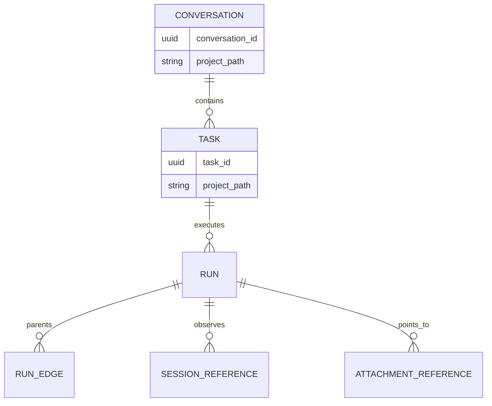

# Operator UX and orchestration review, 2026-09-04

Status: review, not a decision or implementation plan.

This review evaluates the current canvas, every shipped widget, the proposed conversation and kanban experience, harness selection, harness-owned logs, and the core-versus-extension split.
It preserves the closed decisions unless it explicitly identifies a correction that needs its own ticket.

## Recommendation

Keep Berd's canvas as the home screen and use Orca's orchestration ideas inside a smaller set of operational widgets.
Reduce the default canvas from ten mounted widgets to four first-party widgets: **Conversation**, **Work**, **Fleet**, and **Capacity**.
Treat a card as a stack of related faces rather than creating separate permanent cards for list, detail, configuration, and history.
Do not implement a literal 3D flip as the navigation model.
Use an explicit face title, breadcrumb, Back action, keyboard focus restoration, and a reduced-motion crossfade or slide, with a subtle flip animation only as decoration.

Build the durable work model before redesigning the cards.
The current runtime has runs and a `TaskId`, but it has no task row, farseer-owned conversation, project association, kanban state, session-reference index, harness-log pointer, or process-resource surface.
Building those as widget-local state would make the UI a second source of truth and would repeat the failure the record was created to prevent.

There is still no case for a farseer runtime plugin ABI.
Core invariants belong in Rust, protocol-specific observations belong in runner adapters, first-party operational views belong in the shipped UI, and agent-authored widgets remain sandboxed presentation extensions.

## Vocabulary correction

The proposed UI **thread** must not become a farseer core `thread` or `session`.
The locked glossary reserves **session** for a harness-owned conversation, and Codex already calls its harness-owned session a thread.
Farseer needs a durable **conversation** that groups operator turns and tasks while surviving runner changes and harness session replacement.
The UI should label it **Conversation**, not Thread, unless a later vocabulary ticket deliberately accepts the collision.

The relationships are:

- A **conversation** is a farseer-owned operator context.
- A **task** is one operator request inside a conversation.
- A **run** is one worker contract's execution inside a task.
- A **session** is the harness-owned conversation observed for one run.
- A **project** is an authorized directory that may scope a conversation and its tasks.

This is additive to [Vocabulary and naming lock](issues/14-vocabulary-lock.md), but the new noun needs a correction appended there before implementation.

## Berd plus Orca

Berd contributes the calm, rearrangeable command-center home and the rule that the operator can recognize current state without opening a control room.
Orca contributes orchestration depth: work decomposition, visible participants, task ownership, intervention, and drill-down into active execution.
The combination should not copy Orca's terminal-pane substrate or treat terminal state as runtime truth.
Farseer's record, run controls, Job Objects, and replay remain the substrate.

| Concern | Berd contribution | Orca contribution | Farseer decision |
| --- | --- | --- | --- |
| Home | Arrangeable command-center canvas | Active orchestration overview | Keep the canvas and make orchestration one of its first-party faces. |
| Conversation | One obvious place to type | Work-specific coordination | Keep one top-manager composer and bind each submission to a conversation. |
| Work tracking | Compact status cards | Thread and task hierarchy | Use Conversation -> Task -> Run, never infer hierarchy from panes. |
| Execution | Calm summaries | Multiple harnesses and subagents | Show a normalized run graph with capability badges and direct run verbs. |
| Detail | Card-focused inspection | Deep session and worker inspection | Drill through faces on the same card, with an optional expanded overlay still owned by that widget. |
| Truth | UI composition | Live orchestration state | The record and projections are truth; widget state is presentation only. |

The canvas remains the only top-level surface, preserving [What does the operator look at, and what is a widget?](issues/28-operator-surface.md).
Conversation selection, project selection, run selection, and board scope become subject context carried by first-party widgets.
Every AI request still goes to the top manager.
Direct verbs such as cancel, steer, observe, take over, and release still target runs without going through a conversation.

## Recommended default canvas

| Widget | Default size | Front face | Related faces |
| --- | ---: | --- | --- |
| **Conversation** | `2x2` | Selected conversation and composer | Context, participants, manager harness, session references, attachments. |
| **Work** | `2x2` | Global kanban or attention queue | Conversation list, project kanban, session graph explorer, task detail, completed work. |
| **Fleet** | `2x2` | Active run graph and items needing attention | Cells, workers, delegation tree, run detail, event timeline. |
| **Capacity** | `2x1` | Provider windows and current pressure | Model breakdown, context usage, process resources, historical analytics. |

The default must fit one viewport at the common desktop window size.
Clock remains available but unmounted.
Configuration remains reachable from shell navigation rather than consuming a permanent canvas slot.

## Widget disposition

### Shipped first-party widgets

| Current widget | Current job | Decision | Destination |
| --- | --- | --- | --- |
| **Clock** | Local time. | Keep as an optional utility and remove from the default layout. | Optional canvas widget. |
| **Conversation** | Top-manager answers and session metadata. | Keep and deepen. | Conversation widget front and detail faces. |
| **Delegation** | Manager-to-worker activity and results. | Combine. | Fleet run graph and task detail. |
| **Windows** | Provider quota windows and account usage. | Combine and rename the containing card. | Capacity provider face. |
| **Cells** | Cell definitions and lifecycle. | Combine. | Fleet topology face. |
| **Activity** | Raw global event tail. | Remove from the default canvas and retain as detail. | Fleet event face and per-run timeline. |
| **Runners** | Active processes and a per-run event thread. | Combine. | Fleet active face and run detail. |
| **Runs** | Recent run rows and direct verbs. | Split by operator job, then combine. | Work owns task/conversation history; Fleet owns live run controls. |
| **Run** | Selected run detail. | Stop mounting it as an empty standalone card. | Fleet or Work task-detail face. |
| **Projects** | Authorized roots, projects, and current project selection. | Split configuration from navigation. | Work project filter and composer context; Settings owns root authorization. |
| **Settings** | Top-manager runner and cell configuration. | Remove from the canvas. | Application settings drawer opened from shell chrome. |

### Agent-authored widgets

| Current widget | Decision | Reason |
| --- | --- | --- |
| **cost-today** | Retire after Capacity ships. | It duplicates core analytics and previously guessed the `/analytics/cost` response shape incorrectly. |
| **run-tally** | Retire after Work analytics ships. | Outcome and intervention rollups belong beside the work they summarize. |
| **sandbox-probe** | Keep only as developer diagnostics. | It verifies the sandbox contract and is not an operator job. |

Agent-authored widgets remain valuable for cell-specific and noncritical views that the product does not ship.
They must not become the home for task truth, run control, budget enforcement, authorization, or resource sampling.
The sandbox bridge deliberately cannot perform run verbs, which makes authored widgets the wrong place for fleet control.

### Shell chrome that is not a widget

The top-manager composer remains shell chrome because every request shares one destination.
The pending-widget keep-or-undo bar remains shell chrome because it is a safety gate over code changes.
The widget sidebar, arrangement controls, and application settings remain shell chrome.
These controls may open or focus a widget, but they do not become cards themselves.

## Card faces and navigation

A face is a view state of one widget, not a new runtime entity.
Each first-party widget should own a typed route such as `{ face, subject_id, scope }` and persist it in the existing opaque UI-state store.
The runtime must continue treating that blob as opaque.

Recommended interaction:

1. Selecting a project on Work changes the same card from the global board to that project's board.
2. Selecting a conversation changes Work to conversation detail and synchronizes the Conversation widget to that conversation.
3. Selecting a task changes Work to task detail and Fleet to the task's run graph.
4. Selecting a run changes Fleet to run detail and exposes only verbs the runtime accepts.
5. Back returns to the prior face and restores focus to the item that opened it.
6. Selecting Explore from Work opens the session graph at the current project, conversation, task, or run without losing the prior Work face.

The title bar must always name the current face and subject.
A breadcrumb or explicit Back control is mandatory because visual rotation alone does not explain where the operator is.
Inactive faces must be removed from accessibility navigation or marked inert.
Face changes must announce the new heading to assistive technology.
`prefers-reduced-motion` must replace the decorative flip with an immediate or crossfade transition.
A selected subject that no longer resolves must fall back to the nearest valid list and state why.

The current `Runners` conditional list/thread replacement is the closest existing pattern, but it lacks persistent route state, focus restoration, a deep link, and a shared subject model.
Do not clone that local boolean into every widget.

## Conversation and task model

The current `TaskId` only groups runs.
There is no task table or task API, and every instruction creates a fresh `TaskId`.
The current Conversation widget replays a global event tail and therefore cannot enumerate, select, archive, or resume durable conversations.

Recommended core relationships:



Farseer must not invent a durable `ProjectId`.
[What an installed farseer points at](issues/39-what-an-installed-farseer-points-at.md) defines a project as a filesystem-discovered directory inside an authorized root, and that directory may later disappear.
A conversation should carry `conversation_id`, title, optional canonical `project_path`, created time, updated time, archived time, and the default manager selection used for new tasks.
A task should carry `task_id`, `conversation_id`, an optional canonical `project_path` snapshot, operator goal, title, board state, priority, created time, updated time, and terminal disposition.
The run keeps the exact project path in its queued provenance so historical execution remains explainable even if the directory moves or disappears.
A run keeps its immutable worker contract and selected runner.
A run edge records manager-to-worker and manager-to-cell relationships so the orchestration graph does not have to infer parentage from timestamps.

Conversation text should remain reconstructible from operator submissions and `manager_answered` events.
Do not copy harness transcripts into the conversation.
The conversation is farseer-owned history; the session is harness-owned context.

## Kanban

The kanban is a projection over tasks, not a second task store.
There is one task set and multiple scopes over it.
The global board is the same projection grouped by project, conversation, cell, assignee, or status.
A project board is that projection filtered to one project.
There are no independent project boards for the global board to synchronize.

Recommended initial board states are `inbox`, `planned`, `in_progress`, `blocked`, `review`, `done`, and `cancelled`.
Run lifecycle must not be reused as task state because one task may have several concurrent or sequential runs.
Liveness remains derived from run activity and must never be stored on a task.
Board counts, swimlane order, and filtered views remain derived or UI state.
An operator or manager transition must go through a validated command so the runtime writes the event with the correct actor.
Agents must not gain raw event append authority.

The manager needs deterministic reads of task state before planning.
A manager claiming board state from conversation memory would recreate the manager-drift risk already rejected in the architecture.

## Multiple harnesses inside one conversation

A conversation may contain tasks whose manager runs and worker runs use different runners.
That already fits the record because each run records its runner and all delegated runs share the task id.
The missing part is the conversation association and explicit run-parent graph.

Farseer workers and harness-native subagents must remain visibly different.
A farseer worker has a worker contract, budget, run id, record entry, worker cap, cancellation ownership, and attach surface.
A built-in harness subagent may exist only inside one harness session and may not be independently budgeted, cancelled, attached, or counted by farseer.
The UI should label such a participant **harness-owned** and show only the controls and evidence the adapter actually observed.

If independent supervision matters, the manager must delegate through farseer rather than use its built-in subagent mechanism.
If built-in subagents are allowed for convenience, their activity stays nested under the parent run and never masquerades as child runs.
The current omp `task` and `hub` paths are specifically outside farseer's worker cap and child-run accounting, so treating them as ordinary workers would overstate control.

## Harness session and log tracking

[Record scope: global with visibility, or private per cell?](issues/02-record-scope.md) already decided that the record is not session history.
Keep that decision.
Track harness logs as attachment references rather than ingesting them into the event log by default.

Add an adapter-normalized observation shaped conceptually as:

```text
HarnessSessionReference
  run_id
  runner
  provider_id_kind       session | thread | conversation | unknown
  provider_id
  observed_model
  observed_provider
  first_seen_at

HarnessLogPointer
  run_id
  session_reference
  scheme                 file | directory | harness
  locator
  availability           present | missing | rotated | unknown
  discovered_at
```

The provider id kind must be preserved because a Codex thread, Claude session, ACP session, and Agy conversation are not interchangeable merely because the current adapter stores them in `session_id`.
Every field remains optional unless the harness actually reports it.
A dangling pointer is an accepted state because harnesses rotate their own logs.
Raw transcript custody remains opt-in because those files are large, unsanitized, and may contain every secret the harness read.

A runner-adapter **observation seam** should discover session identifiers, child-session relationships when observable, and stable log pointers.
It must not guess default paths without a versioned adapter rule and a fixture from the real harness.
Farseer's own event cursor remains the reliable replay surface even when the harness log is absent.

## Session graph explorer

The requested graph is an operator history graph, not a code graph.
It needs two visibly distinct edge layers because causal execution and semantic similarity make different claims.

The topology layer shows observed structure: project path, conversation, task, run, harness session reference, manager-to-worker delegation, cell calls, rescope, and continuation.
The similarity layer shows derived neighbors between conversations, sessions, tasks, and project aggregates.
A similarity edge is not evidence that one session caused, copied, or consulted another.

The Work widget should expose **Graph** beside Board and Conversations, then expand into a full-canvas explorer when the graph needs space.
Nodes should open the existing task, run, conversation, and attachment faces rather than invent graph-only detail panels.
Filters should cover project path, cell, runner, model, outcome, time range, entity, and similarity threshold.
Every semantic edge should reveal its score, embedding model, projection version, source-content digest, and evidence pointers.

[Session and graph exploration research](research/session-graph-exploration.md) found no open project that combines cross-project semantic session discovery, causal run topology, and local transcript custody end to end.
Laminar is the strongest trace-reading UX reference.
Langfuse and Phoenix are useful session and trace references.
Graphiti is a temporal knowledge-graph reference, but it requires a separate graph backend and surrounding application.
None should own Farseer's evidence store or session identity.

Full raw harness logs are not required in the canonical record to compute useful similarity.
Build embeddings from scrubbed normalized summaries by default.
When the operator needs transcript-level similarity, require the new explicit `copy-plus-index` custody mode.
Keep `reference`, `copy`, and `copy-plus-index` distinct at global, cell, and run scope.
Copied bytes belong in a content-addressed attachment store outside event rows, while embeddings and similarity edges remain disposable, versioned projections.
This preserves [Record scope](issues/02-record-scope.md): the record remains operational evidence rather than a vendor transcript dump.

Use SQLite for graph metadata and edges until measured queries disprove [Store decision](issues/09-store-decision.md).
Do not add a graph database merely to render the graph.
An OTLP and OpenInference import/export boundary is valuable for interoperability, but it is an adapter around the record rather than a runtime plugin ABI.

## Top-manager harness selection

The top manager is the role in cell zero, not a particular runner process.
Today the shell rewrites `cells/zero.toml`'s `[manager].runner` and reloads definitions.
That changes future runs only, leaves a git diff, and cannot switch an active manager session.
This global default remains useful and should stay.

Add a conversation-level selection only after the work model exists.
The cell definition should declare an ordered set of manager runner candidates, reusing the author-asserted equivalence rule already used for workers.
A conversation may pin one candidate from that declared set.
The operator must not be able to select an arbitrary installed runner that the cell did not grant.
Availability and quota may choose among unpinned declared candidates, but every fallback must be recorded.

Changing the harness for an existing conversation must start a new manager run and a new harness-owned session.
It must never mutate the immutable worker contract or claim that model context migrated.
The new manager rehydrates from farseer's conversation, task, memory, and record projections rather than from the old harness transcript.
The handoff should record old runner, new runner, actor, reason, and the last completed task or event cursor.

| Choice | Scope | Effect |
| --- | --- | --- |
| Cell default | Future conversations without a pin. | Shell edits the cell definition and reloads it, as today. |
| Conversation pin | Future tasks in one conversation. | Runtime chooses the pinned declared runner when creating the manager run. |
| Conversation switch | One existing conversation. | New manager run and session, with explicit handoff provenance. |
| Worker routing | One worker contract. | Existing roster candidate list and routing policy apply. |

This requires a correction to the current assumption that a running cell has exactly one live manager session if multiple conversations may be active concurrently.
The invariant should become one logical manager role per cell, with session concurrency explicitly bounded, or conversations must be serialized through one live manager.
That decision must precede implementation because it changes ownership, cancellation, budget pools, and restart recovery.

## Capacity: usage and resource monitoring

Usage and resource monitoring belong on one card because both answer whether the fleet can safely take more work.
They do not share one data source and must remain separate faces with explicit denominators.

The **Provider** face shows subscription windows, reset times, provider-reported percentages, accounts, and runners sharing an account.
The **Context** face shows `used / size` only for sessions whose runner reports both values.
The **Models** face shows a selected time range and each model's share of recorded runs, tokens, and cost.
It must label the denominator and must never present model share as provider quota consumption.
The **Resources** face shows current process count, CPU time or rate, working set, elapsed time, and per-run peaks where Windows exposes them reliably.
GPU belongs later unless a stable per-process source is proven.

Provider-window transitions and terminal per-run summaries belong in the record.
High-frequency CPU and memory samples do not belong in the append-only event stream.
Keep live samples in a bounded in-memory monitor, expose latest snapshots over the API, and record only meaningful run summaries such as peak working set and total CPU time.
This avoids turning a one-second resource poll into permanent record noise.

Resource collection is core because the runtime owns the Job Object and process tree.
The card rendering is first-party UI.
A general host-monitoring plugin is unnecessary until a second resource adapter exists.

## Core versus extension decision matrix

| Capability | Owner | Why |
| --- | --- | --- |
| Conversation identity and task membership | Core work module. | Durable orchestration truth shared by every client. |
| Task state commands and kanban projection | Core work module. | The board is derived from validated task facts. |
| Run graph and direct run verbs | Core runtime and API. | Cancellation, budgets, lifecycle, and provenance are invariants. |
| Harness session identifiers and log pointers | Runner adapters into core attachment references. | Shapes vary by harness and observations must remain honest. |
| Top-manager candidate policy and selection | Cell definition plus core run creation. | Selection affects the immutable contract and policy enforcement. |
| Quota and context observations | Runner adapters plus core quota/record modules. | Only adapters know what a harness actually reported. |
| Job and process resources | Core supervisor/resource module. | The runtime owns the Windows process tree. |
| Canvas, faces, flip motion, breadcrumbs, filters | First-party UI. | Presentation can change without changing runtime truth. |
| Built-in operational widgets | First-party UI. | They need trusted run verbs and stable response contracts. |
| Cell-specific visualizations | Agent-authored widgets. | Presentation-only, sandboxed, replaceable, and git-reviewed. |
| Foreign tools | Harness environment or external MCP server. | Farseer does not become a third-party tool proxy. |
| Foreign orchestrators | A2A peer cells. | Existing out-of-process extension seam. |
| New harness protocols | Runner adapters. | Protocol facts belong at the existing process-control seam. |

No plugin may own task truth, budgets, authorization, record writes, run cancellation, manager selection policy, or process supervision.
No widget may create an unrecorded runner or become a second place agents execute.

## Deep modules to build before UI experimentation

### Work module

The Work module should hide conversation creation, task submission, task transitions, project association, and run-parent relationships behind a small validated command interface.
Its query interface should return conversation summaries, task detail, and board projections by scope.
The interface must enforce actor provenance and optimistic revision checks so two stale UI actions cannot silently reorder task truth.
The deletion test passes because removing this module would spread work identity and board rules across API handlers, widgets, and managers.

### Runner catalog

Runner facts are currently spread across launch dispatch, ACP and pi registries, capability tables, settings lists, and runner configuration.
A Runner Catalog should become the one source for runner identity, executable, channel, manager eligibility, observed controls, and adapter hooks.
Settings, contract validation, launch dispatch, and capability warnings should derive from it.
This is a real seam because native, ACP, Codex app-server, pi RPC, and Agy adapters already vary.

### Harness observation module

A Harness Observation module should accept normalized session observations and attachment references from runner adapters.
It should preserve provider-native identifier kinds, deduplicate repeated session announcements, and expose references by run.
It should never parse or store full transcripts on the hot path.

### Session archive and similarity projection

A Session Archive should implement `reference`, `copy`, and `copy-plus-index` without changing the append-only record into transcript storage.
It should own content-addressed attachment copies, digests, retention, deletion, access control, and custody provenance.
A separate Similarity Projection should derive scrubbed session documents, embeddings, nearest-neighbor edges, and project aggregates.
Projection rows must carry model, dimensions, distance metric, redaction version, source digest, and projection version so they can be discarded and rebuilt honestly.
The explorer queries topology and similarity through one read interface, but the interface must preserve which edges are observed and which are derived.

### Resource monitor

A Resource Monitor should sample the Job Object and supervised processes, retain bounded live samples, and produce one terminal summary per run.
Its interface should expose a snapshot and a subscription without revealing Windows handles to callers.
System-wide monitoring can be a second adapter later; per-run Job Object monitoring is the first required implementation.

### UI navigation module

The UI needs one subject-selection and face-routing module shared by Conversation, Work, Fleet, and Capacity.
It should persist valid routes in opaque UI state, restore focus, synchronize related widgets, and degrade cleanly when a referenced subject disappeared.
Without it, every widget will grow a local `selected` boolean and disagree about what the operator is viewing.

## Current capability and gap summary

| Area | Current capability | Missing foundation |
| --- | --- | --- |
| Operator intake | One composer sends every request to cell zero. | Conversation id, selected conversation, structured subject anchor. |
| Task grouping | `TaskId` groups manager and delegated runs. | Task row, title, project-path snapshot, state, API, and event-backed projection. |
| Conversation | Manager answers are durable events. | Conversation entity, list, archive, resume, task membership. |
| Kanban | Only an early architecture sketch exists. | Task transition events, projection, global and project queries. |
| Run graph | Runs share task ids and cell calls emit events. | Explicit parent edges and one graph query. |
| Harness selection | Shell changes the global cell-zero manager runner. | Declared manager candidates and per-conversation pin/switch semantics. |
| Harness sessions | Adapters emit optional session ids and models. | Native id kind, normalized index, multiple refs, child-session links. |
| Harness logs | The record decision permits transcript pointers. | Adapter discovery, storage, API, availability, and security UX. |
| Session graph | Run and cell relationships exist as events, and transcript pointers are permitted. | Topology projection, attachment custody modes, scrubbed session documents, versioned embeddings, similarity edges, and explorer query. |
| Usage | Quota windows, cost, tokens, and some context denominators exist. | Unified Capacity query and honest model-share analytics. |
| Resources | Job Objects supervise and cancel process trees. | CPU/memory sampling, bounded live snapshots, terminal summaries. |
| Widget detail | Runners locally swaps list and detail. | Shared face route, focus restoration, persistence, breadcrumbs. |
| Extensions | Sandboxed authored widgets with read/ask/state. | Response schemas, manifest validation, packaged authoring loop. |

## Existing UX and contract debt found during review

The Activity widget subscribes only to new stream events and performs no initial replay, so opening or reloading it after work occurred produces an empty card until the next event.
The UI README's inventory omits several shipped first-party widgets and all authored widgets.
The App registry comment still describes a static registry although authored widget discovery is active.
The authored-widget contract lists readable paths but not response schemas, and the generated `cost-today` widget already demonstrated why guessing those shapes fails.
The authored manifest loader does not enforce the documented kebab-case id, exact file set, or metadata schema.
The current built-in anchor often carries only a widget title even though project, conversation, task, run, and board scope are the useful context.
`ui/src/meaning.ts` still implies named tools are reachable through farseer, while [The tool verb](issues/38-the-tool-verb.md) says farseer serves no third-party tool verb.
Roster tool names are cell-level authorization and audit metadata, while `ToolLevel` controls the runner's actual launch capability.
Those are distinct axes that need one validation relation rather than being collapsed or described as named enforcement.
The decision map's claim that twenty-eight tickets are all closed conflicts with the presence of later tickets and the open status recorded on `38`.
Reconcile the map before treating its completion statement as authoritative for this new scope.

## Required decision corrections before coding

1. Append **conversation** to [Vocabulary and naming lock](issues/14-vocabulary-lock.md), explicitly distinct from harness session and Codex thread.
2. Amend [Is the cell the right primitive?](issues/01-cell-primitive.md) to decide whether one logical manager may own several concurrent harness sessions across conversations.
3. Add a work-model decision defining conversation, task persistence, task transitions, canonical project-path snapshots, and run-parent edges.
4. Amend [What does the operator look at, and what is a widget?](issues/28-operator-surface.md) with conversation-scoped manager selection and shared widget-face navigation.
5. Revisit routing only for declared manager candidates, preserving [Routing policy](issues/26-routing-policy.md)'s author-asserted equivalence rule.
6. Amend [Record scope](issues/02-record-scope.md) to name `reference`, `copy`, and `copy-plus-index` as operator-selectable custody modes and define their global, cell, and run precedence.
7. Add a session-exploration decision separating observed topology from derived similarity and keeping attachment bytes outside canonical event rows.
8. Decide resource retention before sampling so high-frequency telemetry cannot accidentally become append-only event volume.

The map currently says every architectural decision is closed, so these are explicit new requirements rather than implementation details that can be slipped under old tickets.
They should be recorded as corrections or new tickets before code changes.

## Core-first sequence

### Phase 1 - decisions and vocabulary

Lock conversation versus task versus harness session.
Decide manager multiplicity and per-conversation harness selection.
Lock board states and actor authority for transitions.

### Phase 2 - work foundation

Add conversation and task persistence, canonical project-path snapshots, run-parent edges, migrations, and indexes.
Add validated commands and read models for conversations, tasks, global board, project board, and orchestration graph.
Keep legacy runs readable and backfill only facts that can be recovered honestly.

### Phase 3 - runner and observation foundation

Consolidate runner metadata into a Runner Catalog.
Preserve native session identifier kinds.
Store multiple harness session references and attachment pointers per run.
Expose capability and evidence gaps rather than defaulting absent fields.

### Phase 4 - archive and graph foundation

Implement transcript references first, then content-addressed attachment custody behind explicit `copy` and `copy-plus-index` settings.
Build a scrubbed session-document projection, local similarity index, and versioned topology/similarity query over SQLite.
Add OTLP and OpenInference import/export only at the adapter boundary.

### Phase 5 - capacity foundation

Add bounded Job Object resource sampling and terminal run summaries.
Create one Capacity read model joining provider windows, context observations, model analytics, and live resources without merging their meanings.

### Phase 6 - first-party UX

Build shared subject selection and face routing.
Replace the ten-card default with Conversation, Work, Fleet, and Capacity.
Move Settings to shell chrome, Clock to optional, and diagnostics out of the operator canvas.
Add Board, Conversations, and Graph as Work faces, with a full-canvas expansion for graph exploration.
Verify keyboard navigation, focus restoration, reduced motion, narrow width, stale subjects, and restart restoration on the actual Tauri surface.

### Phase 7 - extension hardening

Publish stable response schemas for the authored-widget bridge.
Validate authored manifests and packaging constraints.
Let authored widgets consume the new read models only after the first-party UI proves those interfaces.
Do not widen the sandbox bridge with privileged run verbs.

## Acceptance gates

- One conversation can contain multiple tasks and survive a manager runner change without claiming session continuity.
- One task can display a manager run, farseer worker runs, cell-manager runs, and observed harness-owned subagents without conflating their control guarantees.
- The global and project kanbans show the same task facts under different scopes.
- A task transition records actor and reason, and no widget can forge it through raw event append.
- Every selected runner came from the cell's declared candidates and is sealed into the run contract before spawn.
- Harness log pointers may be missing or dangling without breaking record replay.
- Reference mode never copies transcript bytes, copy mode never indexes them, and copy-plus-index records the embedding and redaction versions.
- The explorer visually distinguishes observed topology from derived similarity and exposes the evidence and model behind every derived edge.
- Capacity never computes provider quota from farseer's own spend and never presents model share as quota.
- CPU and memory polling remains bounded and does not flood the event log.
- The default canvas communicates conversation, work, fleet state, and capacity in one viewport.
- Every detail face is keyboard reachable, restores focus on Back, and remains understandable with motion disabled.

## Final recommendation

Build the work, observation, runner-catalog, session-archive, similarity-projection, and resource interfaces first.
Then replace the current widget collection with four first-party operational widgets over those interfaces.
Keep agent-authored widgets for optional presentation and keep the runtime free of a plugin ABI.
This preserves Berd's command-center strength, adds Orca-style orchestration depth, and keeps the record rather than the UI or a harness transcript as the source of truth.
