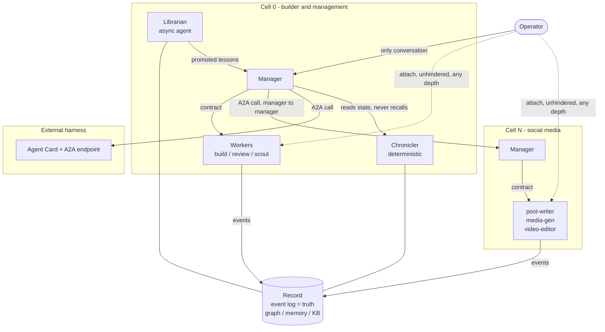

# Farseer: Architecture Draft

Status: draft 1, proposal. **The model proposed here was tested and largely survived** - see [.scratch/farseer/map.md](.scratch/farseer/map.md) for what changed, notably the A2A-shaped in-process bus, which was rejected.
Date: 2026-08-18.
Companion to `BRIEF.md` (research and landscape).
This document proposes the model; `.scratch/farseer/map.md` holds the route to deciding it.

## 1. The one idea

Farseer is a **cell runtime**, not a coding orchestrator.

A **cell** is a harness: one manager, its workers, its own record scope, and an address.
The builder-and-management harness is cell #0.
Every harness farseer builds is a sibling cell, not a plugin.

This is the operator's corporate model expressed as a primitive:

| Corp | Farseer | Kind |
|---|---|---|
| Owner | operator | human, sole interface |
| CEO | cell manager (agent) | agent, one per cell |
| PA who tracks everything | Chronicler | deterministic code, not an agent |
| PA who manages knowledge | Librarian | agent, batched and asynchronous |
| Staff | workers | agents, short-lived, disposable |
| Subsidiary | another cell | addressable peer |

The reason this is worth naming: without it, "farseer builds a social media harness" has no home in the architecture.
With it, the social media harness is a cell whose workers are post-writer, media-generator, video-editor, and whose manager is the only thing farseer's manager ever speaks to.

## 2. Recursion rules

1. Inside a cell, delegation depth is **2**: manager to worker. A worker never spawns a worker without an explicit grant.
2. Across cells, the interaction is a **call**, not a spawn. Manager to manager only.
3. A cell call is a contract with a result, exactly like a worker contract. The caller does not see the callee's workers.
4. The operator may attach to **any** worker in **any** cell, unhindered, bypassing every manager in the chain. Observation is not delegation and obeys no hierarchy.

Rule 4 is the operator's privilege and the thing firstmate could not do on Windows.
Rules 1 to 3 are the defence against the documented number-one multi-agent failure, the infinite handoff loop.

## 3. Cell anatomy

```
cell
  identity      id, name, agent card (capabilities, skills, endpoint)
  manager       one long-lived agent session, idle-cheap, wakes on events
  roster        worker role definitions (contract template, tools, seat class, budget)
  record scope  the slice of the record this cell owns and what it may read of others
  policy        autonomy grants, deny list, delivery gate, escalation rules
  workspace     isolation strategy for whatever this cell operates on
```

A coding cell's roster is implementer, reviewer, scout.
A social media cell's roster is post-writer, media-generator, video-editor, scheduler.
Same runtime, same supervision, same record, different roster and different tools.
If that is not true, the abstraction has failed, and that is the load-bearing test for the whole design.

## 4. Layers, restated over cells

- **Layer 1, orchestration.** The cell runtime: supervision, contracts, attach, durability. Non-negotiable.
- **Layer 2, the record.** Event log, memory, knowledge base, graph, shared across all cells and all harnesses.
- **Layer 3, improvements.** Kanban projection, seat and model routing.

Unchanged design rule: Layer 3 must be deletable without breaking Layer 1.
New corollary: **a cell must be deletable without breaking the runtime**, and the runtime must run with exactly one cell.

## 5. Protocol boundary

Three protocols, three non-overlapping jobs. Do not let them blur.

| Hop | Protocol | Why |
|---|---|---|
| farseer to a coding worker | **ACP** (Agent Client Protocol, Zed, JSON-RPC 2.0) | structured control without a PTY; native in Antigravity/Gemini, adapters for Claude Code and Codex |
| any agent to tools and to the record | **MCP** | the de facto vertical standard, now under the Linux Foundation |
| cell to cell | **A2A** (Agent2Agent, Google, Linux Foundation) | the only standard aimed at delegation between agents; Agent Cards give discovery |

Naming hazard worth fixing now: **ACP is overloaded.**
Zed's Agent Client Protocol (what `BRIEF.md` means everywhere) and IBM's Agent Communication Protocol are different specifications with the same acronym.
Farseer should always write `ACP (Zed)` or avoid the acronym.

Transport decision:

- **Internal cells** exchange A2A-shaped envelopes over farseer's in-process bus. No HTTP, no serialization tax, no discovery problem.
- **External harnesses** get a real A2A endpoint plus an Agent Card.
- Same message shape both ways, so promoting a local cell to a remote service is configuration, not a rewrite.

Known A2A gotcha to design against: dead agents linger in discovery until their card expires.
Farseer's registry must health-check, not trust the card.

## 6. Runtime shape

```
farseer/
  core (Rust)                 single binary, no required external services
    api                       HTTP + SSE/WebSocket for UI and CLI
    bus                       A2A-shaped envelopes; in-process for local cells
    a2a                       external endpoint + agent card registry + health checks
    mcp                       the record exposed to any harness (native exe, absolute path)
    store                     SQLite (WAL); event log is truth; git owns code state
    projections               board, graph, memory, KB, analytics; all rebuildable by replay
    scheduler                 task queue, concurrency caps, wake events
    supervisor                process lifecycle, Win32 Job Objects, health, timeouts
    adapters                  per-harness driver (ACP first, headless JSON fallback)
    cells                     cell registry, roster definitions, policy, lifecycle
    chronicler                deterministic state keeper: ledger, board, session logs
    librarian                 agent: memory curation, lesson promotion, KB, graph upkeep
    router                    seat/quota accounting, model selection (Layer 3)
    workspace                 isolation strategy per cell
  ui (web)                    manager chat, worker attach, diff review, board, graph explorer
  cli (farseer.exe)           non-interactive, JSON out, explicit exit codes
```

Rust for the same reasons as before: one self-contained binary (which also dodges the MCP `npx ENOENT` class entirely), direct Win32 access for Job Objects and `\\?\` paths, and vibe-kanban as proof the stack fits.

## 7. Chronicler and Librarian

The two PAs are not symmetrical, and treating them as one thing is a mistake.

**Chronicler is code, not an agent.**
Tracking what exists and what state it is in is a deterministic query over the event log.
An agent doing it costs tokens, drifts, and can hallucinate board state.
Every manager claim about task state is a Chronicler read, never recall.

**Librarian is an agent, but asynchronous.**
Deciding what a run *meant*, whether a lesson generalizes, and whether two notes are the same fact needs judgment.
It runs in batches on idle or on a schedule, never in the request path of a task, so it is never a latency or cost tax on real work.
Its charter: propose memory, promote candidates to active, demote by efficacy score, keep the graph honest.
Precedent: prime-agent's Continual Harness stores prompts, memories, skills and reusable subagent specs as durable state refined by small evidence-backed updates. That is the job, already validated in the wild.

Promotion gate stays load-bearing, given the documented memory-confabulation failure mode: a lesson starts `candidate`, needs reviewer or operator confirmation to go `active`, and auto-demotes when tasks applying it fail more than tasks that did not.

## 8. What "farseer builds a harness" produces

Not code generation. A cell definition plus its scaffolding:

```
cell definition       identity, agent card, roster, policy, record scope
worker contracts      one template per role, with validation and done-criteria
tool bindings         MCP servers and credentials the roster needs
workspace strategy    what this cell operates on and how it is isolated
seat mapping          which harness accounts and model classes each role may use
evaluation hooks      how the cell's own output gets reviewed
```

The builder cell's job is to interview the operator, draft this, dry-run it, and register it.
Building a harness is therefore a task shape, not a new subsystem.

## 9. Control plane rules (carried forward, unchanged)

1. No PTY as a control channel. A PTY is a view, attached only on request.
2. Every child in a Win32 Job Object with `JOB_OBJECT_LIMIT_KILL_ON_JOB_CLOSE`.
3. Nothing runs from inside a workspace we intend to delete. Cleanup is a supervised state machine ending in quarantine, never a blind recursive delete.
4. Long paths everywhere (`\\?\`), workspaces at a short root such as `D:\fw\<hash>`.
5. One writer to the store, in-process, WAL, native path only.
6. The event log is truth. Everything else is a projection and can be dropped and rebuilt.
7. Every run fully reconstructible from disk: contract, event stream, artifacts, exit status, cost.

## 10. Interaction, drawn



Read the dotted lines as the operator privilege: attach bypasses the hierarchy, and no manager may gate it.

## 11. Open architectural questions

These are the ones this document creates, on top of the 35 in `BRIEF.md`.
Each is a ticket on the map.

1. Is the cell the right primitive, or is it one abstraction too many for v1?
2. Does a cell own a private record scope, or is there one global record with visibility rules?
3. When a cell call fails, who owns the retry: caller manager, callee manager, or the operator?
4. Can a cell be paused as a unit, and what happens to its in-flight workers?
5. Is cell #0 allowed to modify farseer itself, or only to define other cells?
6. Does a non-coding cell need git at all, and if not, what is its unit of reviewable change?
7. Is the Librarian one global agent or one per cell?
8. Does the operator attach to a *worker*, or to a *run*? Runs are the durable thing; workers are processes.
