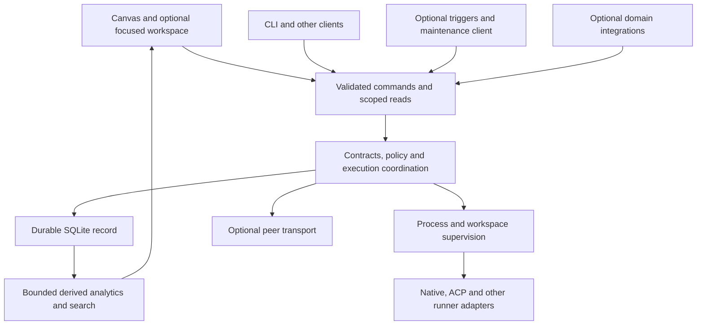

# Farseer project critique and implementation handoff

Date: 2026-09-06.
Review snapshot: `e9d2e76975d7802c50b501f79d3184cc0bd0e543`, including the uncommitted working-tree changes present at review start.
Scope: user feedback, architecture, maintainability, UI/UX, self-maintenance, multiple harnesses per project, routing, and future domain integrations.
This is a review and proposed work sequence, not an approved replacement specification.
No product code was changed for this review.
The former root REVIEW.md is [Git-only history](.scratch/README.md#git-only-history); use the [active ticket index](.scratch/farseer-command-center/tickets.md) for implementation status.

## 1. Recommendation

**Keep the existing Rust runtime, cell model, runner adapters, SQLite record, and client-only widget direction.**
Strengthen their failure isolation before expanding the feature surface.
Farseer already has considerably more of the requested foundation than a new scaffold would provide.
The main issue is that implemented interfaces, usable operator workflows, and operational guarantees are sometimes treated as the same milestone.
They need separate acceptance criteria.

Your desired product is coherent: a local orchestration supervisor with a customizable command center, supervising both other projects and maintenance work on its own repository.
The phrase "self-improving harness" needs a constraint: the installed supervisor must remain trustworthy while agents propose changes to its next version.
A maintenance agent should not be required for ordinary execution, cancellation, recovery, or viewing the record.

Build in this order:

1. Make daemon ownership, startup failure, and UI/backend compatibility explicit.
2. Bound record queries and separate expensive optional analysis from execution-critical work.
3. Make the existing board, composer, sessions, and detail views reliable and legible.
4. Add explicit project teams and explainable runner selection using existing cells and contracts.
5. Prove one self-maintenance loop and one non-coding integration before generalizing plugins or workflows.

Do not start with a plugin framework, arbitrary docking engine, autonomous routing model, or new graph database.
Those would add maintenance before resolving the observed gaps.

## 2. Evidence and confidence

### Review method

The local [decision map](.scratch/farseer/map.md), linked tickets, [AGENTS.md](AGENTS.md), and current source were used as the specification and implementation baseline.
Historical proposals in [ARCHITECTURE.md](.scratch/README.md#git-only-history) and [BRIEF.md](.scratch/README.md#git-only-history) were not treated as current implementation facts.
Three bounded GPT-5.6 Luna reviews covered architecture/spec, code/UI quality, and primary-source reference research.
The source review was repository-wide, not a branch-diff review.

Evidence labels used below:

| Label | Meaning |
| --- | --- |
| Confirmed | Directly visible in the reviewed source or current test result |
| Reported | An observation in feedback.txt that was not reproduced live in this review |
| Risk | A concrete source mechanism supports the concern, but its production impact was not measured |
| Proposal | Recommended future behavior, requiring a specification or decision correction |

No live desktop screenshot or browser interaction was performed.
Exact clipping, empty viewport percentages, and perceived appearance are therefore reported observations supported where possible by layout source, not newly measured pixel findings.
No paid harness tests, live provider capability probes, deployment, or autonomous maintenance run was performed.

### Validation performed

| Check | Current result | What it establishes |
| --- | --- | --- |
| `cargo test --workspace` | Passed outside the restricted Windows sandbox | The default workspace suite passes; ignored live-runner and capability checks remain unexecuted |
| Initial sandboxed workspace test | Five API tests failed on identity/ACL/private prompt-file access | Environment-sensitive failures; the same command passed with normal host permissions |
| `cargo clippy --workspace --all-targets` | Passed | No Clippy diagnostics in this run |
| `cargo fmt --all -- --check` | Passed | Current Rust formatting conforms |
| `bun run --cwd ui test` | Six passed, all in layout.test.ts | Layout normalization, sizes, and ordering arithmetic have focused coverage |
| `bun run --cwd ui check` | Passed | TypeScript typechecking succeeds |

Passing these checks does not establish interactive UX correctness, large-record responsiveness, backend/UI version compatibility, or safe self-upgrade.
Those need different tests described in the work packets below.

## 3. Feedback verdicts

The private account identifier in [feedback.txt](feedback.txt) is deliberately not copied here.

| Feedback | Verdict against current source | Recommendation |
| --- | --- | --- |
| Sidebar consumes width for toggles and dimensions | Valid usability criticism; manual collapse already exists, but is not a persisted auto-hide preference | Extend that control with persistence and explicit pin/reveal behavior; layout controls belong in an edit-layout mode |
| Seven cramped cards and a mostly empty canvas | Exact geometry is reported, not remeasured; the current fresh layout is four widgets, so seven is not today's default | Preserve custom layouts; give fresh layouts useful per-widget sizes and responsive packing |
| W/H metric controls clutter daily navigation | Valid | Move them into layout settings; daily navigation should expose project, selection, activity, and attention |
| Need 1x2, 2x1, and 2x2 card sizes | Already implemented in layout.ts | Fix defaults and discoverability; do not build a second size system |
| Capacity/Work clip or require awkward inner scrolling | Credible and source-supported: all default cards start at 300x220, while Work contains a board and detail surface | Compact summary cards plus focus view; bounded auto-height only where useful |
| Raw `GET /v1/tasks?...: 404` shown in Work | Error rendering is confirmed; the reported HTTP failure is not reproduced | Structured recoverable states plus backend capability check; investigate stale daemon/build before declaring the route missing |
| Mask account details for screenshots | Valid privacy and presentation feature | Global privacy mode covering visible text, tooltips, copy/export, accessibility names, and all relevant widgets |
| Empty states are too verbose | Reasonable, with qualification | One-line state plus one useful action; retain help on demand and distinguish empty, loading, offline, denied, and unsupported |
| Hover changes composer context accidentally | Confirmed: App.tsx updates anchor on mouse enter | Explicit selection and pinned context; hover may preview but must not retarget a draft |
| Harness switching is missing | Partly stale: Work already contains a manager runner picker | Surface the existing choice in the composer; distinguish requested runner from observed runner/model |
| Model/harness/target chips should select anything | Needs policy correction | Offer only eligible choices; a widget anchor supplies context, not authority to bypass the top manager |
| Floating input has unclear ownership | Valid product criticism; exact appearance is unmeasured | Stable composer with conversation/project/context shown; Ctrl+K opens commands, not an ambiguous second composer |
| Only Work has expand | Confirmed in the inspected widget source | Common focus/open-details action with keyboard access and stable return behavior |
| Every card should open a fixed three-pane IDE | Accept the consistency goal, reject a universal IDE payload | One workspace shell with optional navigation/main/inspector panes; each feature supplies relevant detail |
| Free placement, snap grid, hybrid, auto-sort | Too much initial scope | Keep the existing non-overlapping grid, add deterministic arrange/reset; defer free placement until a real workflow needs it |

Relevant source: [App.tsx](ui/src/App.tsx), [layout.ts](ui/src/layout.ts), [Work](ui/src/widgets/work.tsx), [bridge](ui/src/bridge.ts), and [styles](ui/src/style.css).
The previous decision to make every surface a canvas widget is in [Operator surface](.scratch/farseer/issues/28-operator-surface.md).
An attached multipane workspace would amend that decision rather than merely restyle it.

## 4. Standards and code quality findings

### What is worth preserving

The crate separation has useful meaning: pure domain rules, persistence, process/runner handling, manager execution, HTTP coordination, and desktop presentation are distinguishable.
The runtime normalizes runner behavior instead of forcing the rest of the application to understand every vendor stream.
Windows Job Object supervision and executable resolution address observed platform failures.
Typed contracts and explicit lifecycle/control/liveness distinctions are valuable complexity, not overengineering.
Scoped manager credentials, widget sandboxing, and record provenance should survive any refactor.

Ticket comments and behavior-named tests make intent discoverable for a smaller model.
The shared layout module and shared SSE subscription are good examples of concentrating repeated rules behind a small interface.
SQLite is still appropriate here; the reviewed problems come from query scope and work scheduling, not evidence that the storage engine is wrong.

### Concrete findings

| ID | Priority and confidence | Evidence | Consequence and action |
| --- | --- | --- | --- |
| Q1 | High, confirmed behavior; design mismatch | shell/runtime.rs:37-46 and shell/main.rs:105 | Shell-owned daemon is killed when ownership drops; define runtime survival independently of window ownership |
| Q2 | High, confirmed | shell/runtime.rs:55-69 and 110-118 | A TCP listener is accepted as a daemon and startup timeout returns success with port zero/empty token; validate authenticated health and return actionable failure |
| Q3 | High, confirmed mechanism; impact needs measurement | api/work.rs:29,355-388; api/lib.rs:69,187 | Graph loads all rows while holding the shared store guard; a large optional read can contend with execution writes |
| Q4 | High, confirmed mechanism; impact needs measurement | api/work.rs:254-284,311-329 | Transcript indexing compares against all indexed bodies under the store guard; search loads bodies before filtering; isolate and bound these operations |
| Q5 | Medium, confirmed | ui/widgets/work.tsx:66-91 | Every refresh fetches tasks, conversations, global graph, and cell zero together; one failed optional request prevents all four result assignments |
| Q6 | Medium, confirmed omission/risk | ui/main.tsx and ui/App.tsx widget rendering | No React error boundary was found; one built-in widget render exception can remove the host UI; add per-widget failure isolation |
| Q7 | Medium, confirmed | ui/App.tsx:655-657 | Hover changes the instruction anchor; pin explicit context and freeze the submitted context snapshot |
| Q8 | Medium, confirmed coverage gap | ui/tests/layout.test.ts; ui/package.json | Six arithmetic tests do not exercise HTTP errors, race conditions, selection, graph interaction, or card isolation |
| Q9 | High for self-upgrade, confirmed gap | store/lib.rs:129-176 and store/schema.rs | There is a specific transactional attachment migration, but no general ordered schema-version and backup/recovery contract; specify this before automatic runtime promotion |

Source files: [shell runtime](crates/farseer-shell/src/runtime.rs), [shell main](crates/farseer-shell/src/main.rs), [API work](crates/farseer-api/src/work.rs), [API state](crates/farseer-api/src/lib.rs), [UI Work](ui/src/widgets/work.tsx), and [UI entry](ui/src/main.tsx).
Q1 is ordinary source behavior, not a claim that a running user task was killed during this review.
Q3/Q4 establish an unbounded-work and lock-contention mechanism, not measured outage latency.

### Structure, scaffold, and YAGNI

The most useful refactor is to remove reasons for unrelated features to change together.
App.tsx currently combines registry, layout editing, drag/resize, persistence, selection, composer, and settings presentation.
Work combines loading, task mutations, conversation management, transcript attachment, board rendering, and graph rendering.
Extract those responsibilities only while implementing the relevant behavior packet; do not create a framework of generic managers, registries, and factories first.

The large API lib.rs also contains substantial test code, so file length alone is not evidence of bad design.
Move command handling and projection handling into cohesive modules where they already differ in locking, latency, or dependencies.
A bounded query interface and a projection job interface would earn their place through actual differing behavior.
Do not introduce a trait for every concrete Rust type.

Comments occasionally retain an old story after behavior widens.
For example, bridge.ts describes a narrow run-verb surface while its allowlist now includes conversations, projects, task transitions, and transcripts.
Refresh these comments with the changes they describe; avoid embedding a full historical essay in every adapter.

Dependency policy is inconsistent: the UI pins exact versions, while many workspace Cargo requirements are ranges and some are exact.
Cargo.lock provides a resolved application build, but it is not the same policy as exact manifest requirements.
Clarify the intended distinction for existing dependencies and follow the exact-pin rule for newly introduced ones.
Do not churn every dependency as part of this product review.

## 5. Spec alignment and architecture decisions

### Current foundation versus requested product

| Requested capability | Current foundation | Remaining product work |
| --- | --- | --- |
| Multiple harnesses for a project | Runner candidates, manager runner choice, worker/cell delegation, shared task lineage | Explicit project-to-team policy, dispatch visibility, concurrency and artifact integration rules |
| Global and project kanban | Durable tasks and transitions, project filter, shared store rows | Pagination, truthful counts, independent loading, dependable focus/detail workflows |
| Session explorer | Harness identifiers, attachment custody, task/run association, transcript indexing | Search UI, format-aware viewing, session provenance, navigation and supported resume semantics |
| Graphs | Causal parent edges and a rendered graph; derived transcript similarity | Bounded neighborhoods, selection, direction/edge labels, filters, loop summaries, evidence drilldown |
| Usage monitor | Quota windows, reported usage/cost, account grouping | Coverage/freshness indicators, task-level retry-inclusive breakdown, resource metrics |
| Self-maintenance | Farseer can supervise code work using existing project/worktree mechanisms | Dedicated maintenance policy, evaluation, promotion, rollback, self-trigger suppression, external recovery |
| Removable features | Headless API and sandboxed authored widgets | Explicit optional workload isolation and extension shutdown/upgrade contracts |
| Terminal choice | Native runner launch and control abstractions | Operator terminal session adapter and shell-profile selection; no complete embedded terminal UX established here |
| Cost router | Ordered availability selection is already present | Explainable policy, consistent manager/worker scope, actual outcome feedback, bounded retries and opt-in model gateway |

These are extensions of [Work model and session explorer](.scratch/farseer/issues/40-work-and-session-explorer.md), not reasons to recreate its schema from scratch.
Later implementers must read current source before opening a ticket that says "add tasks", "add A2A", or "add harness switching".
Those broad statements would discard work already present.

### Define the core by guarantees, not by whether a feature is popular

There are two meanings of core here.
`farseer-core` is the pure domain crate; the operational core also includes the necessary store, supervision, coordination, and local command interface.
A popular essential UI feature need not belong in the pure crate or be required for execution.

| Responsibility | Placement recommendation | Behavior when unavailable |
| --- | --- | --- |
| Contract validation, identity, policy narrowing, cancellation ownership | Mandatory operational core | Refuse unsafe/new work; preserve an actionable failure |
| Durable tasks/runs/events and recovery metadata | Mandatory operational core | Do not silently execute unrecorded work; define admission and recovery behavior |
| Process supervision and workspace lifecycle | Mandatory operational core | Refuse affected launches; retain cancellation/recovery information |
| Minimal local command/read API | Mandatory operational core | Needed for operating without the desktop |
| Specific vendor runner adapter | Optional capability, included as useful | Existing pinned work follows its recorded adapter contract; new affected work is refused or explicitly rerouted |
| Board, graph, layouts, terminal rendering, session viewer | Optional clients/features | Running work continues; other views and direct API remain usable |
| Similarity index, richer analytics, telemetry exporters | Optional derived workloads | Truth remains in the record; projection is stale/unavailable and rebuildable |
| Schedules, event triggers, maintenance team | Optional API clients | Ordinary manual work remains possible; missed trigger state is visible |
| Automatic route ranking or model gateway | Optional policy/adapter | Deterministic eligible default or explicit queue/refusal remains available |
| Trading, publishing, rendering, social collection integrations | Optional cells/tools/runners or peer integrations | Failure stays local to that integration and its runs |

The existing "no plugin ABI" decision remains a good default.
Do not equate removable features with dynamically loading arbitrary native code into the supervisor.
An API client, supervised process, compiled runner adapter, or sandboxed widget can supply the required replaceability with much less failure coupling.

### Target relationship



This is a responsibility diagram, not a request for one service or crate per box.
Retain one local deployment and one owning writer unless measurements establish a reason to change them.

## 6. Self-improvement and self-maintenance

### The useful version of the idea

Register Farseer's own repository as a project and assign it a maintenance cell using ordinary runner and worker contracts.
Its inputs should be concrete failures, operator requests, dependency observations, and bounded periodic checks.
Its outputs should be reviewable changes, test results, and a candidate release, not silent mutation of the running installation.
Use the same task/run/artifact provenance as every other project.

Separate three operations:

| Operation | Recommended autonomy | Why |
| --- | --- | --- |
| Propose or evaluate a memory/skill/config change | Can run automatically within a declared policy | Cheap to compare and reversible when versioned |
| Edit source in an isolated maintenance workspace | Can run automatically within a declared policy | Running supervisor remains unaffected |
| Promote runtime binary, security policy, or database migration | Explicit promotion policy with independent validation and rollback | The supervisor cannot be its own only recovery mechanism |

Promotion approval is a recommended product policy, not a request for permission to finish this review.
You may later authorize automatic promotion for a narrow proven category.
Changing the installed supervisor, its authority rules, and its state schema should not inherit permission merely because an agent may edit a repository.

### Minimum maintenance loop

1. Observe an event or scheduled check and deduplicate it into a maintenance task with a bounded attempt count.
2. Create an isolated workspace from a recorded revision and delegate a narrowly scoped worker contract.
3. Validate the proposed artifact against the reproducer and ordinary repository checks, retaining evidence and the previous good revision.
4. Promote through an explicit release operation; drain or reject new work, handle active runs, preserve a compatible data backup, and verify health.
5. Roll back on failure using an executable/path and procedure that still work when the new Farseer does not start.

Do not let a changed runtime schema imply that the old binary can simply reopen the new database.
Rollback requires either a backwards-compatible migration or a matching data restoration plan.
On Windows, expect the running executable and workspace files to be locked; stage a new version beside the active one and switch only through the lifecycle procedure.

Prevent feedback loops explicitly.
A maintenance run should not recursively trigger another maintenance run merely because it wrote a log, emitted telemetry, or changed its own branch.
Persist origin and deduplication information, cap retries and active maintenance work, and expose a pause control.
The global kanban manager should be an on-demand or event-triggered role rather than a permanently reasoning agent.
Most board transitions, ordering, and summaries can be deterministic and cost no model tokens.

**The monitor can watch itself, but its final recovery path must work without it.**
That can be a small local CLI rollback operation and retained previous version; it does not require Kubernetes, a privileged service, or a second orchestration platform.

## 7. Multiple harnesses and project teams

### Preserve the vocabulary

A project is the work context, a cell holds addressing/policy/record scope, a runner executes work, a task spans runs, and a session identifier belongs to the harness.
Use [Vocabulary lock](.scratch/farseer/issues/14-vocabulary-lock.md) and the later work-model correction.
Do not introduce a second "team" execution primitive merely because the UI uses Team as a friendly label for a cell and its roster.

One project can use several runners and several cells.
One run should still have one sealed runner choice and one accountable owner.
Changing harness during a task should create an explicit successor run or delegation edge, not rewrite the original run's identity.
Do not imply that a Claude session can become a Codex session by changing a dropdown.
Cross-harness continuity uses an artifact/summary handoff with provenance and context limits; native resume is a separate, observed capability.

### Recommended project policy

Expose a project's primary coordinating cell plus allowed specialist cells/runners, concurrency limits, and default routing preference.
Store this as a small extension of existing configuration relationships after specifying its ownership and precedence.
Do not duplicate the cell's roster, tool grants, or budget into an independent team database.

The top manager can accept a request and delegate to the appropriate project cell.
Routine routing should use deterministic project defaults where possible, avoiding an extra LLM classification call for every instruction.
If you later want direct AI input to a project cell, record that as an explicit correction to Operator surface, including authority, visibility, and failure ownership.
Do not smuggle the policy change into a visual Target chip.

Parallel harnesses need artifact ownership rules.
For code, isolate workers with worktrees and assign one integration owner to review/merge competing changes.
For non-code, isolate output directories or stage immutable artifacts and explicitly promote the chosen version.
Do not allow several workers to edit the same working directory concurrently by default.
Do not give workers independent permission to create more workers if the existing manager-only delegation rule is meant to hold.

## 8. Routing for cost and quality

"Always optimal cost saving" is not a guarantee a router can honestly make.
The cheapest initial model can cost more after retries, context loss, failed tool calls, and human correction.
Use a declared objective: minimize expected cost of an accepted task subject to capability, quality, latency, and quota constraints.

### Keep routing levels separate

| Level | Selection | Authority |
| --- | --- | --- |
| Project/cell | Who coordinates this request | Project and cell policy |
| Runner/account | Which eligible harness executes the next run | Farseer policy plus observed capability and quota |
| Model/provider | Which model a selected harness may use | Observed harness support and configured provider/model policy |
| Escalation/retry | Whether to spend another attempt | Task budget, attempt limit, acceptance evidence, operator policy |

Current first-available routing is a useful baseline, not an outcome-aware optimizer.
Keep it as the fallback while introducing route-decision evidence.
Both manager and worker routing must say what candidates were considered, which were rejected, and why the selected runner was eligible.

Start without a learned router:

1. Filter by observed capability, tool level, project authority, model support, availability, and configured constraints.
2. Respect explicit runner/model pins; never silently substitute a weaker or differently authorized route.
3. Rank eligible candidates using declared account preference and task class; record when cost is unknown.
4. Escalate after a meaningful failure or acceptance-check result, with bounded attempts and retained evidence.
5. Compare accepted-task outcomes against the deterministic baseline before adding classifier calls or learned ranking.

Do not treat unknown quota as exhausted or as a promise of available capacity.
Do not add subscription usage, list-price estimates, and billed currency into one total.
Record basis, source, timestamp, and coverage for every metric.
Avoid double-counting a task total and its child-run totals in the same aggregate.

Existing fail-closed bounded-budget behavior must remain explicit.
Post-run spend accounting and stopping before the next attempt cannot prove pre-spend enforcement inside a harness.
Before offering a strict dollar cap, establish which adapter can enforce it or refuse that guarantee.

NVIDIA NeMo Switchyard routes model requests and offers model-routing telemetry; it is not a replacement for worktree, runner, account, or task ownership.
Treat it as an optional gateway for harnesses that can actually use its supported endpoint/authentication path.
Do not assume subscription-backed CLIs can be redirected through a generic API gateway without changing their behavior or economics.
See [Switchyard core concepts](https://github.com/NVIDIA-NeMo/Switchyard/blob/main/docs/core_concepts.md) and the [reference research](.scratch/farseer/research/2026-09-06-command-center-references.md).

## 9. Command-center UI/UX

### Two presentations, one state model

Keep the canvas as a customizable home for summaries and attention.
Add a focused workspace for sustained work on a selected project, task, run, or session.
Both should select the same durable identities and call the same validated commands.
Pane arrangement is opaque UI state, not execution state.

Recommended focus layout:

| Pane | Default content | Optional behavior |
| --- | --- | --- |
| Navigation | Project, conversation/task tree, saved filters | Hide or narrow |
| Main | Conversation, board, artifact/diff, or session transcript | Split when comparing two real subjects |
| Inspector | Selected run, tool evidence, lineage, metrics | Toggle without changing selection |

Do not put raw stdout in every workspace by default.
It is useful when diagnosing a runner, while a content pipeline needs drafts and publishing evidence and a render pipeline needs artifact previews and job progress.
Allow a feature to supply these views without changing core task semantics.

### Concrete interaction contract

The composer displays project, conversation, explicit context, requested runner, and requested model only where supported.
Requested and observed values remain distinguishable after dispatch.
Selecting a graph node or board card updates one shared subject; hovering does not change the draft destination.
Opening details preserves board filters, scroll position, and draft text on return.
Navigation and pane toggles are available by keyboard and expose meaningful accessibility labels.

Default cards should answer a glanceable question.
Conversation shows the latest relevant exchange and an action to open it.
Work shows active/blocked/review counts and a small actionable list, with the full kanban in focus mode.
Fleet shows running and unavailable cells/runners.
Capacity shows the constrained accounts and freshness, with detailed windows in focus mode.
A card should not shrink a complete application into 300x220.

Use one primary scrolling region in each compact card.
Transcript and terminal panes can scroll internally because that is their function.
Avoid unbounded auto-expansion: streaming output must not keep moving the rest of the canvas.
Provide minimum useful sizes, compact breakpoints, and a focus action before adding arbitrary aspect-ratio machinery.

### Graphs and analytics

Current WorkGraph places nodes in six columns and draws edges; this is a topology preview, not yet an investigative graph explorer.
Add bounded neighborhoods around the selected subject, directional labels, edge-type filters, keyboard-selectable nodes, and a list/table fallback.
Show retries, continuation, rescope, delegation, and cell calls as distinct observed relationships.
Treat a repeated workflow as a derived grouping over recorded runs until a real scheduling requirement demands a durable workflow definition.

Causal and similarity graphs answer different questions and should have separate default views.
Similarity is not causation or evidence that one project depends on another.
The current `farseer-hash-tf-64` projection is hashed lexical term frequency, not semantic understanding.
It is a reasonable offline baseline but can be distorted by collisions, repeated boilerplate, and transcript length.
Label it lexical similarity and validate retrieval relevance before marketing it as project/session intelligence.
Retain projection version, redaction version, source digests, and score meaning.

Start analytics with cost per accepted task including retries, intervention rate, rework, duration, and coverage.
Add CPU time, memory high-water mark, and output/storage sizes only from actual measurements with clear units and aggregation rules.
Do not claim complete host or harness telemetry when only the supervised process tree is visible.
Event sampling and optional exporters must not discard lifecycle events or block cancellation and durable finalization.

## 10. Terminal agnosticism

Separate the operator's terminal experience from the protocol used to supervise a harness.
A Codex/ACP process does not become a PowerShell session because the operator changes the terminal dropdown.
Use structured executable plus argument arrays for runner launch, preserving the existing PATHEXT and Windows Job Object rules.

Offer configured shell profiles for PowerShell, cmd, Git Bash, and explicit executable paths.
Detect availability and show unsupported profiles rather than guessing.
A profile controls a new terminal session's executable, arguments, cwd, and environment policy.
Switching profile creates a new session; it must not attempt to transform an already-running shell.

An embedded terminal needs a supervised ConPTY-capable adapter on Windows, resize/input/output handling, cancellation, and clear ownership.
Keep PTY handling at that adapter seam, consistent with Attach semantics; do not turn the pure domain crate into a terminal emulator.
An external-terminal launch can be the first increment if its observation and control limitations are stated.
No embedded terminal library or cross-platform implementation is justified until the first acceptance scenario is specified.

## 11. Integration strategy for future projects

Use the existing distinction between supervised workers, returning tools, and peer cells.
A long-running render is a supervised run; a short metadata lookup is a tool; an external orchestrator with its own delegation decisions is a peer.
Do not represent all three as an undifferentiated plugin command.

| Project type | First useful integration | Required acceptance boundary |
| --- | --- | --- |
| Game development | One build/render pipeline returning artifacts | Cancellation kills the owned process tree; failed outputs are not promoted |
| Content creation | Draft generation and review | Publishing is a separate declared action with recorded target and result |
| Social research | Bounded collection and summarized evidence | Source/time provenance, retention, rate limits, and incomplete-collection state |
| Automation similar to n8n | One scheduled API-triggered workflow | Trigger deduplication, retries, timeout, cancellation, and duplicate-effect handling |
| Trading harness | Paper-mode signals/order simulation first | Domain-owned risk constraints and execution reconciliation; Farseer status does not substitute for trading risk control |

For irreversible external effects, retries require idempotency or an explicit reconciliation step.
If an HTTP timeout follows a publishing/order request, "no reply" must not be treated as proof that nothing happened.
The domain integration owns that protocol knowledge; Farseer owns the task, authority, attempt record, and operator visibility.

There is a concrete existing constraint here.
`ToolHasNoVerb` in [cell.rs](crates/farseer-core/src/cell.rs), lines 239-265, explicitly says a roster tool entry is recorded but grants and gates nothing callable through Farseer.
The later resolution of [The tool verb](.scratch/farseer/issues/38-the-tool-verb.md) rejects making Farseer a general third-party tool gateway.
Preserve that resolution: a declared `post` entry does not make arbitrary publishing calls subject to a Farseer approval gate.
The integration must enforce its own declared action policy, or a separately approved narrow operation must put Farseer in the actual execution path.
A shell-capable harness can bypass a decorative tool label; never present that label as containment.
The remaining duplication between a shell roster declaration and ToolLevel::Shell should be resolved explicitly rather than adding another permission concept.

Before adding a generic plugin manifest, prove two integrations that vary across the same interface.
A minimal later manifest may identify version, required protocol capabilities, granted scope, entry point, and health state.
Do not add marketplace, dependency solver, native plugin ABI, or hot migration simply to make optional features sound modular.

## 12. Implementation packets for subsequent agents

These are proposed packets, not ticket numbers.
Assign actual numbers only after checking the map for existing work.
Each packet should produce a small specification before implementation, with the referenced source rechecked against the then-current checkout.
Where a packet changes a locked decision, append a correction to the relevant ticket and map; do not erase historical text.

### R01. Runtime ownership and startup contract

Priority: first.
Evidence: Q1/Q2.
Files: shell/runtime.rs, shell/main.rs, shell/tray.rs, API health/security runtime metadata, CLI startup.
Decision: desktop close leaves supervised work running; explicit runtime shutdown remains a separate operation.
Define ownership for attached and newly started daemons, one writer per data directory, startup races, and cleanup after a failed start.
Validate authenticated health, runtime identity, data directory, and required feature compatibility rather than TCP openness alone.
Include executable/build provenance in diagnostics so the reported tasks 404 can be investigated.

Acceptance:

1. Start a local deterministic supervised job through the desktop, close/reopen the UI, and observe the same run without a replacement task.
2. A non-Farseer listener, stale runtime file, failed child, and startup timeout produce explicit failures, never a port-zero success.
3. Two concurrent UI starts cannot create two owning writers for one record.
4. Explicit shutdown follows documented drain/cancel behavior and leaves no owned child or unexplained live workspace.

### R02. Bounded projections and store contention

Priority: first, before richer analytics.
Evidence: Q3/Q4.
Files: api/work.rs, store/work.rs, API state/record access.
Add bounded task/conversation/graph reads with cursor semantics, filters, truncation/count metadata, and limits on nodes, edges, and body bytes.
Reuse existing query fields; do not make the UI download the global record to apply a project filter.
Move tokenization/similarity computation outside the store guard, then commit only validated derived results with source/version checks.
Use bounded candidate selection or incremental top-k edges rather than retaining every possible transcript pair by default.
Specify cancellation, stale-source handling, and index rebuild behavior.

Acceptance:

1. A seeded large record returns a bounded graph neighborhood and paginated lists with explicit continuation.
2. Concurrent projection/index work leaves cancel/status/finalization responsive against a recorded baseline and agreed latency budget.
3. Disabling or failing the projection produces stale/unavailable analysis while normal work still executes.
4. Retrying/rebuilding produces no duplicate authoritative events and no dangling derived edges after source removal.

### R03. Reliable widget data and failure isolation

Priority: first UI packet; can be specified alongside R02.
Evidence: Q5/Q6/Q8.
Files: bridge.ts, Work, App, stream.ts, UI tests.
Load the active Work face independently, throttle refresh with a maximum wait, and cancel/ignore stale requests after subject changes.
One unavailable graph or cell lookup must not prevent an existing board from loading.
Add a per-widget render error boundary with retry/remount and a compact structured error model.
Define unsupported-backend versus temporarily offline behavior.

Acceptance:

1. Simulated graph failure leaves tasks visible and actionable.
2. Continuous events cannot postpone refresh indefinitely; slow old responses cannot overwrite a newer selection.
3. A deliberately throwing built-in widget leaves the composer and another widget operational.
4. Loading, empty, permission failure, offline, and unsupported states have different accessible text and appropriate recovery actions.

### R04. Explicit context and eligible runner/model choices

Priority: next.
Files: selection.ts, project.ts, bridge.ts, App composer, Work runner picker, API instruct validation.
Make selection explicit and retain draft context; expose the already-supported manager runner choice in a visible place.
Define project/conversation defaults, explicit override precedence, and behavior when a candidate disappears.
Model selection must be capability-derived rather than a static global menu.
Preserve top-manager routing unless its ticket is explicitly amended.

Acceptance:

1. Moving the pointer across cards does not change a draft's context.
2. Submission records the displayed project/conversation/runner intent even if another view changes selection during the request.
3. Unsupported runner/model combinations are rejected before workspace creation; running contracts are not rewritten.
4. A harness change preserves task lineage and clearly starts a new run/session where required.

### R05. Responsive canvas and focused workspace

Priority: after reliable data/selection.
Files: layout.ts, App, styles, widget registration, UI-state persistence.
Keep existing spans; add per-widget defaults, a collapsible/pinnable rail, edit-layout mode, and a common focus action.
Start with navigation/main/inspector toggles and one split use case, not arbitrary nested docking.
Persist arrangement separately from selected execution facts.
Add privacy mode across identifying text, tooltips, accessibility labels, and exports/copy behavior.

Acceptance:

1. At 1280x820, 1920x1080, and a narrow resized window, primary actions remain reachable without clipping; verify at 100% and 150% display scaling.
2. Keyboard users can focus/open/close details and return to the prior selection and scroll position.
3. Resize, hide/show, restart, and malformed saved layout preserve or repair a usable layout without changing tasks.
4. Privacy mode passes a DOM/text and screenshot review with representative account/path/session identifiers.

### R06. Session and graph exploration

Priority: after R02-R05.
Files: Work, Run, transcript routes/projections, selection model.
Expose search with highlighted matching excerpts and links to originating runs, plus supported transcript viewing.
Make graph nodes selectable and use bounded neighborhoods with observed/derived edge filters.
Add lexical-similarity labeling and an evaluation fixture before adding an optional embedding implementation.
Preserve session provider/kind and never fabricate a missing transcript pointer.

Acceptance:

1. Selecting a session identifies its harness, run, task, project, custody, and source without assuming native resume support.
2. Graph and list navigation open the same subject; unavailable or truncated neighbors are explicitly represented.
3. Similarity results distinguish boilerplate matches from relevant examples on a small judged corpus.
4. Removing/rebuilding an index leaves raw custody and authoritative task/run history intact.

### R07. Usage and resource observations

Priority: before adaptive routing.
Files: runner signals, manager aggregation, quota/analytics store modules, Capacity and Run views.
Define source, unit, basis, timestamp, coverage, and aggregation for each observation.
Separate billed currency, list-price estimates, tokens, subscription windows, and process resources.
Attribute attempts to tasks without counting parent aggregates twice.
Choose bounded sampling and retention for resource metrics; preserve authoritative lifecycle events.

Acceptance:

1. A task with retries and delegated children has a reconcilable breakdown with no double counting.
2. Unknown provider/model/token fields remain unknown, not zero or guessed.
3. Disabling resource collection does not affect execution or cancellation.
4. Stale quota, provider-stated percentages, estimates, and measured process resources are visibly distinguished.

### R08. Explainable deterministic routing

Priority: after R07; independent of a model gateway.
Files: runner selection in API/MCP, cell candidate configuration, record observations, composer preference.
Specify candidate filtering, pins, fallback, exhaustion, unknown data, attempt caps, and route reasons.
Apply the same eligibility rules wherever managers/workers select a runner, while respecting their different contracts.
Record selected and rejected candidates without exposing credentials.
Use a fixed policy baseline before learned routing.

Acceptance:

1. Identical policy and observed inputs produce the same route decision.
2. Exhausted, unavailable, unauthorized, and unsupported candidates are rejected with distinct reasons.
3. Explicit pins are honored or refused; no hidden downgrade or infinite retry occurs.
4. Historical evaluation compares total accepted-task cost and quality to the baseline; list-price savings are not presented as billed savings.

### R09. Project-to-cell policy and multiple harnesses

Priority: after R04 and R08 policy definition.
Files: existing project authorization/configuration, cell definitions, instruct/delegation, Work/Fleet projections.
Define a project's default coordinating cell and allowed specialists using existing roster/policy concepts.
Specify whether defaults can be overridden and how project scope travels across a cell call.
Add artifact integration ownership and workspace isolation rules.
Do not add a new team execution engine.

Acceptance:

1. One project runs two different harness workers concurrently under a bounded cell policy and one task lineage.
2. A solo project follows the same model without placeholder agents.
3. Two workers cannot silently overwrite the same promoted artifact; integration is recorded.
4. A project outside authorized roots or an ungranted specialist is refused server-side regardless of UI selection.

### R10. Operator terminal sessions

Priority: after ownership semantics.
Files: new narrow runner/terminal adapter as needed, shell profile configuration, optional UI view.
Specify external-terminal versus embedded ConPTY scope before choosing a library.
Separate operator terminal sessions from harness protocol channels and sealed runner choices.
Use direct executable/argv launch, explicit cwd, bounded output history, and owned-process cleanup.

Acceptance:

1. Available PowerShell, cmd, and Git Bash profiles start correctly with spaces and non-ASCII paths.
2. Switching profile opens a new session and does not alter an active harness run.
3. Resize, input, close, cancellation, and UI reconnect follow the documented ownership contract.
4. Child cleanup uses job membership or verified identity, never a guessed PID tree.

### R11. Maintenance team and safe promotion

Priority: after R01, with R14 required before any binary/schema promotion; source-proposal-only work can start earlier.
Files: ordinary maintenance cell/project configuration plus the smallest external trigger/release client required.
Select one reproducible issue class; use a bounded task and isolated worktree to propose its fix.
Specify deduplication, attempt limits, evaluation, promotion authority, active-run handling, backup compatibility, and rollback.
No live source hot-patching and no mandatory always-on LLM manager.

Acceptance:

1. The loop produces a candidate change with a reproducer, validation evidence, and previous-version pointer.
2. Its own logs/commits do not recursively schedule unlimited maintenance.
3. A broken candidate startup is rolled back using a path that does not require the broken runtime.
4. Disabling maintenance leaves ordinary project execution fully usable.

### R12. First domain integration and extension contract

Priority: after R09; choose one concrete pipeline.
Recommended first candidate: a deterministic build/render job or draft-only content pipeline.
Classify its operations as worker, tool, or peer and reuse those interfaces.
Specify cancellation, artifact custody, idempotency/reconciliation, configuration, health, and disable behavior.
Generalize only after a second integration proves the shared interface.

Acceptance:

1. A non-coding project can start, observe, cancel, and inspect its result without a Git-only assumption.
2. A failing/uninstalled integration does not stop unrelated work or the core command interface.
3. Retried external effects do not duplicate the effect without explicit reconciliation.
4. No domain-specific financial, publishing, or rendering policy enters the pure core.

### R13. Focused maintainability cleanup

Priority: accompany R02-R06, not a standalone rewrite.
Split existing responsibilities only where the feature packets establish a real seam.
Update stale source comments and compact README structure/flow after behavior changes.
Clarify dependency pinning versus lockfile policy and keep new tools exact-pinned.
Preserve ticket citations and behavior-oriented tests.

Acceptance:

1. A widget can be modified without editing unrelated routing or persistence behavior.
2. A projection implementation can change without changing authoritative lifecycle commands.
3. The ordinary cargo/bun toolchain remains sufficient; no external review daemon or service becomes required.
4. The targeted behavior tests and full repository checks pass with no weakened capability assertions.

### R14. Versioned storage and recoverable upgrade

Priority: before installed self-upgrade; independent of visual work.
Evidence: Q9.
Files: store/schema.rs, store/lib.rs, startup/release path.
Keep the current migration and define an explicit schema version plus ordered migrations and supported reader/writer compatibility.
Specify backup consistency across SQLite state and externally stored transcript bytes, disk-space failures, migration interruption, and old-binary refusal.
Use SQLite's supported consistency mechanisms; copying only a live main database file must not be assumed to capture committed WAL state.
Define retention separately for authoritative events, raw attachments, and rebuildable indexes; preserve the existing purge/tombstone semantics.
Choose a retention policy from measured growth before implementing a generic tiering engine.

Acceptance:

1. A previous schema fixture upgrades once and preserves task/run/attachment associations.
2. An interrupted or failed migration leaves a documented recoverable state and does not admit new work against partial state.
3. A backup restores into a working installation with its matching binary and attachment references; test restoration, not merely file creation.
4. An older incompatible binary refuses the newer schema with an actionable message rather than modifying it.

### R15. Honest tool authority for integrations

Priority: before any publishing, trading, or other irreversible action integration.
Files: cell validation/advisories, The tool verb decision, integration configuration and operator presentation.
Preserve the decision against a general third-party tool gateway.
Resolve duplicate shell declarations and expose which capabilities are actually enforced, observed, or merely declared.
For each integration action, identify the component that enforces authorization, idempotency, and result reconciliation.
Do not implement a global approval dialog unless the actual execution path can honor its answer.

Acceptance:

1. A tool roster entry without a serving path is visibly described as non-enforcing in validation and relevant UI.
2. Shell-capable execution does not claim per-tool containment it cannot provide.
3. The first irreversible integration demonstrates both denied and permitted calls at its real enforcement point.
4. Conflicting shell declarations have one documented resolution and behavior test.

## 13. Instructions for a lower-cost implementing agent

Read this document's packet, the linked current ticket, and the named source before drafting a spec.
Do not treat a recommendation here as proof that the feature is absent.
Use one packet or a clearly bounded slice per task; avoid passing the whole architecture repeatedly to every worker.

For each resulting specification, include these five sections:

1. Current evidence and the exact behavior being changed.
2. Invariants, authority, ownership, and failure/recovery semantics.
3. Smallest implementation surface, dependencies, and explicit exclusions.
4. Reproducer or acceptance scenarios, including negative and restart cases.
5. Rollout/rollback, documentation correction, and verification evidence.

For bug fixes, reproduce the behavior through the public interface before editing.
Use deterministic local children and fake provider responses for routine tests; run a paid harness probe only when the specific adapter behavior cannot otherwise be established and its scope is authorized.
Do not "fix" a capability test by weakening the observed guarantee.
Do not rewrite the existing dirty changes or overwrite REVIEW.md while implementing an unrelated packet.

The routine final checks remain the repository's own toolchain:

```powershell
cargo test --workspace
```

```powershell
cargo clippy --workspace --all-targets
```

```powershell
cargo fmt --all -- --check
```

```powershell
bun run --cwd ui test
```

```powershell
bun run --cwd ui check
```

UI packets additionally require interaction and visual checks of the specified scenarios.
Record viewport, scaling, fixture size, and measured outcome rather than writing only "looks good".

## 14. Reference products and what to borrow

| Reference | Borrow | Do not infer |
| --- | --- | --- |
| [Berd](https://github.com/block/berd/blob/main/PRODUCT.md) | Legible context, persistent workspace, calm operational presentation | Its backend choice or a fixed pane arrangement is required for Farseer |
| [Orca](https://github.com/stablyai/orca#readme) | Parallel agent workspaces, terminal continuity, direct agent-driving controls | Terminal compatibility proves normalized lifecycle, budget, or permission guarantees |
| [Hermes Agent](https://github.com/NousResearch/hermes-agent#readme) | Memory/skills/session reuse and multiple entry points | An agent's self-improvement features prove safe supervisor self-upgrade |
| [NeMo Switchyard](https://github.com/NVIDIA-NeMo/Switchyard/blob/main/docs/core_concepts.md) | Model-routing policy separation and routing observations | Model-request routing solves project, runner, subscription, or task ownership |

The [primary-source research note](.scratch/farseer/research/2026-09-06-command-center-references.md) records the supporting links and limitations.
These are current documentation checks, not release benchmarks or proof of adoption ranking.
No reference dependency needs to be installed to implement the first review packets.

## 15. Decisions to carry into specification work

Recommended defaults are explicit so specification work can start without another architecture survey.
They are proposals until adopted through the relevant ticket correction.

| Decision | Recommended default |
| --- | --- |
| Does closing the desktop stop execution? | No; runtime shutdown is explicit |
| Can agents improve Farseer's own source? | Yes, in isolated ordinary project runs |
| Can maintenance silently replace the active supervisor? | No by default; promotion follows a declared policy and independent recovery path |
| Does every project need a permanent agent team? | No; use a coordinating cell and spawn only useful bounded work |
| Must every essential operator feature be mandatory core code? | No; durable semantics are mandatory, presentation and derived analysis are removable |
| Is the canvas enough for every workflow? | No; add a shared focused workspace while retaining the canvas home |
| Should routing promise cheapest execution? | No; optimize and measure accepted-task cost under explicit constraints |
| Should plugins be arbitrary in-process modules? | No; prefer current client, widget, runner, tool, and peer seams |
| Should a new graph engine or docking framework come first? | No; bound data and prove interactions with the current stack |

Done: source-backed project critique, feedback verdicts, architecture recommendations, validation, and fifteen implementation packets recorded.
Next: specify R01 runtime ownership/startup and R02 bounded projections; implement only after that separate coding task is authorized.
