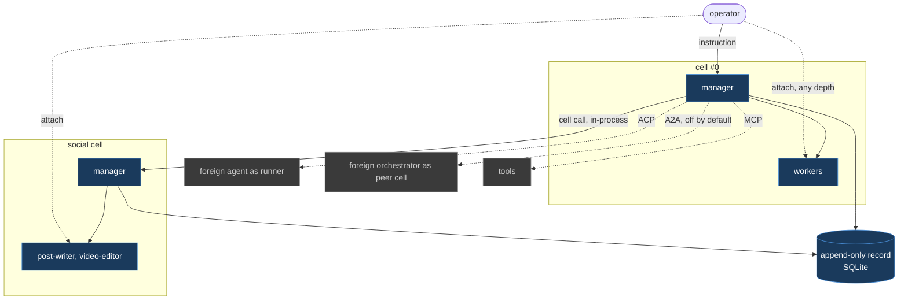

# Farseer

A local-first agent orchestration runtime for Windows.
One operator, one Rust binary, no required external services.

**Status: specification locked, implementation not started.**
Twenty-seven decision tickets are closed and no architectural question remains open.
The only code in this repository is three throwaway spikes that exist to answer platform questions, not to become the product.

## The one idea

Farseer is a **cell runtime**, not a coding orchestrator.

A **cell** is a harness: one manager, its workers, its own record scope, and an address.
The builder-and-management harness is cell #0.
Every harness farseer builds is a sibling cell rather than a plugin, so a social media harness and a coding harness differ only in roster, tools and policy values.

The operator talks to a manager. The manager writes contracts, supervises workers, and escalates.
Mechanics never surface in conversation; they are all in the record and on the fleet view.



Solid edges are native. Dotted edges cross a protocol boundary.
The operator attaches to any run at any depth, bypassing every manager, because observation is not delegation.

## Three protocol boundaries

| Boundary | Protocol | Role |
| --- | --- | --- |
| Foreign agent driven by a farseer manager | **ACP** (Zed) | a **runner** |
| Foreign orchestrator making its own decisions | **A2A** (Linux Foundation) | a **peer cell**, off by default |
| Tools | **MCP** | query and memory-write, never raw event append |

An external protocol is spoken at a boundary, never shaped into internals.

## Repository layout

```
.
├─ BRIEF.md            landscape research, Windows failure catalogue, operator questions
├─ ARCHITECTURE.md     the cell model this map decided on
├─ AGENTS.md           conventions for agents working here (CLAUDE.md points at it)
└─ .scratch/farseer/
   ├─ map.md           the decision route: destination, decisions, fog, out of scope
   ├─ issues/          27 decision tickets, all closed
   ├─ research/        compaction, hang detection, headless UI boundary
   ├─ prototypes/      one operator turn, end to end
   └─ spikes/          jobspike, wsspike, storebench
```

## The spikes

Three Rust programs that answered the scary platform questions before any design depended on the answers.
Each is reproducible and has its own README.

| Spike | Question | Answer |
| --- | --- | --- |
| [`jobspike`](.scratch/farseer/spikes/jobspike/README.md) | Does a Win32 Job Object reap a real harness process tree? | **Yes.** A five-deep tree reaps in **300-400µs** with zero survivors, where killing the root alone leaves **five of six alive indefinitely**. |
| [`wsspike`](.scratch/farseer/spikes/wsspike/README.md) | Can a workspace be destroyed under a running dev server? | **Yes, 60/60 supervised cycles**, p50 2.5ms. Every blocked attempt was the worker's own cwd, not the watcher or Defender. |
| [`storebench`](.scratch/farseer/spikes/storebench/README.md) | SQLite or an embedded graph engine? | **SQLite, not close.** At 100x the target (2M events, 291MB): cursor scan **p99 425µs**, recursive CTE over the rework chain **790ms**. |

Run one:

```bash
cargo run --release --manifest-path .scratch/farseer/spikes/jobspike/Cargo.toml -- job
```

Toolchain is `x86_64-pc-windows-msvc`, rustup stable, decided in [19 rust toolchain](.scratch/farseer/issues/19-rust-toolchain.md).

## Where the decisions live

[`.scratch/farseer/map.md`](.scratch/farseer/map.md) is the index.
It gists every closed ticket in one line and links to the ticket that holds the detail.

A decision lives in exactly one place: its ticket.
Corrections are recorded on the corrected ticket as well as the map, so nobody reads a stale version.

Start with [01 cell primitive](.scratch/farseer/issues/01-cell-primitive.md), then [14 vocabulary lock](.scratch/farseer/issues/14-vocabulary-lock.md) for the glossary every later document uses.

## Not in scope for v1

A plugin ABI, multi-human collaboration, cloud execution of workers, mac and Linux, a token-level model router, and autonomous cell generation by cell #0.
The map's **Out of scope** section records each with the reasoning.
