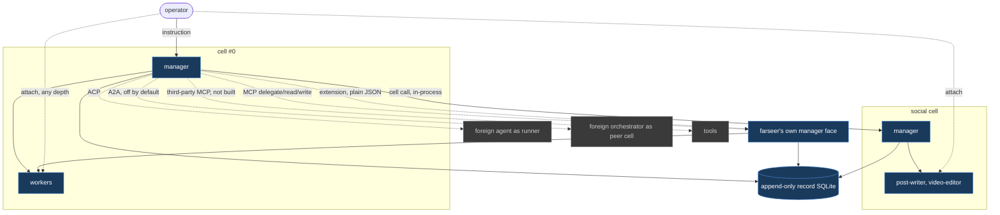

# Farseer

A local-first agent orchestration runtime for Windows.
One operator, one Rust binary, no required external services.

**Status: the foundation is built, and a Claude Code manager can delegate to a real roster worker.**
Twenty-eight decision tickets are closed, and the domain model, the record, the local API, four native runners, all four manager verbs from [Run state model and control semantics](.scratch/farseer/issues/05-run-state-model.md), and the MCP face from [Record scope](.scratch/farseer/issues/02-record-scope.md) are implemented against them.
`POST /v1/cells/{id}/instruct` runs a cell's manager against a goal and returns a `run_id` immediately.
The operator surface is a separate client under [`ui/`](ui/README.md): a canvas of widgets whose arrangement farseer stores as an opaque blob, one composer addressed to the top manager, and a host bridge that is the only thing a widget may reach.

A Claude Code manager receives farseer's own MCP face under a per-run capability and can call `delegate_to_worker`, or `delegate_to_cell` for a granted cell, during the same live conversation; cancel and steer remain available through the run API.
See [What runs today](#what-runs-today).

## The one idea

Farseer is a **cell runtime**, not a coding orchestrator.

A **cell** is a harness: one manager, its workers, its own record scope, and an address.
The builder-and-management harness is cell #0.
Every harness farseer builds is a sibling cell rather than a plugin, so a social media harness and a coding harness differ only in roster, tools and policy values.

The operator talks to a manager. The manager writes contracts, supervises workers, and escalates.
Mechanics never surface in conversation; they are all in the record and on the fleet view.



Solid edges are native. Dotted edges cross a protocol boundary.
The operator attaches to any run at any depth, bypassing every manager, because observation is not delegation.

## Three protocol boundaries

| Boundary | Protocol | Role |
| --- | --- | --- |
| Foreign agent driven by a farseer manager | **ACP** (Zed) | a **runner** |
| Foreign orchestrator making its own decisions | **A2A** (Linux Foundation) | a **peer cell**, off by default |
| Tools | **MCP** | farseer's own `/v1/mcp` face provides memory and roster-worker delegation, never raw event append; `/v1/manager/delegate/*` offers the same verbs as plain JSON to a runner with no MCP client; calling third-party MCP tool servers is not built |

An external protocol is spoken at a boundary, never shaped into internals.

## Repository layout

```
.
├─ crates/
│  ├─ farseer-core/    domain model: cells, policy, run state, scrubbing. Pure, no I/O
│  ├─ farseer-store/   the record: one append-only SQLite log, memory, UI state
│  ├─ farseer-api/     local HTTP plus SSE on 127.0.0.1, token and loopback guard; nests the MCP face at /v1/mcp; pushes notifications out
│  ├─ farseer-runner/  runners: Claude Code, Codex, cursor-agent and goose, PATHEXT resolution, Job-Object spawn, stream-json mapping, worktree lifecycle
│  ├─ farseer-manager/ runs one sealed contract, captures terminal text, and records what happened
│  ├─ farseer/         the binary: runtime and CLI in one
│  └─ farseer-shell/   the desktop shell: finds a farseer, serves the canvas, holds the token, and puts the most constrained quota window in the tray
├─ ui/                 the canvas: the operator surface, a client of /v1 like any other
│  ├─ src/bridge.ts    everything a widget may reach, and nothing else
│  └─ src/widgets/     runs, activity, quota, fleet - plus whatever cell zero writes
├─ widgets/            agent-authored widgets, in git, compiled and sandboxed by the canvas
│  └─ AGENTS.md        the contract a manager reads before writing one
├─ skills/             test skills a cell may declare; never discovered from the operator's home
├─ extensions/         runner extensions farseer supplies
│  └─ pi/              delegation tools for pi and omp, which have no MCP client
├─ cells/              cell definitions, hand-written, in git
│  ├─ zero.toml        cell #0, the builder harness
│  └─ social.toml      the second cell, thinner on purpose
├─ runners.toml        machine-wide runner facts: which account each signs in with
├─ BRIEF.md            landscape research, Windows failure catalogue, operator questions
├─ ARCHITECTURE.md     the cell model this map decided on
├─ HARNESS.md          what eight harnesses taught farseer, written as the contract a farseer-native one would meet
├─ AGENTS.md           conventions for agents working here (CLAUDE.md points at it)
└─ .scratch/farseer/
   ├─ map.md           the decision route: destination, decisions, fog, out of scope
   ├─ issues/          28 decision tickets, all closed
   ├─ research/        compaction, hang detection, headless UI boundary
   ├─ prototypes/      one operator turn, end to end
   └─ spikes/          jobspike, wsspike, storebench
```

## What runs today

```bash
cargo run
```

Opens the desktop shell, which is what running farseer means: it attaches to a daemon already on this machine or starts one itself, serves the canvas on a loopback port of its own, and proxies `/v1` with the operator token attached on its side - so the page it loads is one origin and never holds a credential.
It also puts the most constrained subscription window in the system tray. See [Tray](#tray).

Build the canvas once first, or the shell has nothing to serve:

```bash
bun run --cwd ui build
```

`cargo build` and `cargo test` follow the same default, so **both cover the shell alone** - pass `--workspace` to build or test everything:

```bash
cargo test --workspace
```

The daemon can still be driven on its own, which is what CI and the tests do:

```bash
cargo run --bin farseer -- validate
```

Parses every definition in `cells/`, prints one line each, and exits non-zero if any is broken.

```bash
cargo run --bin farseer -- serve --port 8787
```

Binds `127.0.0.1` only, opens the record, loads the definitions, and writes its port and a fresh token to a file whose DACL grants nobody but the current user.
`--repo <path>` picks which git repository a `Worktree`-strategy cell's runs are worktrees of; it defaults to the current directory if omitted.

| Surface | What it does |
| --- | --- |
| `GET /v1/cells`, `/v1/cells/{id}` | read definitions. There is deliberately **no edit path** - they are files in git |
| `POST /v1/cells/reload` | re-read from disk, reporting broken files rather than dying on them |
| `POST /v1/cells/{id}/instruct` | run the cell's manager against a goal; current native LLM runners require an explicit shell-capable roster grant; a Claude Code manager gets a generated strict MCP config outside the worktree, a codex-app-server manager gets the same MCP face configured in its `thread/start` handshake with the bearer named as an environment variable, and a pi or omp manager gets farseer's delegation extension and its credentials in the environment, and a goose-acp or opencode-acp manager gets it in `session/new`'s `mcpServers` when the agent says it speaks HTTP MCP - so all four transports may delegate to named roster workers. No manager is ever told its own token: identity comes from the bearer the request already carried; every other manager is told its roster and told it cannot reach it; returns `202` with a `run_id` after setup is accepted |
| `GET /v1/events?cell=&run=&since=&tail=` | the cursor read. `since` is exclusive, so a client resumes with no gap and no duplicate; `tail=N` reads the **last** N instead, for a surface opening cold with no cursor |
| `GET /v1/stream` | the same query as SSE, honouring `Last-Event-ID`. Attach and replay are one call with a different cursor |
| `GET /v1/runs/{id}` | a run's row: lifecycle, outcome, cost, tokens, and `18`/`05`'s liveness - `live`/`stalled`/`likely_hung`, or `null` once nothing in memory can answer |
| `POST /v1/runs/{id}/cancel` | end a run early, recorded as `05`'s `cancelled` outcome, never `failed`. `404` if it already finished or never existed - idempotent, not a silent no-op |
| `POST /v1/runs/{id}/steer` | send a follow-up message into a run's live process. `400` if the runner has no steering path - Codex, cursor-agent and goose today - `404` if the run is unknown or already finished |
| `POST /v1/runs/{id}/rerun` | same sealed contract, fresh run, fresh workspace; managers and delegated workers retain their pinned cell authority, and a worker reacquires that cell's shared cap; legacy records without a pinned definition fail closed; `404` on an unknown run |
| `POST /v1/runs/{id}/rescope` | a new run with a changed `goal`. `400` if `goal` is missing or unchanged from the original - that is `rerun`, not `rescope` |
| `GET`/`PUT /v1/ui-state/{key}` | an opaque blob farseer never parses, so a canvas survives a restart. `413` above 1 MiB |
| `GET /v1/analytics/{cost,intervention,rework,lessons}` | the four questions from [11 analytics questions](.scratch/farseer/issues/11-analytics-questions.md) |
| `/v1/mcp` | the streamable-HTTP MCP face nested into this router and guard; all three tools - `read_memory`, `write_memory`, and `delegate_to_worker` - derive identity from an active manager capability, and no raw event append exists because "an agent that can forge events can rewrite its own history" |
| `POST /v1/manager/delegate/{worker,cell}` | the same two delegation verbs as plain JSON, for a manager whose runner has no MCP client. It calls the same functions the MCP tools call, so the roster, the worker cap and the budget are one implementation rather than two |
| `GET /v1/skills` | the skills a cell may declare - directories in `skills/`, with which cells declare each. Deliberately **not** what a harness discovered on this machine: discovery is denied, so that would be a menu of things no cell can order |
| `GET /v1/quota` | recorded windows from runs, plus a live `omp usage --json` snapshot labelled `source: "omp usage"` - the live reading supersedes farseer's own record of the same window, matched on the provider an account declares - the only reading of a Google Antigravity quota farseer has, and the only sight of any window while nothing is running |
| `POST /v1/quota/refresh` | run that snapshot **now** rather than waiting for the five-minute poll, then answer like the read. Refuses, naming the line to add, when `[usage] source` is unset |

Every request must arrive on a loopback `Host`.
Operator routes require the process-wide bearer; `/v1/mcp` and `/v1/manager/` additionally accept an active manager's per-run bearer, which is invalid everywhere else.
A generated manager config contains only the per-run bearer and never discloses the operator token.
A cross-site `Origin` is refused before the token is even looked at, because [16 local API surface](.scratch/farseer/issues/16-local-api-surface.md) found that a token alone does not stop DNS rebinding - the browser attaches it for the attacker.

### Tool levels

A cell says how much of its runner's own tool set a run gets, on `[manager]` and on each `kind = "worker"` roster entry:

```toml
[manager]
runner = "pi"
tools = "read"   # read | edit | shell (default)
```

`read` is looking, `edit` adds writing inside the workspace, `shell` is everything - named for what it is, because [12 autonomy and deny list](.scratch/farseer/issues/12-autonomy-and-deny-list.md) found that granting a shell grants everything.
Absent is `shell`, which is what farseer has always done, now said out loud rather than happening because nothing was passed.
The names farseer passes are its own probed table, never a string from a cell file, and a runner that cannot take an allowlist refuses the run instead of ignoring the field.
See [36 tool grant enforcement](.scratch/farseer/issues/36-tool-grant-enforcement.md).

### Tray

The desktop shell puts one line in the system tray: the **most constrained** subscription window, because that is the only one that changes what an operator does next.
Right-click lists every window, worst first, as readings rather than commands - the verbs stay on the canvas.

A percentage there is always the **provider's own**. farseer never computes one, per [27 quota accounting](.scratch/farseer/issues/27-quota-accounting.md): its own spend is a lower bound on a window drained by sessions it cannot see, and a tray line is read in half a second and remembered as fact.
A runner that states no percentage gets a line without one, never a `0%`.

### Reading a quota nothing else exposes

`omp usage --json` reports every account omp is signed into - including a Google Antigravity window no other runner on this machine exposes - and farseer can poll it on a timer, so the tray and `GET /v1/quota` say something while nothing is running.

**Off unless you ask**, because it is farseer launching somebody else's binary:

```toml
[omp]
usage_poll = true
```

### Notifications

Set `FARSEER_NOTIFY_URL` and farseer POSTs to it when a root run answers, finishes, or goes `likely-hung`.
Unset, the whole plane is off.

```
set FARSEER_NOTIFY_URL=https://ntfy.sh/some-hard-to-guess-topic
```

The backend is the URL, so ntfy, Slack, Discord or an operator's own bridge are one code path.
ntfy is the documented default because it needs no account, no token and no SDK, and its topic is a password - which is why this is an environment variable rather than a line in `runners.toml`.
Delivery is best-effort and never in the path of a run.
See [35 notification plane](.scratch/farseer/issues/35-notification-plane.md).

### What is not built yet

- **Delegation reach for ACP and Codex managers.** Claude Code managers delegate over MCP and pi/omp managers over farseer's own extension, both verified live.
  `goose-acp`, `opencode-acp`, `codex-app-server`, `agy` and `cursor-agent` managers are told their roster and told they cannot reach it, because no channel for the verbs has been probed on those protocols yet.
- **Pre-spend enforcement for bounded native-runner budgets.** Task-root and per-worker caps narrow and draw down as `23 prototype loose ends` requires, but every bounded dimension fails closed before spawn today.
  Claude Code 2.1.233's `--max-budget-usd` exceeded a one-micro-dollar cap by more than five orders of magnitude before reporting `budget_exhausted`, while the other runners report only after spending.
- Gated actions.
- **Third-party MCP clients.** The manager process is now an MCP client of farseer's own server, but reaching arbitrary third-party MCP tool servers is still the `M0 -.->|MCP| TOOL` edge on the map above and is not implemented.
- **The ACP server adapter** and the A2A endpoint, both decided and both later.
- **The UI.** Backend support exists - `GET`/`PUT /v1/ui-state/{key}` per `24`, and `07` constrains the attach surface to a rendered event stream over one run - but "UI shape" itself is still fog on [the map](.scratch/farseer/map.md), not a closed ticket: manager chat, fleet view, board and graph explorer are options, not a decision. It waits on a `/wayfinder` grilling-and-prototype session, HITL, not something to design and build unilaterally.
- **A fifth runner, `pi` (badlogic/pi-mono).** Installed on the dev machine but has no provider credentials configured (`pi auth check` answers `credentials_not_configured`) - configuring one is an operator decision, so this stays a documented gap rather than a guess.

## The spikes

Three Rust programs that answered the scary platform questions before any design depended on the answers.
Each is reproducible and has its own README.

| Spike | Question | Answer |
| --- | --- | --- |
| [`jobspike`](.scratch/farseer/spikes/jobspike/README.md) | Does a Win32 Job Object reap a real harness process tree? | **Yes.** A five-deep tree reaps in **300-400µs** with zero survivors, where killing the root alone leaves **five of six alive indefinitely**. |
| [`wsspike`](.scratch/farseer/spikes/wsspike/README.md) | Can a workspace be destroyed under a running dev server? | **Yes, 60/60 supervised cycles**, p50 2.5ms. Every blocked attempt was the worker's own cwd, not the watcher or Defender. |
| [`storebench`](.scratch/farseer/spikes/storebench/README.md) | SQLite or an embedded graph engine? | **SQLite, not close.** At 100x the target (2M events, 291MB): cursor scan **p99 425µs**, recursive CTE over the rework chain **790ms**. |

Run one:

```bash
cargo run --release --manifest-path .scratch/farseer/spikes/jobspike/Cargo.toml -- job
```

Toolchain is `x86_64-pc-windows-msvc`, rustup stable, decided in [19 rust toolchain](.scratch/farseer/issues/19-rust-toolchain.md).

## Where the decisions live

[`.scratch/farseer/map.md`](.scratch/farseer/map.md) is the index.
It gists every closed ticket in one line and links to the ticket that holds the detail.

A decision lives in exactly one place: its ticket.
Corrections are recorded on the corrected ticket as well as the map, so nobody reads a stale version.

Start with [01 cell primitive](.scratch/farseer/issues/01-cell-primitive.md), then [14 vocabulary lock](.scratch/farseer/issues/14-vocabulary-lock.md) for the glossary every later document uses.

## Not in scope for v1

A plugin ABI, multi-human collaboration, cloud execution of workers, mac and Linux, a token-level model router, and autonomous cell generation by cell #0.
The map's **Out of scope** section records each with the reasoning.
