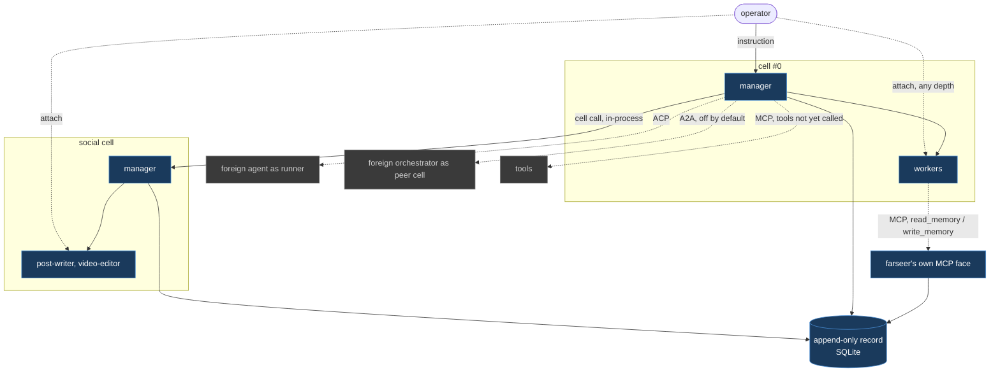

# Farseer

A local-first agent orchestration runtime for Windows.
One operator, one Rust binary, no required external services.

**Status: the foundation is built, and farseer can now execute and steer a real instruction.**
Twenty-seven decision tickets are closed, and the domain model, the record, the local API, three native runners, all four of `05`'s manager verbs, and `02`'s MCP face are implemented against them.
`POST /v1/cells/{id}/instruct` runs a cell's manager against a goal and returns a `run_id` immediately; `POST /v1/runs/{id}/cancel` ends it early; `POST /v1/runs/{id}/steer` sends a follow-up message into the same live process. All three are real, not stubs - the command half of the API is no longer absent.
See [What runs today](#what-runs-today).

## The one idea

Farseer is a **cell runtime**, not a coding orchestrator.

A **cell** is a harness: one manager, its workers, its own record scope, and an address.
The builder-and-management harness is cell #0.
Every harness farseer builds is a sibling cell rather than a plugin, so a social media harness and a coding harness differ only in roster, tools and policy values.

The operator talks to a manager. The manager writes contracts, supervises workers, and escalates.
Mechanics never surface in conversation; they are all in the record and on the fleet view.



Solid edges are native. Dotted edges cross a protocol boundary.
The operator attaches to any run at any depth, bypassing every manager, because observation is not delegation.

## Three protocol boundaries

| Boundary | Protocol | Role |
| --- | --- | --- |
| Foreign agent driven by a farseer manager | **ACP** (Zed) | a **runner** |
| Foreign orchestrator making its own decisions | **A2A** (Linux Foundation) | a **peer cell**, off by default |
| Tools | **MCP** | query and memory-write, never raw event append. Farseer's own memory face is built (`/v1/mcp`); calling *out* to third-party MCP tool servers is not |

An external protocol is spoken at a boundary, never shaped into internals.

## Repository layout

```
.
├─ crates/
│  ├─ farseer-core/    domain model: cells, policy, run state, scrubbing. Pure, no I/O
│  ├─ farseer-store/   the record: one append-only SQLite log, memory, UI state
│  ├─ farseer-api/     local HTTP plus SSE on 127.0.0.1, token and loopback guard; nests the MCP face at /v1/mcp
│  ├─ farseer-runner/  runners: Claude Code, Codex and cursor-agent, PATHEXT resolution, Job-Object spawn, stream-json mapping, worktree lifecycle
│  ├─ farseer-manager/ runs one worker contract against a runner and records what happened. Called by `POST /v1/cells/{id}/instruct`
│  └─ farseer/         the binary: runtime and CLI in one
├─ cells/              cell definitions, hand-written, in git
│  ├─ zero.toml        cell #0, the builder harness
│  └─ social.toml      the second cell, thinner on purpose
├─ BRIEF.md            landscape research, Windows failure catalogue, operator questions
├─ ARCHITECTURE.md     the cell model this map decided on
├─ AGENTS.md           conventions for agents working here (CLAUDE.md points at it)
└─ .scratch/farseer/
   ├─ map.md           the decision route: destination, decisions, fog, out of scope
   ├─ issues/          27 decision tickets, all closed
   ├─ research/        compaction, hang detection, headless UI boundary
   ├─ prototypes/      one operator turn, end to end
   └─ spikes/          jobspike, wsspike, storebench
```

## What runs today

```bash
cargo run --bin farseer -- validate
```

Parses every definition in `cells/`, prints one line each, and exits non-zero if any is broken.

```bash
cargo run --bin farseer -- serve --port 8787
```

Binds `127.0.0.1` only, opens the record, loads the definitions, and writes its port and a fresh token to a file whose DACL grants nobody but the current user.
`--repo <path>` picks which git repository a `Worktree`-strategy cell's runs are worktrees of; it defaults to the current directory if omitted.

| Surface | What it does |
| --- | --- |
| `GET /v1/cells`, `/v1/cells/{id}` | read definitions. There is deliberately **no edit path** - they are files in git |
| `POST /v1/cells/reload` | re-read from disk, reporting broken files rather than dying on them |
| `POST /v1/cells/{id}/instruct` | run the cell's manager against a goal. Fire-and-forget: `202` with a `run_id` the moment the process spawns, per `16` |
| `GET /v1/events?cell=&run=&since=` | the cursor read. `since` is exclusive, so a client resumes with no gap and no duplicate |
| `GET /v1/stream` | the same query as SSE, honouring `Last-Event-ID`. Attach and replay are one call with a different cursor |
| `GET /v1/runs/{id}` | a run's row: lifecycle, outcome, cost, tokens, and `18`/`05`'s liveness - `live`/`stalled`/`likely_hung`, or `null` once nothing in memory can answer |
| `POST /v1/runs/{id}/cancel` | end a run early, recorded as `05`'s `cancelled` outcome, never `failed`. `404` if it already finished or never existed - idempotent, not a silent no-op |
| `POST /v1/runs/{id}/steer` | send a follow-up message into a run's live process. `400` if the runner has no steering path - Codex today - `404` if the run is unknown or already finished |
| `POST /v1/runs/{id}/rerun` | same contract, fresh run, fresh workspace. `404` on an unknown run |
| `POST /v1/runs/{id}/rescope` | a new run with a changed `goal`. `400` if `goal` is missing or unchanged from the original - that is `rerun`, not `rescope` |
| `GET`/`PUT /v1/ui-state/{key}` | an opaque blob farseer never parses, so a canvas survives a restart. `413` above 1 MiB |
| `GET /v1/analytics/{cost,intervention,rework,lessons}` | the four questions from [11 analytics questions](.scratch/farseer/issues/11-analytics-questions.md) |
| `/v1/mcp` | `02` section 8's MCP face - streamable HTTP, nested into this same router and guard. Exactly two tools: `read_memory` and `write_memory`. No raw event append - "an agent that can forge events can rewrite its own history" |

Every request must arrive on a loopback `Host` and carry the bearer token.
A cross-site `Origin` is refused before the token is even looked at, because [16 local API surface](.scratch/farseer/issues/16-local-api-surface.md) found that a token alone does not stop DNS rebinding - the browser attaches it for the attacker.

### What is not built yet

- **Delegation.** `instruct` runs the cell's own **manager** runner directly against the goal - there is no manager loop yet to plan and delegate to workers, so `22`'s "an instruction delegates to one owner" is true only in the trivial sense that the owner is whichever manager was asked. Three native runners are wired now - `claude-code`, `codex`, `cursor-agent` - so a manager naming any of them can execute; no roster worker can, since nothing yet calls `run_worker` for one.
- Gated actions and cell calls.
- **Farseer as an MCP client.** The MCP face built here is farseer as a *server* for its own memory; a manager reaching *out* to a third-party MCP tool server is still the `M0 -.->|MCP| TOOL` edge on the map above, and it is not implemented.
- **The ACP server adapter** and the A2A endpoint, both decided and both later.

The command half of the API is absent rather than stubbed: an endpoint that accepts an instruction nothing can execute would be a lie with a status code.

## The spikes

Three Rust programs that answered the scary platform questions before any design depended on the answers.
Each is reproducible and has its own README.

| Spike | Question | Answer |
| --- | --- | --- |
| [`jobspike`](.scratch/farseer/spikes/jobspike/README.md) | Does a Win32 Job Object reap a real harness process tree? | **Yes.** A five-deep tree reaps in **300-400µs** with zero survivors, where killing the root alone leaves **five of six alive indefinitely**. |
| [`wsspike`](.scratch/farseer/spikes/wsspike/README.md) | Can a workspace be destroyed under a running dev server? | **Yes, 60/60 supervised cycles**, p50 2.5ms. Every blocked attempt was the worker's own cwd, not the watcher or Defender. |
| [`storebench`](.scratch/farseer/spikes/storebench/README.md) | SQLite or an embedded graph engine? | **SQLite, not close.** At 100x the target (2M events, 291MB): cursor scan **p99 425µs**, recursive CTE over the rework chain **790ms**. |

Run one:

```bash
cargo run --release --manifest-path .scratch/farseer/spikes/jobspike/Cargo.toml -- job
```

Toolchain is `x86_64-pc-windows-msvc`, rustup stable, decided in [19 rust toolchain](.scratch/farseer/issues/19-rust-toolchain.md).

## Where the decisions live

[`.scratch/farseer/map.md`](.scratch/farseer/map.md) is the index.
It gists every closed ticket in one line and links to the ticket that holds the detail.

A decision lives in exactly one place: its ticket.
Corrections are recorded on the corrected ticket as well as the map, so nobody reads a stale version.

Start with [01 cell primitive](.scratch/farseer/issues/01-cell-primitive.md), then [14 vocabulary lock](.scratch/farseer/issues/14-vocabulary-lock.md) for the glossary every later document uses.

## Not in scope for v1

A plugin ABI, multi-human collaboration, cloud execution of workers, mac and Linux, a token-level model router, and autonomous cell generation by cell #0.
The map's **Out of scope** section records each with the reasoning.
