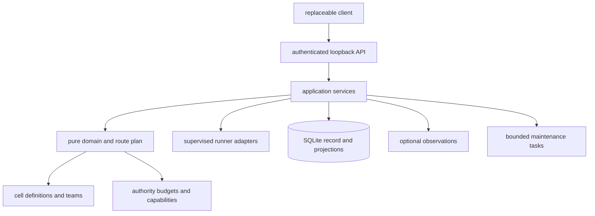

# Farseer

Farseer is a local-first agent orchestration runtime for Windows.
It runs a headless Rust core behind one authenticated loopback API and optional desktop clients.

## Run

Build the client before starting the desktop shell:
```bash
bun run --cwd ui build
```
```bash
cargo run
```

Run the daemon directly:
```bash
cargo run --bin farseer -- validate
```
```bash
cargo run --bin farseer -- serve --port 8787
```

Validation:
```bash
cargo fmt --all -- --check
```
```bash
cargo clippy --workspace --all-targets -- -D warnings
```
```bash
cargo test --workspace
```
```bash
bun run --cwd ui check
```
```bash
bun run --cwd ui test
```

## Core

Read [CORE.md](CORE.md) before changing runtime behavior.
It defines cells, runners, workers, projects, tasks, routes, authority, records, observations, feature seams, and bounded self-maintenance.
The runtime is headless and clients are replaceable.

## Architecture


```mermaid
graph TD
  CLIENT[replaceable client] --> API[authenticated loopback API]
  API --> APP[application services]
  APP --> CORE[pure domain and route plan]
  APP --> RUN[supervised runner adapters]
  APP --> STORE[(SQLite record and projections)]
  APP --> OBS[optional observations]
  APP --> MAINT[bounded maintenance tasks]
  CORE --> CELL[cell definitions and teams]
  CORE --> POLICY[authority budgets and capabilities]
```

Solid edges are native boundaries.
External protocols and terminals stop at adapters.

## Workspace layout

```text
.
|- CORE.md              durable architecture and rework contract
|- README.md            operational entry points
|- AGENTS.md           Farseer-specific working rules
|- crates/
|  |- farseer-core/    pure domain model and invariants
|  |- farseer-api/     authenticated HTTP/SSE and application boundary
|  |- farseer-manager/ sealed worker execution and delegation
|  |- farseer-runner/  native harness and terminal adapters
|  |- farseer-store/   SQLite record and rebuildable projections
|  |- farseer/         daemon and CLI
|  `- farseer-shell/   desktop shell and loopback proxy
|- cells/              hand-written cell definitions
|- runners.toml        machine runner and quota facts
|- ui/                 replaceable client
|- widgets/            optional sandboxed client widgets
|- skills/             declared cell skills
`- .scratch/history.md compact historical record only
```
## Runtime boundaries

A cell is a stable address, policy, roster, workspace, budget, and record scope.
A manager may delegate only to declared workers, tools, cells, or peers.
A worker run has an immutable contract and a supervised process tree.
Events are runtime-owned evidence; clients and agents cannot append raw events.
SQLite is canonical and read projections are bounded and rebuildable.
Projects and project teams are authorized profiles, not arbitrary paths or inferred routing.
Optional resource, quota, terminal, transcript, and maintenance features report unavailable states rather than inventing values.

## Client rule

The UI may change freely.
It must use named API projections and verbs, never become a source of authority, and never put credentials into widgets or browser storage.
UI context is semantic when needed and cosmetic origin metadata stays outside core contracts.

## Recovery

Historical planning and research notes were compacted into [.scratch/history.md](.scratch/history.md).
Use Git history for exact deleted documents and old evidence.
Private `feedback.txt` is not tracked.