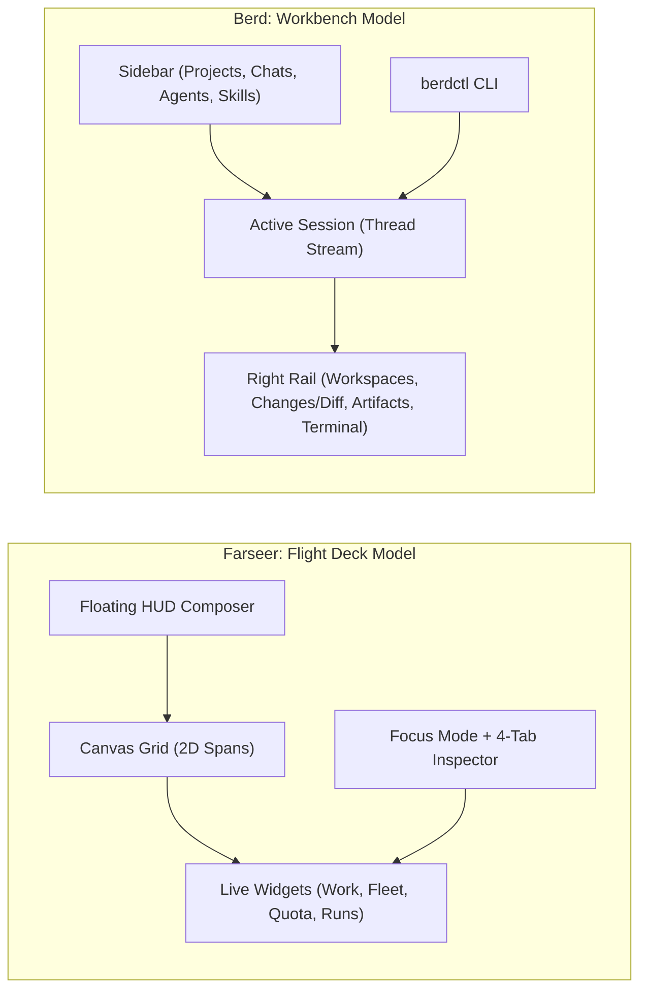
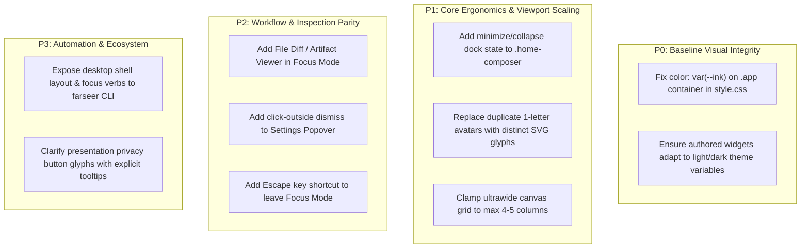

# Desktop UI/UX Gap Review: Farseer vs. Block Berd

> **Context**: This review examines the desktop UI/UX of **Farseer** (an open-source, local-first agent orchestration runtime for Windows) in contrast with **Berd** ([github.com/block/berd](https://github.com/block/berd), Block's open-source desktop app for AI agents).
>
> **Methodology**: Evaluated through live automated desktop inspection (**Computer Use** driving headless Google Chrome over Chrome DevTools Protocol across **1920×1080**, **1366×768**, and **2560×1440** viewports) alongside direct analysis of the locally installed Berd distribution (`C:\Users\izanorshahril\AppData\Local\Berd`), including its bundled agent (`berdy.md`), bundled skills (`berd-help`, `agent-builder`, `skill-builder`), companion CLI (`berdctl.exe`), and upstream architecture.

---

## 1. Executive Summary & Architectural Overview

Both **Farseer** and **Berd** are modern, local-first desktop applications built on the same core technology stack: **Tauri 2**, **React 19**, and a **Rust** backend operating over agent communication protocols (ACP) and local subprocess supervision on Windows.

However, their **mental models and interaction paradigms diverge significantly**:

| Product | Core Identity | Primary Mental Model | Primary User Persona |
| :--- | :--- | :--- | :--- |
| **Farseer** | Local-first agent runtime & fleet supervisor | **Command Center / Flight Deck** (2D flowing canvas of bounded, live widget cards) | Systems engineer, technical operator managing multi-agent teams, quotas, and background runs |
| **Berd** | Unified workspace for AI agents & personas | **Workbench / Document IDE** (Thread-centric chat with split-pane right rail, artifacts, and terminal) | Knowledge worker, developer, or creator collaborating with personalized AI companions |



---

## 2. Comprehensive Comparison Matrix

| Dimension | Farseer (Current Desktop Canvas) | Block Berd (Installed Desktop App) | UX Evaluation & Gap |
| :--- | :--- | :--- | :--- |
| **Spatial Model** | **2D Flowing Canvas Grid**: Widgets take discrete 1x/2x spans (`layout.ts`) packed dense-row with custom base pixel metrics (`1X WIDGET METRIC`). | **Split-Pane Workbench**: Left navigation sidebar (Projects, Chats, Agents, Skills) + Center chat stream + Collapsible right rail context panel. | **Farseer** excels at concurrent visibility across heterogeneous processes (quota, active runners, fleet health, work board at a glance). **Berd** excels at deep focus within a single task context. |
| **Prompting & Input** | **Floating HUD Composer**: Fixed at screen bottom (`.home-composer`), decoupled from any single card, with context pinning (`canvas`, `Work`, `Fleet`). | **In-Stream Session Composer**: Anchored directly to the active chat thread with inline file attachments, agent selector, and model pills. | **Farseer's** floating composer occludes bottom content on laptop screens (1366×768) and lacks a minimize toggle. **Berd's** input stays naturally scoped to its thread. |
| **Workspace & File Context** | **Authorized Folders (`Projects` widget)**: Directory paths are authorized; files are touched by background workers; no embedded file viewer. | **Attached Workspaces & Right Rail**: Sessions attach folders/repos with live Git status, diff viewer (`Changes`), and rendered file previews (`Artifacts`). | **Major Gap for Farseer**: Farseer has no inline file diff or artifact inspector. Berd gives immediate visual verification of file edits produced by agents. |
| **Agent Personification & Ergonomics** | **Headless Cells & Rosters**: Formal cell definitions in TOML files (`cells/`); workers are supervised execution units with budgets. | **Characters & Personas**: Agents have rich names, avatars, "vibes", instructions, and personality (`berdy.md`). | **Berd** is approachable and communicative; **Farseer** is cold and industrial. Farseer avoids anthropomorphism by architectural design, but loses conversational warmth. |
| **Terminal Integration** | **Native Harness Subprocesses**: Runs use Windows Job Objects for supervised process trees; terminal output streams as record events. | **Embedded Interactive Terminal**: Dockable interactive terminal in the right rail opened directly at the attached workspace path. | **Berd** lets the user drop into a live terminal alongside the agent session; Farseer requires an external terminal or CLI window. |
| **Extensibility Model** | **Sandboxed Client Widgets**: Agent-authored widgets live in `widgets/` and render inside sandboxed iframes (`allow-scripts`, no credentials). | **Skills & Extensions**: Declarative `SKILL.md` bundles, OAuth catalog connections (GitHub, Slack), and stdio/SSE/ACP tool extensions. | Both have rigorous security. Farseer sandboxes UI presentation; Berd sandboxes protocol extensions. |
| **Quota & Cost Accounting** | **Native Fleet Quota Surface (`QuotaWidget`)**: Deep multi-provider accounting (Codex 5h/7d windows, Antigravity, usd/token spend). | **Provider Settings**: Basic API keys and model provider toggles; lacks fleet-wide rolling quota exhaustion graphs. | **Major Advantage for Farseer**: Farseer provides unprecedented visibility into rolling rate limits, reset countdowns, and real-time spend bounds. |
| **Companion CLI** | **Daemon CLI (`farseer`)**: Robust operational CLI for daemon lifecycle (`serve`, `validate`, `where`, `runs`, `maintenance`). | **App Driver CLI (`berdctl`)**: Rich tool to steer the desktop window from terminal (`berdctl session send`, `berdctl folder attach`). | **Gap for Farseer**: `farseer` manages the background server, but cannot manipulate the open desktop canvas (e.g. focusing a card or opening a run). |
| **Privacy Safeguards** | **Presentation Privacy Mode**: Instantaneous masking (`••`) sanitizing session IDs, hashes, account tokens, and paths for screen shares. | **Standard Local Isolation**: Keeps data local to machine, but lacks active visual redaction filters during screen sharing. | **Major Advantage for Farseer**: Outstanding affordance for live demos, video recordings, and streaming. |

---

## 3. In-Depth UX Gap Analysis

### Gap 1: Conversational Execution vs. Event Replay
* **Berd Approach**: A session is an active workspace. When an agent creates or modifies a file, Berd renders the diff directly in the chat and opens the resulting document in an `ArtifactViewer` tab. Users can visually compare before-and-after states and approve or roll back changes.
* **Farseer Current State**: The `ConversationWidget` is an append-only projection of the SQLite record (`follow` stream). While architecturally resilient across crashes and reloads, it treats output as plain chat logs. There is no rich artifact viewer or inline file diff preview.
* **Recommendation**: Introduce an **Artifact / Diff Preview Face** in Farseer’s `Focus Mode` or inside the `WorkWidget` detail view, allowing operators to inspect file changes committed by worktree runs.

---

### Gap 2: Desktop Viewport Ergonomics & Composer Occlusion
* **Berd Approach**: Uses standard desktop column layouts that shrink and scroll gracefully. The composer sits at the bottom of the active session column, never obscuring other panels.
* **Farseer Current State**: 
  - On **1366×768 (Laptop)**, the floating `.home-composer` (fixed at `bottom: 54px`, `min-height: 112px`) occupies **35% of the viewport height**, completely blocking the bottom of the Kanban board in `WorkWidget` and card resize grips.
  - On **2560×1440 (Ultrawide)**, auto-filling 300px unit widths stretches widgets into a 7-column ribbon across the top, leaving >60% of the screen as dead dotted background.
  - Expanding composer context (`context` button) adds a 4-picker grid that vertically crowds the prompt textarea.
* **Recommendation**:
  1. Add a **minimize/collapse chevron** to `.home-composer` allowing it to dock into the bottom status bar on viewports `< 900px` height.
  2. Implement responsive column clamping on ultrawide viewports (`max-width: 1800px; margin: 0 auto;`).

---

### Gap 3: Collapsed Sidebar Disambiguation
* **Berd Approach**: The left sidebar organizes distinct top-level categories (Projects, Chats, Agents, Skills, Automations) with distinct, recognizable SVG icons.
* **Farseer Current State**: Collapsing `.sidebar` (`09_sidebar_collapsed.png`) reduces widgets to single-letter circle avatars using `title.slice(0, 1)`:
  - **4 duplicate `C`s**: *Conversation*, *Capacity*, *Clock*, *Cost today*.
  - **4 duplicate `R`s**: *Runners*, *Runs*, *Run*, *Run tally*.
  - Operators cannot distinguish cards without hovering over every item.
* **Recommendation**: Replace 1-letter text slices with dedicated SVG glyphs (chat bubble, gauge/meter, clock, terminal, list, document, dollar chart).

---

### Gap 4: Typography Contrast & Theme System
* **Berd Approach**: Polished design system built on high-contrast tokens with consistent light/dark theme variables and dedicated component styles.
* **Farseer Current State**:
  - In dark mode, `.app` failed to declare `color: var(--ink)`, causing headings (`.widget h2`), the brand mark, and the composer prompt to inherit `#252525` black text on `#20242c` dark panels (**1.06:1 contrast ratio**).
  - In light mode, built-in widgets look clean, but authored widgets (`Cost today`, `Run tally`, `Sandbox probe`) render with hardcoded pitch-black internal cards.
* **Recommendation**: Enforce `color: var(--ink)` on `.app` and require authored widgets in `widgets/` to consume theme tokens rather than raw hex values.

---

### Gap 5: Desktop Companion CLI Automation
* **Berd Approach**: Ships `berdctl.exe`, which allows bash, PowerShell, and terminal agents to control the desktop app dynamically:
  ```bash
  berdctl session create --prompt "Refactor tests" --harness-id claude-acp
  berdctl folder attach --path C:\path\to\repo
  ```
* **Farseer Current State**: `farseer.exe` has excellent daemon and store commands (`serve`, `validate`, `where`, `runs`), but has no IPC pipe to interact with the active Tauri desktop window (e.g. focusing a card, toggling privacy mode, or arranging spans).
* **Recommendation**: Expose desktop shell window actions over the loopback API so the CLI or external tools can issue `farseer canvas focus <widget>` or `farseer canvas layout reset`.

---

## 4. Prioritized Strategic Roadmap for Farseer Desktop UX



### Action Items Summary

1. **Immediate Visual Fixes (P0)**:
   - Apply `color: var(--ink)` to `.app` in [`ui/src/style.css`](ui/src/style.css) to eliminate the 1.06:1 contrast defect in dark mode.
   - Standardize authored widget CSS to use `var(--panel)` and `var(--sunken)` instead of hardcoded `#151922`.

2. **Viewport & Ergonomic Refinements (P1)**:
   - Add a minimize button to `.home-composer` to prevent occlusion on 1366×768 laptop displays.
   - Update `WidgetChip` in [`ui/src/App.tsx`](ui/src/App.tsx) to render semantic icons instead of `title.slice(0, 1)`.
   - Add `max-width: 1800px; margin: 0 auto;` on `.canvas` for screens wider than 1920px.

3. **Feature Gap Closures (P2 & P3)**:
   - Leverage Farseer’s existing `Focus Mode` to host an embedded git diff and artifact preview tab, closing the inspection gap with Berd’s right rail.
   - Extend the loopback API to allow the `farseer` CLI to control desktop presentation states.
